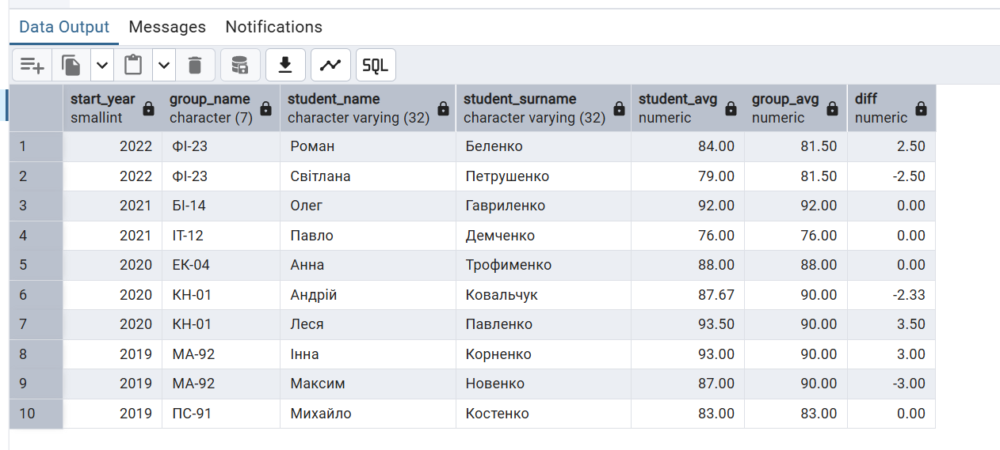
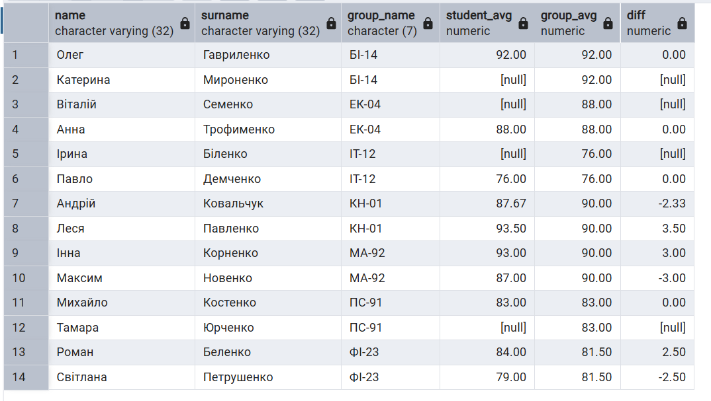
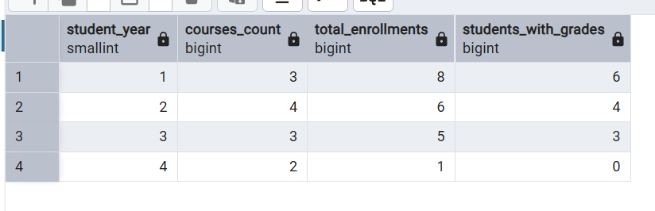
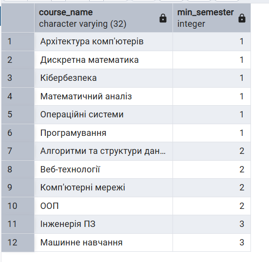
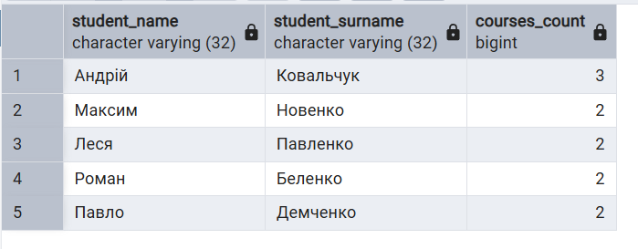
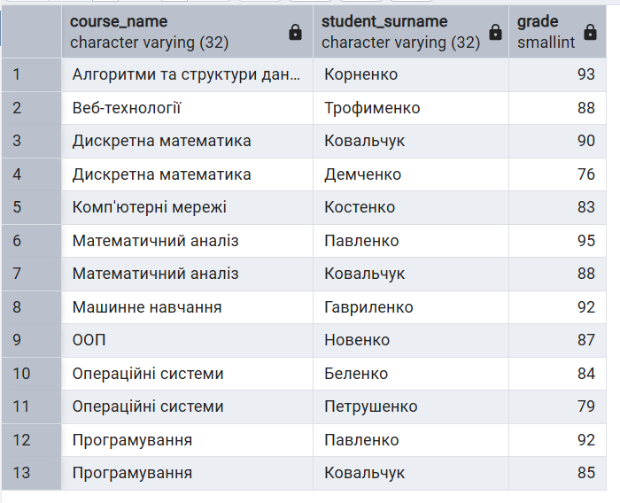

    Осипенко Гліб Костянтинович ІМ-44 в мене ще є шара
    exercises

    база та данні - 

    scripts/create-campus-tables.sql

    scripts/insert-data.sql


--порахувати успішність студентів залежно від року навчання

```sql
with student_stats as (
    select student_id, avg(grade) as s_avg 
    from enrolment 
    where grade is not null 
    group by student_id
),
group_stats as (
    select group_id, avg(grade) as g_avg 
    from enrolment 
    inner join student using(student_id)
    where grade is not null 
    group by group_id
)
select 
    sg.start_year, 
    sg.name as group_name,
    s.name as student_name,
    s.surname as student_surname,
    round(s_avg, 2) as student_avg,
    round(g_avg, 2) as group_avg,
    round(s_avg - g_avg, 2) as diff
from student s
inner join student_group sg using(group_id)
inner join student_stats using(student_id)
inner join group_stats using(group_id)
order by sg.start_year desc, sg.name, s.surname;
```


-- для кожного з студентів знайти його середній бал у порівнянні з середнім балом по групі

```sql
with student_stats as (
    select student_id, avg(grade) as s_avg from enrolment group by student_id
),
group_stats as (
    select group_id, avg(grade) as g_avg
    from enrolment inner join student using(student_id)
    group by group_id
)
select s.name, s.surname, sg.name as group_name,
       round(s_avg, 2) as student_avg,
       round(g_avg, 2) as group_avg,
       round(s_avg - g_avg, 2) as diff
from student s
    inner join student_stats using(student_id)
    inner join student_group sg using(group_id)
    inner join group_stats using(group_id)
order by sg.name, s.surname;
```



-- порахувати статистику записів на курси для кожного року навчання:

кількість курсів

кількість записів

кількість студентів, що вже отримали бали

```sql
select 
    student_year, 
    count(distinct course_id) as courses_count,
    count(student_id) as total_enrollments,
    count(grade) as students_with_grades
from course
left join enrolment using(course_id)
group by student_year
order by student_year;
```



-- Для кожного курсу знайти в якому мінімальному семестрі він може читатись

```sql
with recursive course_depth as (
    select course_id, 1 as semester 
    from course c
    where not exists (select 1 from course_prerequisite p where p.course_id = c.course_id)
    union all
    select p.course_id, cd.semester + 1
    from course_prerequisite p
    inner join course_depth cd on p.prerequisite_course_id = cd.course_id
)
select c.name, max(semester) as min_semester
from course c
inner join course_depth using(course_id)
group by course_id, c.name
order by min_semester, c.name;
```



-- Знайти всіх студентів, які записані на більше курсів ніж в середньому студенти

```sql
select s.name, s.surname, count(*) as courses_cnt
from student s
inner join enrolment using(student_id)
group by student_id, s.name, s.surname
having count(*) > (
    select avg(cnt) from (select count(*) as cnt from enrolment group by student_id) t
);
```



-- Знайти топ-3 студенти у кожному курсі за отриманими балами

```sql
select c.name as course, s.surname, e.grade
from enrolment e
inner join student s using(student_id)
inner join course c using(course_id)
where grade is not null and (
    select count(*) from enrolment e2 
    where e2.course_id = e.course_id and e2.grade > e.grade
) < 3
order by c.name, e.grade desc;
```



я намагався зробити як в 7 лекції та використовував приклади схожих задач з subqueries.sql
