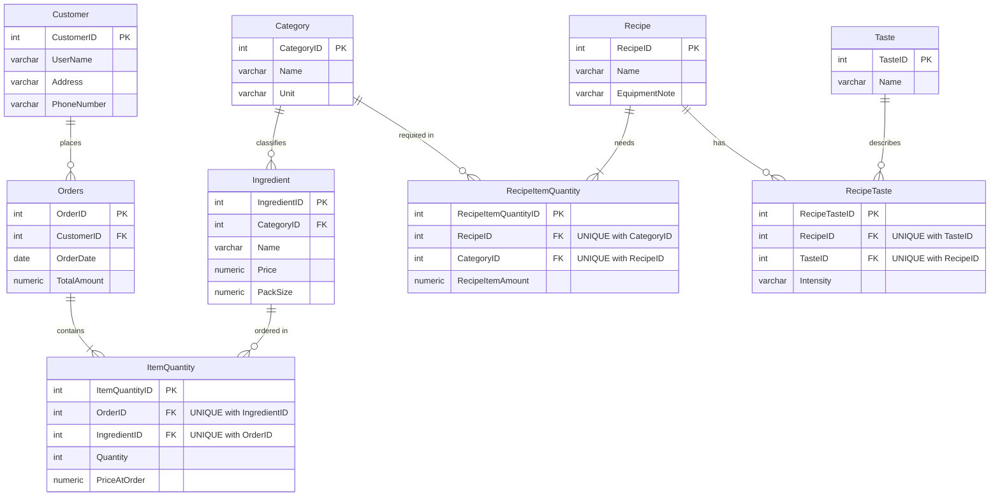

```mermaid 
erDiagram
    Customer ||--o{ Orders : "places"
    Orders ||--|{ ItemQuantity : "contains"
    Ingredient ||--o{ ItemQuantity : "ordered in"
    Category ||--o{ Ingredient : "classifies"
    Category ||--o{ RecipeItemQuantity : "required in"
    Recipe ||--|{ RecipeItemQuantity : "needs"
    Recipe ||--o{ RecipeTaste : "has"
    Taste ||--o{ RecipeTaste : "describes"
 
    Customer {
        int CustomerID PK
        varchar UserName
        varchar Address
        varchar PhoneNumber
    }
    Orders {
        int OrderID PK
        int CustomerID FK
        date OrderDate
        numeric TotalAmount
    }
    ItemQuantity {
        int ItemQuantityID PK
        int OrderID FK "UNIQUE with IngredientID"
        int IngredientID FK "UNIQUE with OrderID"
        int Quantity
        numeric PriceAtOrder
    }
    Ingredient {
        int IngredientID PK
        int CategoryID FK
        varchar Name
        numeric Price
        numeric PackSize
    }
    Category {
        int CategoryID PK
        varchar Name
        varchar Unit
    }
    Recipe {
        int RecipeID PK
        varchar Name
        varchar EquipmentNote
    }
    RecipeItemQuantity {
        int RecipeItemQuantityID PK
        int RecipeID FK "UNIQUE with CategoryID"
        int CategoryID FK "UNIQUE with RecipeID"
        numeric RecipeItemAmount
    }
    Taste {
        int TasteID PK
        varchar Name
    }
    RecipeTaste {
        int RecipeTasteID PK
        int RecipeID FK "UNIQUE with TasteID"
        int TasteID FK "UNIQUE with RecipeID"
        varchar Intensity
    }
```