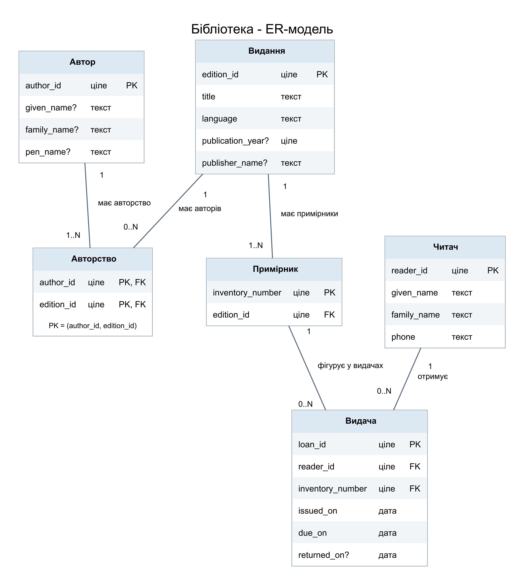

# Лабораторна робота №1
## Збір вимог та розробка ER-моделі бібліотеки

**Брюховецький Євген Вадимович · ІМ-51 · Бази даних**

### 1. Мета та формат роботи

Мета - визначити дані й правила роботи невеликої бібліотеки паперових книг та побудувати концептуальну ER-модель як основу майбутньої бази PostgreSQL.

Роботу виконано індивідуально за погодженням із викладачем. Замість групового інтерв'ю застосовано аналіз навчального сценарію: потреби сформульовано з позиції бібліотекаря, а структуру даних - з позиції аналітика.

Бібліотеку обрано через зрозумілий процес видачі та повернення, обмежений масштаб і наявність змістовних зв'язків між даними. Основний користувач системи - бібліотекар; читач отримує примірники, але окремий кабінет читача не моделюється.

### 2. Збір та аналіз вимог

| Питання до навчального сценарію | Потреба бібліотекаря | Висновок для моделі |
|---|---|---|
| Як розрізнити однакові книги? | Знати, який фізичний примірник видано | Окремі видання й примірники; у примірника інвентарний номер |
| Які відомості потрібні про читача? | Розрізняти людей та мати контакт | Ідентифікатор, ім'я, прізвище, телефон |
| Чи може видання мати кількох авторів? | Зберігати співавторство та інші праці автора | Зв'язок M:N через «Авторство» |
| Що робити, коли автор невідомий? | Врахувати видання без вигаданого автора | Видання може не мати зв'язків авторства |
| Як оформити кілька книг одній людині? | Повертати кожен примірник незалежно | Окрема видача на кожен примірник |
| Як дізнатися, що можна видати? | Не видати зайнятий примірник повторно | Доступність визначається за незавершеною видачею |
| Які дати потрібні? | Знати початок, строк і факт повернення | Три дати у видачі; фактична дата спочатку відсутня |
| Чи зберігати завершені видачі? | Переглядати історію й прострочення | Повернення завершує запис, а не видаляє його |

#### Функціональні вимоги

- **F1. Каталог:** реєструвати видання, його авторів і фізичні примірники; знаходити видання за назвою та автором.
- **F2. Читачі:** реєструвати читачів, зберігати та оновлювати їхні контактні дані.
- **F3. Видача:** оформлювати видачу доступного примірника конкретному читачеві з обов'язковим строком повернення.
- **F4. Повернення:** фіксувати фактичну дату повернення окремого примірника, зокрема після строку.
- **F5. Доступність:** визначати, чи є примірник вільним для видачі.
- **F6. Облік:** переглядати історію видач читача або примірника, поточні видачі та прострочення.

### 3. ER-діаграма

[Масштабована версія SVG](model/library-er.svg) · [Вихідний опис DOT](model/library-er.dot)

На кінці кожного зв'язку число позначає кількість об'єктів біля цього кінця для одного об'єкта протилежної сторони: `1` - рівно один, `0..N` - від нуля до багатьох, `1..N` - від одного до багатьох. PK - первинний ключ, FK - посилання на іншу сутність; `?` означає необов'язковий атрибут. Позначення FK уточнює майбутнє відображення зв'язків; SQL DDL тут не задається.

### 4. Сутності та атрибути

Типи описано на рівні даних: ціле число, текст, календарна дата без часу. Усі атрибути обов'язкові, крім позначених `?`.

| Сутність | Атрибути | Призначення |
|---|---|---|
| Автор | `author_id` - ціле, PK; `given_name?`, `family_name?`, `pen_name?` - текст | Відомий автор; хоча б одне з трьох текстових полів заповнене |
| Видання | `edition_id` - ціле, PK; `title`, `language` - текст; `publication_year?` - ціле; `publisher_name?` - текст | Опис конкретного видання: назва, мова, рік, видавництво |
| Авторство | `author_id` - ціле, PK/FK → Автор; `edition_id` - ціле, PK/FK → Видання | Асоціативна сутність; **пара** `(author_id, edition_id)` утворює один складений PK |
| Примірник | `inventory_number` - ціле, PK; `edition_id` - ціле, FK → Видання | Окремий фізичний об'єкт з унікальним інвентарним номером |
| Читач | `reader_id` - ціле, PK; `given_name`, `family_name`, `phone` - текст | Зареєстрований читач та контактний телефон |
| Видача | `loan_id` - ціле, PK; `reader_id` - ціле, FK → Читач; `inventory_number` - ціле, FK → Примірник; `issued_on`, `due_on`, `returned_on?` - дата | Одна подія видачі одного примірника одному читачеві |

Однакові назва, мова, рік та видавництво не замінюють ідентифікатор видання. Однакові ім'я, прізвище й телефон також не замінюють ідентифікатор читача.

### 5. Пояснення зв'язків

1. **Автор - Авторство - Видання.** Одне видання має від нуля до багатьох авторів; один автор пов'язаний щонайменше з одним виданням. Кожне авторство посилається рівно на одного автора та одне видання. Автор має `1..N` записів авторства, видання - `0..N`. Та сама пара не повторюється; кожен окремий ID у складі пари може повторюватися. Це заплановане представлення M:N згідно із завданням.
2. **Видання - Примірник.** Видання має `1..N` примірників; кожен примірник належить рівно одному виданню. Примірники, які зараз у читачів, також належать фонду та враховуються.
3. **Примірник - Видача.** Примірник має `0..N` видач за всю історію, кожна видача стосується рівно одного примірника. Історична множинність не означає дозвіл на кілька одночасних незавершених видач.
4. **Читач - Видача.** Читач має `0..N` видач; у кожної видачі рівно один читач. Реєстрація може існувати до першої видачі.

«Видача» також пов'язує читачів із примірниками протягом часу та має власні атрибути - дати. Окремий `loan_id` дозволяє повторно видати той самий примірник тому самому читачеві після повернення.

### 6. Бізнес-правила та припущення

- **B1. Ідентифікація.** Ідентифікатори та інвентарні номери - додатні цілі числа. PK унікальний у межах сутності; складений PK авторства унікальний як пара. Посилання ведуть на наявні об'єкти.
- **B2. Імена та невідомі дані.** Обов'язкові текстові значення не порожні й не складаються лише з пробілів. Автор має хоча б одне непорожнє ім'я, прізвище або псевдонім; один псевдонім - свідоме обмеження моделі. Невідомі значення відсутні, а не записані словом «невідомо». За повністю невідомого авторства зв'язок не створюється.
- **B3. Рік і телефон.** Відомий рік видання додатний. Телефон зберігається текстом і не є унікальним: кілька читачів можуть мати спільний контакт.
- **B4. Дати.** `due_on ≥ issued_on`; заповнений `returned_on ≥ issued_on`. Дозволено повернення в день видачі, раніше строку та в сам строк. Повернення після строку приймається й вважається простроченим.
- **B5. Одна активна видача.** Незавершена видача має відсутню `returned_on`. У примірника не більше однієї такої видачі одночасно. Нова видача можлива після завершення попередньої; історичні періоди володіння не повинні перекриватися. За дат без часу повернення й наступна видача одного дня допускаються в цій послідовності; точний час операцій не відтворюється.
- **B6. Незалежні повернення.** Кілька різних примірників одному читачеві - кілька записів видачі. Числового ліміту одночасних видач читачеві не встановлено.
- **B7. Похідні відомості.** Доступність обчислюється за відсутністю незавершеної видачі. Для завершеної видачі прострочення означає `returned_on > due_on`; для незавершеної - поточна дата більша за `due_on`. Окремі поля статусу, кількості примірників і прострочення не зберігаються.
- **B8. Межі.** Одна бібліотека, паперові книги. Бронювання, штрафи, оплата, закупівлі, сповіщення, ремонт, втрата та списання не входять до роботи. Правило про наявність хоча б одного примірника стосується поточного обсягу моделі, де списання не розглядається.

Кардинальності не виражають усіх цих правил: перевірки дат, непорожніх імен і одночасних видач наведено текстом. Механізми їх реалізації в PostgreSQL обиратимуться під час переходу до фізичної схеми.

### 7. Перевірка моделі на сценаріях

Перевірку виконано аналітично за структурою та правилами; це не результати запуску готової бази даних.

| № | Сценарій | Очікуваний результат та обґрунтування |
|---|---|---|
| T1 | Видання 7, примірники 101 і 102; обидва взяла читачка 12 | Видачі 501 і 502 мають однаковий `reader_id`, різні `loan_id` й `inventory_number`; F1, F3, B6 |
| T2 | Повернули лише примірник 101 | Заповнюється `returned_on` видачі 501; 502 залишається незавершеною; F4, B6 |
| T3 | Примірник 102 ще у читачки, інший читач просить його | Нова видача недопустима за B5; F3, F5 |
| T4 | Видача 10.10.2026, строк 20.10.2026 | Повернення 10-го, 15-го або 20-го дозволені та своєчасні; 23-го - дозволене прострочення; 9-го - недопустиме; F4, B4 |
| T5 | Новий зареєстрований читач і новий примірник ще без видач | Обидва можуть існувати: кратності `0..N`; F1, F2 |
| T6 | Видання без зазначених авторів; окремо автор лише з псевдонімом | Перше не має авторства; другий допустимий із псевдонімом і хоча б одним зв'язком із виданням; B2 |
| T7 | Автор має тільки ID, усі три поля імені відсутні | Недопустимо за B2, навіть за наявності PK |
| T8 | Автори 1 і 2 написали видання 7; автор 1 також написав видання 8 | Авторство: `(1,7)`, `(2,7)`, `(1,8)`; повтор `(1,7)` недопустимий; F1, B1 |
| T9 | Два різні читачі мають однакові ім'я, прізвище й телефон | Допустимі різні `reader_id`; F2, B1, B3 |
| T10 | Виправлення назви видання або телефону читача | Зміна в одному відповідному об'єкті; у примірниках і видачах дані не дублюються; F1, F2 |
| T11 | Пошук прострочених незавершених видач та історії примірника | Використовуються дати, `inventory_number` і збережені видачі; F6, B7 |
| T12 | Після повернення 101 та сама читачка знову бере його | Створюється нова видача з новим `loan_id`, попередня зберігається; F3, F6, B5 |

### 8. Повнота та висновок

| Вимога | Відображення в моделі |
|---|---|
| F1 | Видання, Автор, Авторство, Примірник |
| F2 | Читач |
| F3 | Видача та її зв'язки, B4-B6 |
| F4 | `returned_on`, B4, B6 |
| F5 | Видача з відсутньою `returned_on`, B5, B7 |
| F6 | Історія Видачі та її дати, B7 |

Модель містить шість сутностей і п'ять зв'язків. Опис видання не дублюється у примірниках, а ім'я й телефон читача - у видачах. Список авторів не зберігається в одному полі. Повернення є завершенням видачі, тому окремої сутності повернення немає. Визначено дані, кардинальності та обмеження для наступного етапу - реалізації фізичної схеми PostgreSQL.

### Джерело завдання

[Збір вимог та розробка схеми ER, репозиторій курсу](https://github.com/ZheniaTrochun/db-intro-course/blob/4250f4444121d257de70477ea78ddeb841ce1e34/labs/1%20-%20ER%20Diagram/lab_1.md).
