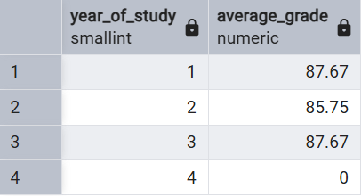
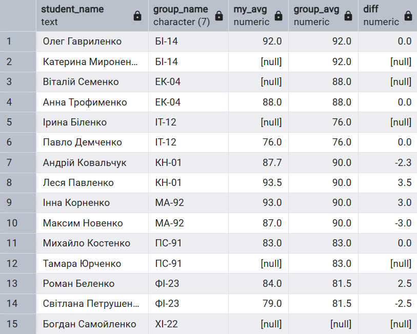
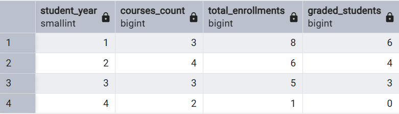
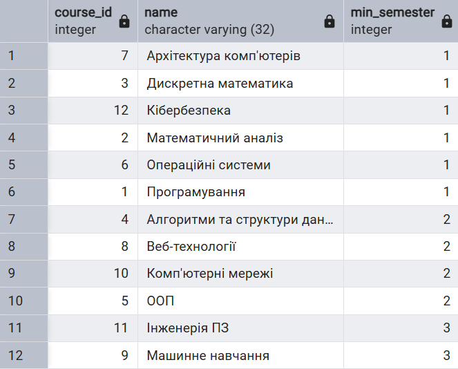
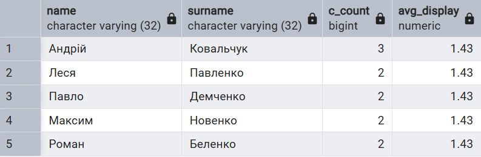
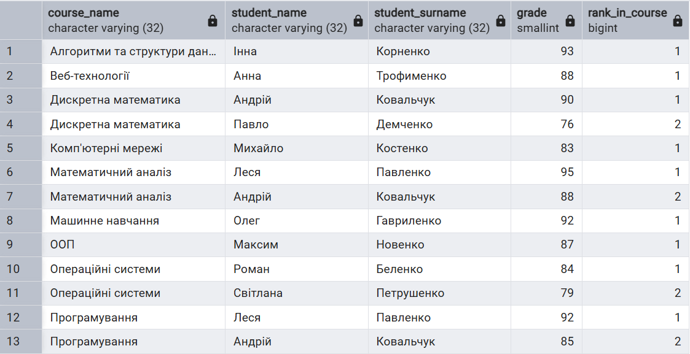

## 1.1 Порахувати успішність студентів залежно від року навчання

#### Реалізація:

- Використано `LEFT JOIN` між таблицями `course` та `enrolment`, щоб врахувати навіть ті роки навчання, на яких студенти ще не отримали жодної оцінки.
- Функція `COALESCE` замінює можливі значення `NULL` на 0 для коректного відображення статистики.
- Результати заокруглені до 2 знаків після коми.

#### Результат виконання:

## 1.2 Для ожного з студентів знайти його середній бал у порівнянні з середнім балом по групі

- Використано CTE через конструкцію `WITH` для попереднього розрахунку статистики.
- `student_stats`: Розраховує середній бал кожного студента.
- `group_stats`: Розраховує загальний середній бал для кожної групи.
- Обчислюване поле `diff` показує відхилення результатів студента від середнього по групі.
- Застосовано `LEFT JOIN`, щоб у списку залишилися студенти навіть без оцінок (у такому разі бали будуть порожніми, але студент не зникне зі звіту).

#### Результат виконання:

## 1.3 Порахувати статистику записів на курси для кожного року навчання

#### Реалізація:

- `COUNT(DISTINCT c.course_id)` дозволяє точно порахувати кількість унікальних дисциплін на кожному році навчання.
- Конструкція `FILTER (WHERE ...)` дозволяє порахувати кількість студентів з оцінками окремо від загальної кількості записів у межах одного запиту.
- Звіт охоплює всі роки навчання завдяки поєднанню course та enrolment через `LEFT JOIN`.

#### Результат виконання:

## 2.1 Для кожного курсу знайти в якому мінімальному семестрі він може читатись

#### Реалізація:

- Використано рекурсивний підзапит `(WITH RECURSIVE)`.
- Базовий блок: вибір курсів, у яких немає пререквізитів `(NOT EXISTS)`. Їм присвоюється 1-й семестр.
- Рекурсивний блок: Додавання +1 до номера семестру для кожного наступного курсу в ланцюжку залежностей.
- `MAX(min_semester)`: Оскільки один курс може мати кілька пререквізитів, обирається максимальне значення, що гарантує виконання всіх попередніх вимог.

#### Результат виконання:

## 2.2 Знайти всіх студентів, які записані на більше курсів ніж в середньому студенти

#### Реалізація:

- `student_counts`: CTE для рахування кількості записів для кожного студента.
- `avg_val`: СТЕ розраховує єдине середнє число по всьому університету.
- У блоці `WHERE` порівняння йде з неокругленим числом, щоб не втратити студентів через передчасне округлення.
- Функція `ROUND` застосовується лише в `SELECT` для відображення результату.

#### Результат виконання:

## 2.3 Знайти топ-3 студенти у кожному курсі за отриманими балами

#### Реалізація:

- Використано віконну функцію `DENSE_RANK()`.
- `PARTITION BY c.course_id` розділяє розрахунок рейтингу окремо для кожного курсу.
- `NULLS LAST` гарантує, що студенти без оцінок не потраплять у топ рейтингу.
- Зовнішній запит фільтрує всіх, хто не потрапив у трійку лідерів (`rank_in_course <= 3`).

#### Результат виконання:

