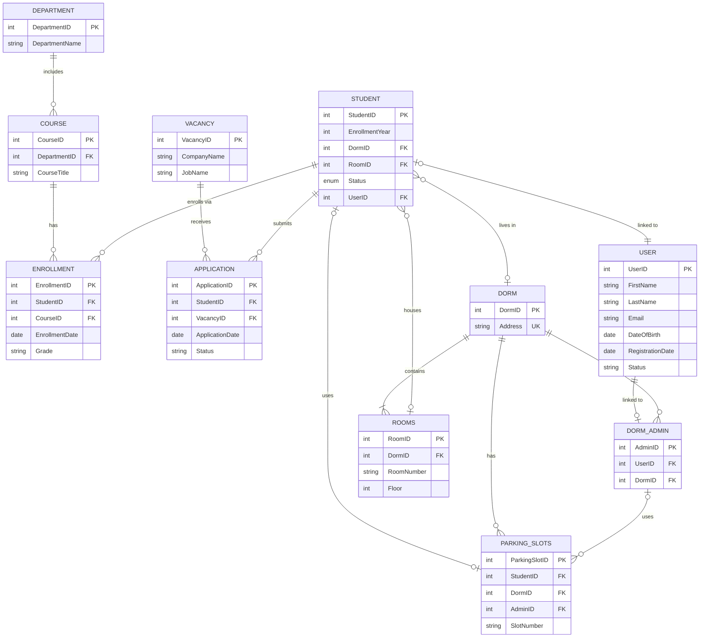

```mermaid
erDiagram
    DEPARTMENT ||--o{ COURSE : "includes"
    COURSE ||--o{ ENROLLMENT : "has"
    STUDENT ||--o{ ENROLLMENT : "enrolls via"
    VACANCY ||--o{ APPLICATION : "receives"
    STUDENT ||--o{ APPLICATION : "submits"
    STUDENT |o--|| USER : "linked to"
    USER ||--o| DORM_ADMIN : "linked to"
    STUDENT }o--o| DORM : "lives in"
    ROOMS |o--o{ STUDENT : "houses"
    DORM ||--|{ ROOMS : "contains"
    STUDENT |o--o| PARKING_SLOTS : "uses"
    DORM ||--o{ PARKING_SLOTS : "has"
    DORM_ADMIN |o--o{ PARKING_SLOTS : "uses"
    DORM ||--O{ DORM_ADMIN : "managed by"

    DEPARTMENT {
        int DepartmentID PK
        string DepartmentName
    }

    COURSE {
        int CourseID PK
        int DepartmentID FK
        string CourseTitle
    }

    ENROLLMENT {
        int EnrollmentID PK
        int StudentID FK
        int CourseID FK
        date EnrollmentDate
        string Grade
    }

    VACANCY {
        int VacancyID PK
        string CompanyName
        string JobName
    }

    APPLICATION {
        int ApplicationID PK
        int StudentID FK
        int VacancyID FK
        date ApplicationDate
        string Status
    }

    STUDENT {
        int StudentID PK
        int EnrollmentYear
        int DormID FK
        int RoomID FK
        enum Status
        int UserID FK
    }

    DORM_ADMIN {
        int AdminID PK
        int UserID FK
        int DormID FK
    }

    DORM {
        int DormID PK
        string Address UK
    }

    ROOMS {
        int RoomID PK
        int DormID FK
        string RoomNumber
        int Floor
    }

    PARKING_SLOTS {
        int ParkingSlotID PK
        int StudentID FK
        int DormID FK
        int AdminID FK
        string SlotNumber
    }

    USER {
        int UserID PK
        string FirstName
        string LastName
        string Email
        date DateOfBirth
        date RegistrationDate
        string Status
    }
```
