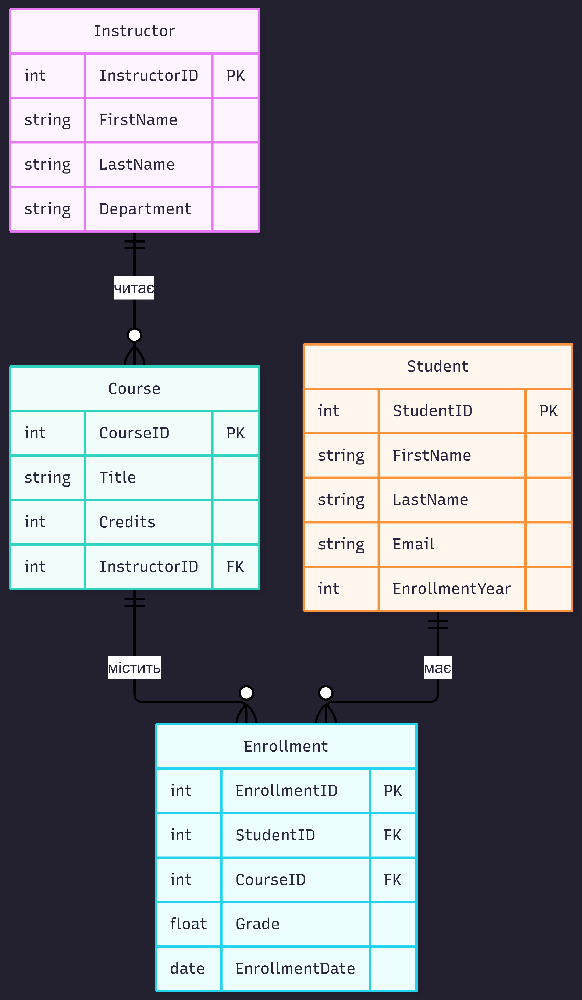

# Лабораторна робота №1: Збір вимог та розробка схеми ER

### Навігація
* [Детальні вимоги та правила](requirements.md)
* [Опис сутностей та атрибутів](entities.md)

---

### Короткий огляд
У цій роботі ми проаналізували предметну область університету, сформулювали основні бізнес-правила для реєстрації студентів і підготували концептуальну схему майбутньої бази даних.

### ER-діаграма

### Склад команди
* Вкажіть тут прізвища та імена учасників вашої групи :)