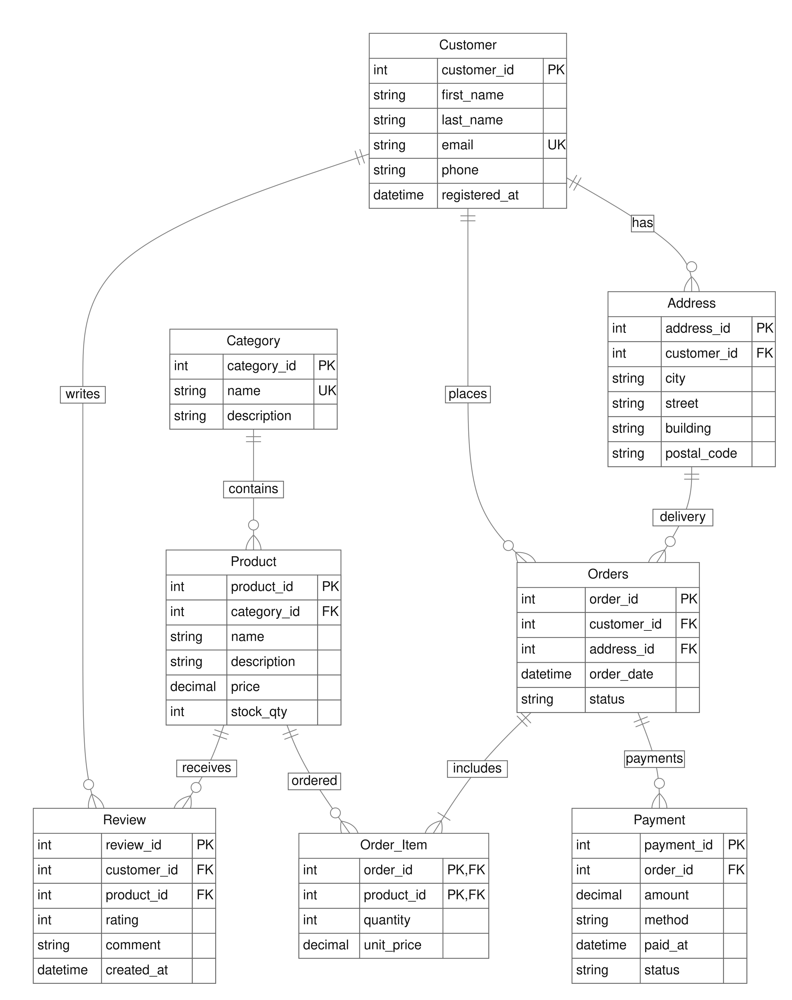

## Лабораторна робота 1 - Збір вимог та розробка схеми ER

## Тема:  Інтернет-магазин

## Виконали:
Брижниченко Злата Володимирівна, ІМ-51
Дмитрієнко Вікторія Андріївна, ІМ-51
Бескровна Олександра Вікторівна, ІМ-51

## Мета роботи:
Визначити вимоги до даних інтернет-магазину,виділити сутності та атрибути,встановити зв’язки між ними й побудувати ER-модель для подальшого проєктування бази даних.

## 1. Короткий виклад вимог
Призначення та потреби зацікавлених сторін
Система зберігає дані про клієнтів, адреси доставки, категорії, товари, замовлення, платежі та відгуки інтернет-магазину.
Клієнту потрібно переглядати товари, оформлювати замовлення, обирати власну адресу доставки, відстежувати стан замовлення та залишати відгуки. Менеджеру магазину потрібно вести каталог, оновлювати ціни й залишки, обробляти замовлення та перевіряти оплату.

## Функціональні вимоги
1.	Реєструвати клієнтів і зберігати кілька адрес кожного клієнта.
2.	Вести каталог товарів за категоріями та облік складських залишків.
3.	Створювати замовлення з позиціями, кількістю і ціною на момент оформлення; зберігати історію та статуси замовлень.
4.	Фіксувати платежі, зокрема часткові оплати та невдалі спроби.
5.	Зберігати оцінки й коментарі клієнтів до товарів.

## Дані для зберігання
Для клієнта потрібні ім’я, прізвище, email, телефон і дата реєстрації; для адреси — місто, вулиця, будинок та індекс. Каталог містить назви й описи категорій та товарів, ціни й залишки. Замовлення містить клієнта, адресу, дату, статус і позиції. Платіж містить замовлення, суму, спосіб, статус та час успішної оплати. Відгук містить автора, товар, оцінку, коментар і дату.

## Бізнес правила
1.	Email клієнта унікальний.
2.	Клієнт може мати кілька адрес, а замовлення прив'язане до однієї адреси доставки.
3.	Товар належить рівно одній категорії.
4.	Замовлення містить щонайменше одну позицію; кількість у позиції ≥ 1.
5.	Ціна товару на момент замовлення зберігається в позиції замовлення, бо ціна в каталозі може змінитися.
6.	Оцінка у відгуку лежить у діапазоні 1–5.
7.	Один клієнт може залишити не більше одного відгуку на один товар.
8.	Кількість товару на складі не може бути від'ємною.
9.	Статус замовлення: new, paid, shipped, delivered, cancelled.
10.	Назва категорії унікальна; ціна товару та ціна в позиції замовлення більші за нуль.
11.	Адреса доставки має належати клієнту, який оформлює замовлення.
12.	Один товар зазначається в замовленні лише один раз: повторне додавання збільшує кількість у позиції.
13.	Кожен платіж стосується одного замовлення та має суму більшу за нуль. Неуспішні платежі не враховуються в сумі оплати.
14.	Замовлення переходить у paid після повної оплати: сума успішних платежів дорівнює вартості замовлення.

## ER-діаграма 

## 3. Сутності та атрибути
1. **Customer**
Первинний ключ: customer_id. Атрибути: first_name, last_name, email, phone, registered_at.
Обмеження: email унікальний, NOT NULL.
2. **Address**
Первинний ключ: address_id. Атрибути: customer_id (FK), city, street, building, postal_code.
Обмеження: належить одному клієнту.
3. **Category**
Первинний ключ: category_id. Атрибути: name, description.
Обмеження: name унікальне.
4. **Product**
Первинний ключ: product_id. Атрибути: category_id (FK), name, description, price, stock_qty.
Обмеження: price > 0, stock_qty ≥ 0.
5. **Orders**
Первинний ключ: order_id. Атрибути: customer_id (FK), address_id (FK), order_date, status.
Обмеження: status зі списку значень.
6. **Order_Item (асоціативна)**
Первинний ключ: (order_id, product_id). Атрибути: order_id (FK → Orders), product_id (FK → Product), quan-tity, unit_price.
Обмеження: quantity ≥ 1, unit_price > 0.
7. **Payment**
Первинний ключ: payment_id. Атрибути: order_id (FK), amount, method, paid_at, status.
Обмеження: amount > 0.
8. **Review**
Первинний ключ: review_id. Атрибути: customer_id (FK), product_id (FK), rating, comment, created_at.
Обмеження: rating 1–5, пара (customer, product) унікальна.

## Уточнення атрибутів
Основні атрибути обов’язкові. Необов’язкові: phone, description у Category і Product, comment та paid_at для неуспішного платежу. Текстові обов’язкові поля непорожні. Кількість, залишок та оцінка — цілі числа. Грошові суми мають десятковий тип.
Payment.status: pending, successful, failed. Payment.method: card, bank_transfer, cash. paid_at заповнюється для успішного платежу. Для Order_Item первинний ключ складений із двох зовнішніх ключів.

## 4. Опис зв’язків
1. **Customer — Address (1:N).** Клієнт може мати від нуля до багатьох адрес; кожна адреса належить одному клієнту.
2. **Customer — Orders (1:N).** Клієнт може мати від нуля до багатьох замовлень; кожне замовлення належить одному клієнту.
3. **Address — Orders (1:N).** Адреса може використовуватися в багатьох замовленнях або ще не використовуватися; замовлення має одну адресу доставки.
4. **Category — Product (1:N).** Категорія може містити від нуля до багатьох товарів; кожен товар належить одній категорії.
5. **rders — Order_Item (1:N).** Замовлення містить щонайменше одну позицію; кожна позиція належить одному замовленню.
6. **Product — Order_Item (1:N).** Товар може входити до багатьох позицій різних замовлень або не входити до жодної; позиція посилається на один товар.
7. **Orders — Payment (1:N).** Замовлення може мати від нуля до багатьох платежів; кожний платіж стосується одного замовлення.
9. **Customer — Review (1:N).** Клієнт може написати від нуля до багатьох відгуків; кожний відгук має одного автора.
10. **Product — Review (1:N).** Товар може мати від нуля до багатьох відгуків;кожний відгук стосується одного товару.

Зв’язок M:N між Orders і Product розкрито через Order_Item, де зберігаються кількість та ціна. Зв’язок M:N між Customer і Product для оцінювання розкрито через Review, де зберігаються оцінка, коментар і дата.

## Перевірка сценаріїв
Новий клієнт без замовлень і товар без відгуків допустимі. Замовлення з двома товарами представлене одним Orders і двома Order_Item. Повторний товар у тому самому замовленні не створює нову позицію. Зміна Product.price не змінює Order_Item.unit_price. Повторний відгук клієнта на той самий товар забороняє унікальність пари ключів. Кілька платежів одного замовлення представлені окремими Payment.

## 5. Припущення та обмеження
1. Єдина валюта: розрахунки та ціни всіх товарів фіксуються виключно в національній валюті (UAH).
2. Спрощене оформлення: модуль тимчасового кошика не враховується; замовлення формується безпосередньо як готовий набір позицій.
3. Пряме рецензування: будь-який авторизований користувач має можливість залишити відгук на товар без обов’язкової перевірки історії його покупок.
4. Однорівнева каталогізація: товар закріплюється лише за однією категорією, без використання складних підкатегорій чи тегів.
5. Централізований склад: усі товарні запаси обліковуються на єдиному складі, а їхній залишок відображається безпосередньо в атрибуті Product.stock_qty.
6. Динамічне обчислення підсумку: загальна вартість замовлення не дублюється в окремому полі, а розраховується як сума добутків quantity × unit_price для кожної позиції.
7. Фіксована цінова політика: функціонал знижок, акційних купонів та логіка розрахунку вартості доставки перебувають поза межами цієї моделі.
8. Адреси, що використовуються у замовленнях, не перезаписуються. Зміна адреси оформлюється новим записом, щоб зберегти історію доставки.
9. Дані, на які посилаються замовлення, не видаляються. Повернення коштів та окрема сутність доставки перебувають поза межами моделі.

## Висновок
Визначено вимоги до інтернет-магазину та побудовано ER-модель з восьми сутностей. Модель відображає дані про клієнтів, каталог, замовлення, платежі й відгуки.
