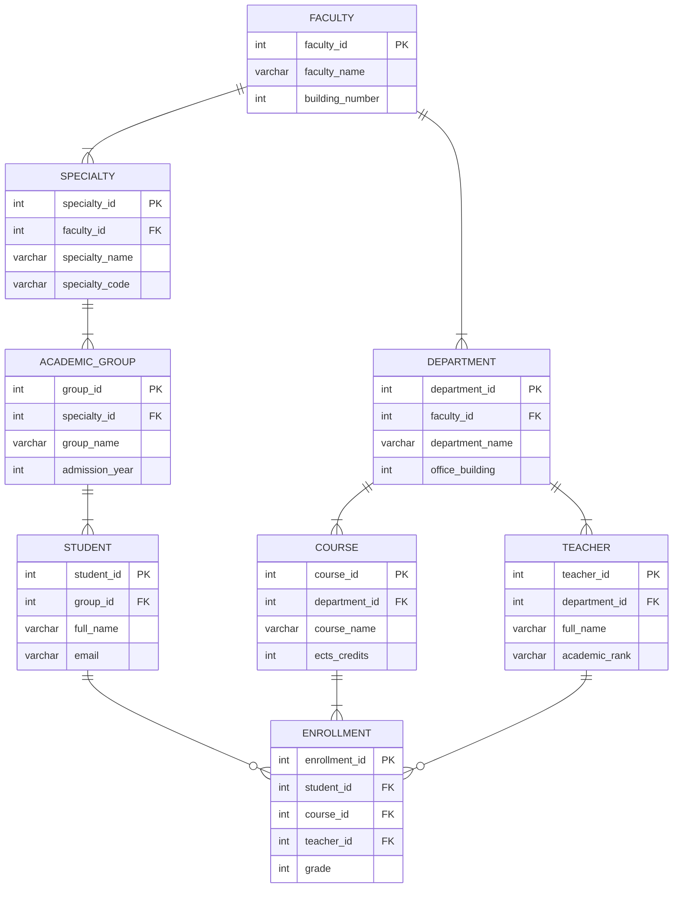

# Лабораторна робота №1. Збір вимог та розробка схеми ER

виконав: Демченко Олександр Стефанович ІМ-51

## Система реєстрації студентів та навчального процесу

## Завдання:

- зібрати вимоги;
- визначити сутності та їх атрибути;
- систематизувати зв'язки між сутностями;
- описати обмеження до системи;

## Вимоги:

Автоматизована система реєстрації студентів повинна вести облік суб'єктів навчального процесу, управляти каталогом дисциплін, обробляти реєстрацію студента на конкретний курс, фіксувати успішність та контролювати правила

Для досягнення цієї мети система має забезпечувати виконання таких функціональних вимог:

- Управління суб'єктами та персональними даними
- Управління навчальними структурами та каталогом курсів
- Реєстрація та формування навчального навантаження
- Облік успішності та оцінювання

Весь перелічений функціонал повинен відповідати таким умовам та обмеженням:

- Забезпечувати цілісність та унікальність даних
- Валідувати правила оцінювання
- Контролювати повторні реєстрації
- Мати змогу легко масштабуватися

## Опис сутностей:

- Факультет:
  - INT | ID факультет | PK;
  - VARCHAR | Назва факультету;
  - INT | Номер корпусу;
- Кафедра:
  - INT | ID кафедри | PK;
  - VARCHAR | Назва кафедри;
  - INT | Кабінет/корпус;
  - INT | ID факультету | FK;
- Спеціальність:
  - INT | ID спеціальності | PK;
  - VARCHAR | Назва спеціальності;
  - VARCHAR | Код спеціальності;
  - INT | ID факультету | FK;
- Навчальна група:
  - INT | ID групи | PK;
  - VARCHAR | Назва групи;
  - INT | Рік вступу;
  - INT | ID спеціальності | FK;
- Студент:
  - INT | ID студента | PK;
  - VARCHAR | ПІБ;
  - VARCHAR | Email (унікальний);
  - INT | ID групи | FK;
- Викладач:
  - INT | ID викладача | PK;
  - VARCHAR | ПІБ;
  - VARCHAR | Вчене звання/посада;
  - INT | ID кафедри | FK;
- Курс/Дисципліна:
  - INT | ID курсу | PK;
  - VARCHAR | Назва дисципліни;
  - INT | Кількість кредитів ECTS;
  - INT | ID кафедри | FK;
- Реєстрація на курс(асоціативна сутність для зв’язку «Багато до багатьох» між студентом і курсом):
  - INT | ID зарахування | PK;
  - INT | ID студента | FK;
  - INT | ID курсу | FK;
  - INT | ID викладача | FK;
  - INT | Оцінка (від 0 до 100 балів);

## Зв'язки між сутнностями:
- Факультет — Кафедра (1 : N): Один факультет може містити декілька кафедр, але кожна кафедра належить лише одному факультету.
- Факультет — Спеціальність (1 : N): Один факультет може включати декілька спеціальностей, але кожна спеціальність належить лише одному факультету.
- Спеціальність — Навчальна група (1 : N): Одна спеціальність може мати декілька навчальних груп, але кожна група належить лише одній спеціальності.
- Навчальна група — Студент (1 : N): Одна навчальна група може містити декілька студентів, але кожен студент належить лише до однієї навчальної групи.
- Кафедра — Викладач (1 : N): Одна кафедра може мати декілька викладачів, але кожен викладач належить лише до однієї кафедри.
- Кафедра — Курс (1 : N): Одна кафедра може відповідати за декілька навчальних курсів, але кожен курс закріплений за однією кафедрою.
- Студент — Зарахування (1 : N): Один студент може мати декілька зарахувань на різні навчальні курси, але кожне зарахування належить лише одному студенту.
- Курс — Зарахування (1 : N): Один курс може мати багато зарахованих студентів, але кожне зарахування стосується лише одного курсу.
- Викладач — Зарахування (1 : N): Один викладач може бути відповідальним за багато зарахувань студентів на курс, але кожне зарахування пов’язане лише з одним викладачем.

## ER діаграма(mermaid):

## Обмеження та бізнес-правила:

- Унікальність: корпоративні email студентів і викладачів мають бути суворо унікальними
- Валідація балів та кредитів: 
  - підсумкова оцінка за курс має перебувати в діапазоні від 0 до 100 балів
  - кількість кредитів ECTS для курсу повинна бути в межах від 1 до 12
- Ліміти реєстрацій: студент не може зареєструватися на один і той самий курс двічі в рамках одного семестру
- Максимальне навантаження: максимальна сума кредитів за один семестр для одного студента не повинна перевищувати 30 кредитів ECTS
