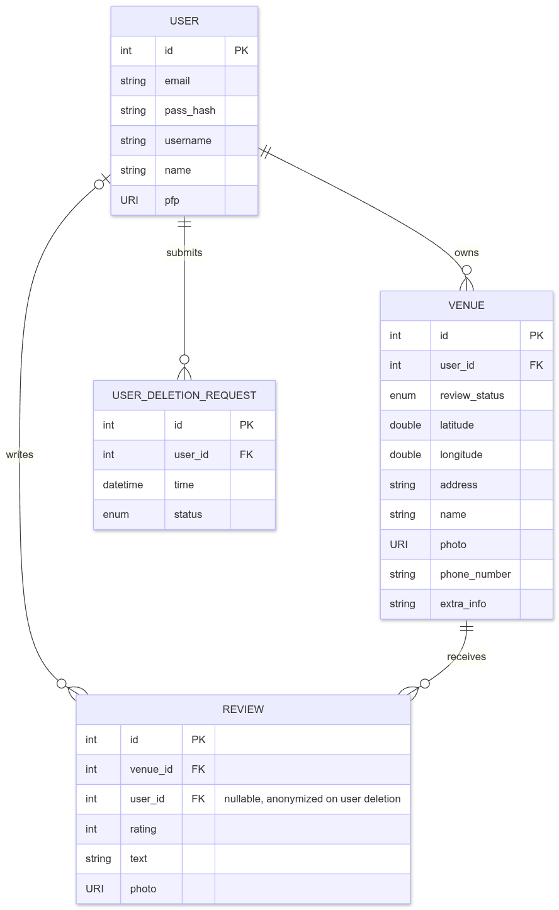

# Shawarmap
## Домен

Shawarmap – платформа для пошуку, огляду та оцінки закладів, які продають шаурму, буріто, донер-кебаб тощо.

## Короткий виклад вимог

### Потреби зацікавлених сторін

Має бути можливість створити профіль, мати інтерактивну карту на основі карт провайдера (наприклад Google Maps, Apple Maps, OpenStreetMap тощо), де можна вибрати бажану локацію, глянути інформацію про неї та відгуки з можливістю залишити рейтинг, коментар та фото.

### Дані для зберігання

Профіль користувача, мітки на карті для закладів, інформація про заклад (адреса, фото, номер телефону, додаткова інформація про заклад).

### Бізнес-правила

* У користувача повинна бути можливість редагувати та видаляти відгуки.  
* Користувач може додавати нові локації на мапу, та локації потребують розгляду.  
* Користувач має можливість видалити обліковий запис, що анонімізує профіль але залишає похідні відгуки та видаляє заклади.  
* Оцінка у відгуках є значенням від 1 до 10, та презентована в вигляді 5 зірок, де можна залишити половинку зірки.

## Діаграма ER

## Список сутностей

* User  
  * int id PK  
  * string email  
  * string pass\_hash  
  * string username  
  * string name  
  * URI pfp  
* Venue  
  * int id PK  
  * int user\_id FK  
  * enum review\_status  
  * double latitude  
  * double longitude  
  * string address  
  * string name  
  * URI photo  
  * string phone\_number  
  * string extra\_info  
* Review  
  * int id PK  
  * int venue\_id FK  
  * int user\_id FK  
  * int rating  
  * string text  
  * URI photo  
* UserDeletionRequest  
  * int id PK  
  * int user\_id FK  
  * datetime time  
  * enum status

## Список зв’язків

* User володіє нулем, одним або кількома Venue. Venue належить саме одному User.  
* User залишає нуль, один або кілька Review. Review залишає саме один User, за винятком випадків, коли цей User видалив свій обліковий запис – у такому разі відгук залишається, але автор є анонімним.  
* Venue отримує нуль, один або кілька Review. Review стосується саме одного Venue.  
* User надсилає нуль, один або кілька UserDeletionRequest. UserDeletionRequest належить саме одному User.

## Припущення та обмеження

* Окреме цифрове меню не передбачається проєктом  
* Автентифікація користувача відбувається без участі сторонніх постачальників автентифікації OAuth  
* Координати на локації зберігаються зі сторони БД, не провайдера карт  
* Фото зберігаються в форматі посилань в сховищі до них  
* Єдина підтримувана країна \- Україна  
* Відгуки не обов’язкові для закладу  
* Користувач не може залишати коментарі під відгуками інших користувачів  
* Кожен заклад має лише одного власника, та право редагування та модерації інформації закладу та його відгуки має власник  
* Розгляд нових закладів відбувається зі сторони розробника, адже модерація потребуватиме окремої ролі  
* Проєкт не враховує графік роботи закладів  
* Кожен Review та Venue має лише одне фото для закріплення