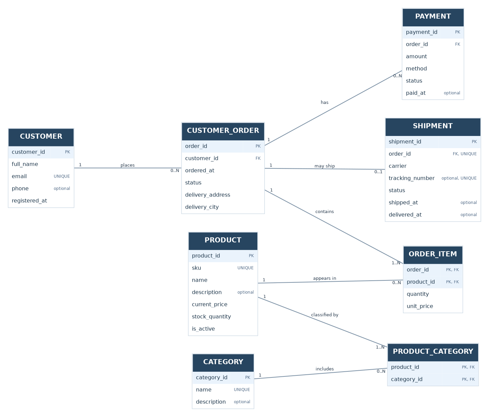

# Лабораторна робота №1. Збір вимог та розробка ER-діаграми

**Дисципліна:** Бази даних  
**Предметна область:** Інтернет-магазин комп'ютерних комплектуючих (PC Components Store)  
**Виконала:** Мосендз Белла 
**Група:** ІМ-о51

## 1. Мета роботи

Зібрати й систематизувати вимоги до інформаційної системи, виділити її сутності та атрибути, встановити зв'язки і кардинальності та побудувати концептуальну ER-діаграму, яка надалі використовуватиметься для створення схеми PostgreSQL.

## 2. Опис предметної області та зацікавлені сторони

PC Components Store — навчальна модель невеликого інтернет-магазину, який продає процесори, материнські плати, відеокарти, оперативну пам'ять та інші комплектуючі. Система повинна зберігати каталог, дані зареєстрованих клієнтів, історію замовлень, оплат і доставок.

| Зацікавлена сторона | Потреба |
| --- | --- |
| Покупець | Переглянути товари, сформувати замовлення, бачити його стан. |
| Менеджер магазину | Перевірити замовлення, оплату і доставку. |
| Контент-менеджер | Оновлювати товари, ціни, залишки та категорії. |
| Власник магазину | Оцінювати обсяг продажів, популярні товари та активність клієнтів. |

### 2.1. Модельний збір вимог

Нижче наведено **змодельований brainstorm** із типовими запитаннями до представника магазину. Це навчальні припущення, а не запис реального інтерв'ю.

| Питання аналітика | Узгоджена для моделі відповідь |
| --- | --- |
| Чи потрібна реєстрація для покупки? | Так, кожне замовлення належить одному зареєстрованому клієнту. |
| Чи може товар мати кілька категорій? | Так, наприклад SSD може входити до «Накопичувачів» і «Акційних товарів». |
| Чи треба зберігати старі ціни? | Так, вартість позиції фіксується в момент оформлення замовлення. |
| Чи можливі кілька оплат? | Так, одне замовлення може мати кілька спроб або часткових оплат. |
| Чи може бути кілька доставок одного замовлення? | У спрощеній моделі — ні, не більше однієї доставки. |
| Які звіти потрібні? | Продажі за датами, товарами і категоріями, кількість замовлень клієнтів. |

## 3. Функціональні вимоги

- **FR-01.** Реєструвати клієнтів і зберігати контактну інформацію.
- **FR-02.** Зберігати товари, їхні артикули, ціни, доступність і залишки.
- **FR-03.** Створювати та редагувати категорії і відносити один товар до декількох категорій.
- **FR-04.** Створювати замовлення для зареєстрованого клієнта.
- **FR-05.** Зберігати склад замовлення: товари, кількість і ціну на момент покупки.
- **FR-06.** Обліковувати платежі, спосіб, суму і стан оплати.
- **FR-07.** Зберігати інформацію про доставку, перевізника й номер відстеження.
- **FR-08.** Переглядати історію замовлень конкретного клієнта.
- **FR-09.** Формувати аналітику продажів за товарами, категоріями та періодами.

## 4. Визначення сутностей та атрибутів

**Позначення:** `PK` — первинний ключ; `FK` — зовнішній ключ, який буде реалізовано у PostgreSQL; `UNIQUE` — унікальне значення. За відсутності позначки `optional` поле вважаємо обов'язковим.

### 4.1. CUSTOMER — Клієнт

- `customer_id` **PK** — унікальний ідентифікатор клієнта.
- `full_name` — ім'я та прізвище клієнта.
- `email` **UNIQUE** — електронна адреса для зв'язку і входу.
- `phone` — необов'язковий контактний номер.
- `registered_at` — дата й час реєстрації.

### 4.2. CATEGORY — Категорія

- `category_id` **PK** — ідентифікатор категорії.
- `name` **UNIQUE** — її назва.
- `description` — необов'язковий опис.

### 4.3. PRODUCT — Товар

- `product_id` **PK** — ідентифікатор товару.
- `sku` **UNIQUE** — артикул товару.
- `name` — назва.
- `description` — необов'язкові характеристики чи опис.
- `current_price` — поточна ціна у гривнях.
- `stock_quantity` — кількість одиниць на складі.
- `is_active` — ознака, чи доступний товар у каталозі.

### 4.4. PRODUCT_CATEGORY — Належність товару до категорії

- `product_id` **PK, FK** — посилання на товар.
- `category_id` **PK, FK** — посилання на категорію.
- Разом ці два поля утворюють **складений первинний ключ**, тому дублювання пари неможливе.

### 4.5. CUSTOMER_ORDER — Замовлення

- `order_id` **PK** — ідентифікатор замовлення.
- `customer_id` **FK** — клієнт, що оформив замовлення.
- `ordered_at` — дата й час оформлення.
- `status` — поточний стан замовлення.
- `delivery_address` — адреса доставки, зафіксована для конкретного замовлення.
- `delivery_city` — місто доставки.

### 4.6. ORDER_ITEM — Позиція замовлення

- `order_id` **PK, FK** — замовлення, у якому є позиція.
- `product_id` **PK, FK** — вибраний товар.
- `quantity` — кількість одиниць.
- `unit_price` — ціна однієї одиниці **на момент замовлення**.
- Пара (`order_id`, `product_id`) — **складений PK**: один товар у межах одного замовлення записується однією позицією.

### 4.7. PAYMENT — Платіж

- `payment_id` **PK** — ідентифікатор платежу.
- `order_id` **FK** — замовлення, до якого належить платіж.
- `amount` — сума платежу у гривнях.
- `method` — спосіб оплати (наприклад, картка або банківський переказ).
- `status` — стан платежу (очікується, успішний, невдалий).
- `paid_at` — час успішної оплати; може бути відсутнім для неуспішних/необроблених платежів.

### 4.8. SHIPMENT — Доставка

- `shipment_id` **PK** — ідентифікатор доставки.
- `order_id` **FK, UNIQUE** — замовлення, якому відповідає доставка; унікальність забезпечує максимум одну доставку на замовлення.
- `carrier` — назва служби доставки.
- `tracking_number` **UNIQUE, optional** — необов'язковий номер відстеження.
- `status` — стан доставки.
- `shipped_at` — необов'язкова дата відправлення.
- `delivered_at` — необов'язкова дата вручення.

## 5. Зв'язки та кардинальності

| Зв'язок | Кардинальність | Пояснення |
| --- | --- | --- |
| CUSTOMER → CUSTOMER_ORDER | 1 : 0..N | Один клієнт може не мати замовлень або мати багато. Замовлення належить рівно одному клієнту. |
| CUSTOMER_ORDER → ORDER_ITEM | 1 : 1..N | Замовлення містить мінімум одну позицію; кожна позиція належить одному замовленню. |
| PRODUCT → ORDER_ITEM | 1 : 0..N | Товар може зустрічатися в багатьох замовленнях або ще не продаватися. |
| PRODUCT → PRODUCT_CATEGORY | 1 : 1..N | Товар має належати принаймні одній категорії. |
| CATEGORY → PRODUCT_CATEGORY | 1 : 0..N | Категорія може містити нуль або багато товарів. |
| CUSTOMER_ORDER → PAYMENT | 1 : 0..N | Замовлення може бути ще неоплаченим або мати декілька спроб/часткових оплат. |
| CUSTOMER_ORDER → SHIPMENT | 1 : 0..1 | Замовлення ще може не мати доставки; у цій моделі доставка максимум одна. |

Зв'язок **PRODUCT ↔ CATEGORY** має кардинальність **M:N** і реалізується через `PRODUCT_CATEGORY`. Зв'язок **CUSTOMER_ORDER ↔ PRODUCT** теж **M:N** і реалізується через `ORDER_ITEM`, де додатково зберігаються кількість і історична ціна.

## 6. Концептуальна ER-діаграма

**Пояснення діаграми:** у прямокутниках наведено сутності та їхні атрибути; позначено PK/FK; біля ліній зазначено кардинальність з кожного боку. Варіанти для редагування: [`er_diagram.drawio`](er_diagram.drawio) (diagrams.net)

## 7. Бізнес-правила та обмеження

1. Кожне замовлення належить **одному** зареєстрованому клієнту.
2. Email клієнта, SKU товару й назва категорії повинні бути унікальними.
3. Поточна ціна товару не може бути від'ємною; залишок на складі — ціле невід'ємне число.
4. Кожен товар належить хоча б одній категорії, однак нова категорія може поки бути порожньою.
5. Кожне збережене підтверджене замовлення повинно мати хоча б одну позицію.
6. Кількість у позиції замовлення — додатне ціле число; ціна позиції не може бути від'ємною.
7. Однаковий товар не можна двічі додати до одного замовлення як окремі позиції; натомість змінюється `quantity`.
8. Історична ціна в `ORDER_ITEM.unit_price` **не змінюється** після оновлення `PRODUCT.current_price`.
9. Сума замовлення обчислюється як **Σ(quantity × unit_price)** за його позиціями, а не зберігається окремим повторюваним полем.
10. Кожен платіж має додатну суму; сума **успішних** платежів не повинна перевищувати вартість замовлення.
11. До відправлення замовлення повинно бути повністю оплачене. Одне замовлення має не більше однієї доставки.
12. Дата фактичного вручення не може передувати даті відправлення.
13. Адреса доставки зберігається саме в замовленні, тому зміни контактів клієнта не змінюють історію доставки.

**Примітка про реалізацію:** частину правил (наприклад, мінімум одна позиція при підтвердженні замовлення, перевірка суми декількох платежів, наявність категорії у товару) недостатньо забезпечити простими зовнішніми ключами. У наступних лабораторних для них можуть знадобитися транзакції, додаткові перевірки або тригери.

## 8. Перевірка моделі на практичних сценаріях

### Сценарій А: покупець робить замовлення

1. Створюється (або знаходиться) запис у `CUSTOMER`.
2. Створюється `CUSTOMER_ORDER` із посиланням на клієнта й адресою доставки.
3. У `ORDER_ITEM` додаються, наприклад, процесор і оперативна пам'ять із кількістю та ціною на дату замовлення.
4. Сума покупки обчислюється з рядків `ORDER_ITEM`.
5. Після оплати в `PAYMENT` зберігається успішний платіж, а у `SHIPMENT` може з'явитися інформація про відправлення.

**Результат:** усі потрібні дані представлені на ER-діаграмі.

### Сценарій Б: магазин змінює ціну відеокарти

Менеджер змінює `PRODUCT.current_price`. У вже оформлених замовленнях `ORDER_ITEM.unit_price` залишається попереднім. Це дозволяє правильно підрахувати історичну виручку.

**Результат:** вимога щодо збереження історичних цін виконується.

### Сценарій В: один товар у кількох категоріях

Для одного `PRODUCT` створюються різні пари `product_id/category_id` в `PRODUCT_CATEGORY`, наприклад «Накопичувачі» та «Рекомендовані». Повтор тієї самої пари забороняється складеним PK.

**Результат:** модель підтримує M:N без дублювання самого товару.

### Сценарій Г: звіт про продажі за місяць

Система може об'єднати `CUSTOMER_ORDER`, `ORDER_ITEM` і `PRODUCT`, згрупувати замовлення за місяцем та підрахувати продажі товарів, використовуючи лише дійсні (не скасовані) замовлення.

**Результат:** схема придатна для наступних OLAP-завдань.

## 9. Припущення та межі моделі

- Для лабораторного проєкту використовується **один магазин та один склад**; `stock_quantity` — загальний залишок цього складу.
- Покупка без реєстрації не підтримується.
- Ціни, платежі та суми замовлень задаються у гривнях.
- Кошик до підтвердження замовлення окремо не моделюється.
- Повернення, знижки, податки, промокоди, мультивалютність, часткові відвантаження і резервування товару залишаються за межами першої версії.
- Зміст полів `status` має бути конкретизований у лабораторній №2 при визначенні `CHECK`-обмежень.
- Початкове збереження позицій замовлення має здійснюватися разом зі створенням/підтвердженням замовлення, щоб бізнес-правило про мінімум одну позицію не порушувалось.

## 10. Висновок

Проаналізовано вимоги до інтернет-магазину комп'ютерних комплектуючих. Визначено 8 сутностей, їхні атрибути, первинні ключі, зв'язки та обмеження. Побудовано ER-діаграму з двома асоціативними сутностями. Перевірено типові сценарії створення замовлення, зміни ціни, категоризації товарів та аналізу продажів. Модель можна використати як основу для реляційної схеми PostgreSQL у лабораторній роботі №2.
