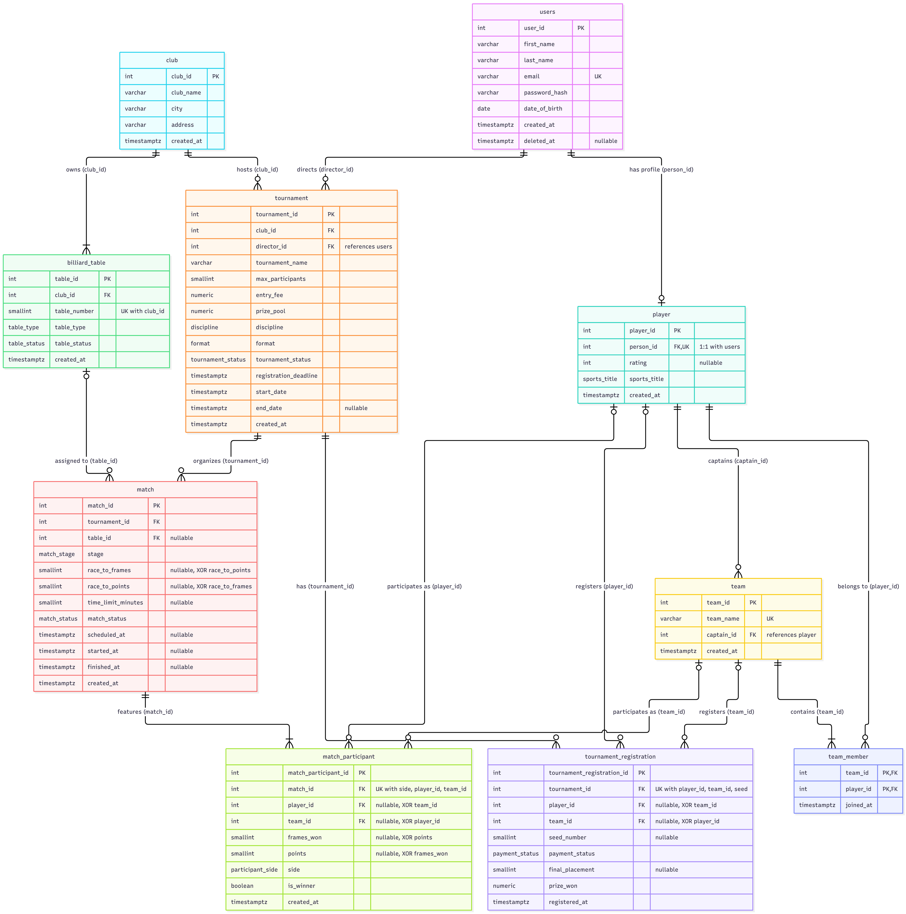
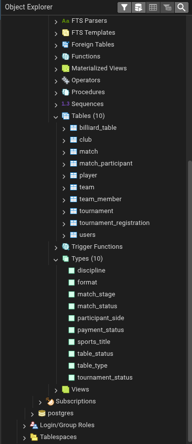
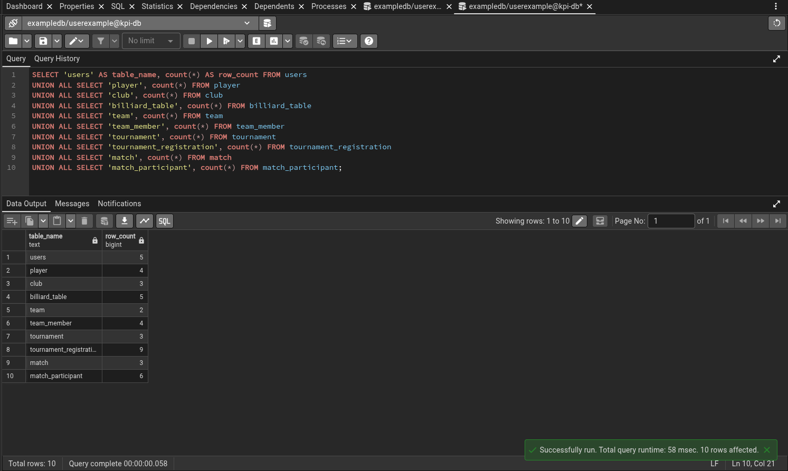
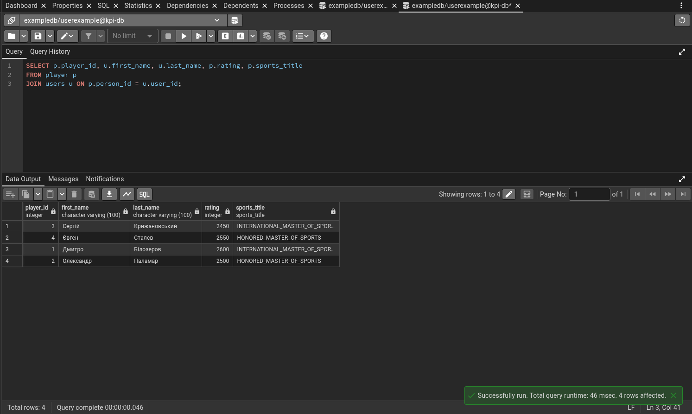

# Звіт з Лабораторної роботи №2

**Дисципліна:** Бази даних  
**Тема:** Перетворення ER-діаграми на реляційну схему PostgreSQL (SQL DDL)  
**Предметна область:** CRM-система турнірів з більярдного спорту (Billiards Tournament CRM)  
**СУБД:** PostgreSQL 18.x (Docker) | **Клієнт:** pgAdmin 4  

---

## 1. Мета та завдання лабораторної роботи

**Мета роботи:** практичне засвоєння методів проектування та реалізації фізичних схем реляційних баз даних за допомогою мови SQL DDL у середовищі PostgreSQL. Трансляція концептуальної ER-моделі у реляційну схему із суворим дотриманням посилальної цілісності, правил нормалізації (3NF) та бізнес-обмежень предметної області.

**Основні завдання:**
1. Сформувати SQL DDL-скрипт створення користувацьких перелічуваних типів (`ENUM`) та реляційних таблиць.
2. Визначити первинні ключі (`PRIMARY KEY`, зокрема складені для зв'язків M:N), зовнішні ключі (`FOREIGN KEY`) із коректними політиками посилальної цілісності (`ON DELETE CASCADE / RESTRICT / SET NULL`).
3. Сформулювати змістовні обмеження атрибутів (`NOT NULL`, `UNIQUE`, `CHECK`, `DEFAULT`).
4. Оптимізувати швидкість виконання операцій з'єднання (`JOIN`) та каскадного видалення через створення індексів на стовпцях зовнішніх ключів.
5. Розробити скрипт заповнення бази узгодженими даними (`INSERT INTO`, щонайменше 3–5 рядків на кожну таблицю) із дотриманням ієрархії залежностей.
6. Верифікувати працездатність схеми засобами СУБД PostgreSQL та графічного інтерфейсу pgAdmin 4.

---

## 2. Оновлена фізична реляційна схема (Physical Schema Diagram)

У процесі фізичної реалізації концептуальну модель з Лабораторної роботи №1 було деталізовано та адаптовано до реляційної моделі даних СУБД PostgreSQL.

### Ключові зміни та вдосконалення порівняно з концептуальною моделлю:
* **Фізичне розкриття зв'язку M:N:** Відношення `Team }o--|{ Player` фізично реалізовано через проміжну таблицю `team_member` зі складеним первинним ключем `PRIMARY KEY (team_id, player_id)`.
* **Явний капітан команди:** Таблиця `team` отримала окремий зовнішній ключ `captain_id FK`, що вказує на лідера команди (`player_id`).
* **Диференціація формату гри в матчах:** Замість абстрактного поля `race_to` реалізовано два взаємовиключні стовпці `race_to_frames` (для пулу, снукеру та піраміди) і `race_to_points` (для карамболю/straight pool), що контролюється обмеженням `num_nonnulls(...) = 1`.
* **Деталізація рахунку учасника:** У сутності `match_participant` введено стовпці `frames_won`, `points`, типізовану позицію за столом `side participant_side` та прапорець перемоги `is_winner`.
* **Аудит та життєвий цикл:** Додано системні мітки часу `created_at` (з `DEFAULT CURRENT_TIMESTAMP`) та поле м'якого видалення `deleted_at` у таблицю користувачів.

---

## 3. Специфікація таблиць та типів даних (Data Dictionary)

### 3.1. Користувацькі перелічувані типи даних (ENUM)
Створено 10 типів `ENUM`:
* `sports_title`: `'NONE'`, `'THIRD_CATEGORY'`, `'SECOND_CATEGORY'`, `'FIRST_CATEGORY'`, `'CANDIDATE_MASTER_OF_SPORTS'`, `'MASTER_OF_SPORTS'`, `'INTERNATIONAL_MASTER_OF_SPORTS'`, `'HONORED_MASTER_OF_SPORTS'`.
* `table_type`: `'PYRAMID_12FT'`, `'PYRAMID_10FT'`, `'POOL_9FT'`, `'POOL_8FT'`, `'SNOOKER_12FT'`, `'CARAMBOLE'`.
* `table_status`: `'AVAILABLE'`, `'OCCUPIED'`, `'RESERVED'`, `'MAINTENANCE'`.
* `discipline`: `'POOL_8_BALL'`, `'POOL_9_BALL'`, `'SNOOKER'`, `'FREE_PYRAMID'`, `'COMBINED_PYRAMID'`, `'DYNAMIC_PYRAMID'`, `'CARAMBOLE'`.
* `format`: `'SINGLE_ELIMINATION'`, `'DOUBLE_ELIMINATION'`, `'ROUND_ROBIN'`.
* `tournament_status`: `'ANNOUNCED'`, `'REGISTRATION_OPEN'`, `'ONGOING'`, `'FINISHED'`.
* `match_stage`: `'QUALIFICATION'`, `'GROUP_STAGE'`, `'ROUND_OF_64'`, `'ROUND_OF_32'`, `'ROUND_OF_16'`, `'QUARTERFINAL'`, `'SEMIFINAL'`, `'FINAL'`, `'THIRD_PLACE'`.
* `match_status`: `'SCHEDULED'`, `'IN_PROGRESS'`, `'COMPLETED'`, `'WALKOVER'`, `'CANCELLED'`.
* `payment_status`: `'PENDING'`, `'PAID'`, `'WAIVED'`, `'REFUNDED'`.
* `participant_side`: `'SIDE_1'`, `'SIDE_2'`, `'SIDE_3'`, `'SIDE_4'`.

### 3.2. Детальний опис реляційних таблиць

1. **`users`**: Первинний ключ `user_id INT GENERATED ALWAYS AS IDENTITY PK`. Стовпці `first_name`, `last_name`, `email UNIQUE`, `password_hash`, `date_of_birth`, `created_at`, `deleted_at`.
2. **`player`**: Первинний ключ `player_id PK`. Зовнішній ключ `person_id UNIQUE FK` $\rightarrow$ `users(user_id) ON DELETE CASCADE`. Стовпці `rating`, `sports_title`, `created_at`.
3. **`club`**: Первинний ключ `club_id PK`. Стовпці `club_name`, `city`, `address`, `created_at`.
4. **`billiard_table`**: Первинний ключ `table_id PK`. Зовнішній ключ `club_id FK` $\rightarrow$ `club(club_id) ON DELETE CASCADE`. Стовпці `table_number`, `table_type`, `table_status`, `created_at`.
5. **`tournament`**: Первинний ключ `tournament_id PK`. Зовнішні ключі `club_id FK` $\rightarrow$ `club(club_id) ON DELETE RESTRICT`, `director_id FK` $\rightarrow$ `users(user_id) ON DELETE RESTRICT`. Стовпці `tournament_name`, `max_participants`, `entry_fee`, `prize_pool`, `discipline`, `format`, `tournament_status`, `registration_deadline`, `start_date`, `end_date`, `created_at`.
6. **`team`**: Первинний ключ `team_id PK`. Стовпці `team_name UNIQUE`, `captain_id FK` $\rightarrow$ `player(player_id) ON DELETE RESTRICT`, `created_at`.
7. **`team_member`**: Складений первинний ключ `PRIMARY KEY (team_id, player_id)`. Зовнішні ключі `team_id FK` $\rightarrow$ `team(team_id) ON DELETE CASCADE`, `player_id FK` $\rightarrow$ `player(player_id) ON DELETE CASCADE`. Стовпець `joined_at`.
8. **`tournament_registration`**: Первинний ключ `tournament_registration_id PK`. Зовнішні ключі `tournament_id FK` $\rightarrow$ `tournament(tournament_id) ON DELETE CASCADE`, `player_id FK` $\rightarrow$ `player(player_id) ON DELETE RESTRICT`, `team_id FK` $\rightarrow$ `team(team_id) ON DELETE RESTRICT`. Стовпці `seed_number`, `payment_status`, `final_placement`, `prize_won`, `registered_at`.
9. **`match`**: Первинний ключ `match_id PK`. Зовнішні ключі `tournament_id FK` $\rightarrow$ `tournament(tournament_id) ON DELETE CASCADE`, `table_id FK` $\rightarrow$ `billiard_table(table_id) ON DELETE SET NULL`. Стовпці `stage`, `race_to_frames`, `race_to_points`, `time_limit_minutes`, `match_status`, `scheduled_at`, `started_at`, `finished_at`, `created_at`.
10. **`match_participant`**: Первинний ключ `match_participant_id PK`. Зовнішні ключі `match_id FK` $\rightarrow$ `match(match_id) ON DELETE CASCADE`, `player_id FK` $\rightarrow$ `player(player_id) ON DELETE RESTRICT`, `team_id FK` $\rightarrow$ `team(team_id) ON DELETE RESTRICT`. Стовпці `frames_won`, `points`, `side`, `is_winner`, `created_at`.

---

## 4. Обґрунтування обмежень цілісності (Constraints & Business Logic)

* **Поліморфізм (XOR):** У `tournament_registration` та `match_participant` взаємне виключення гарантується правилом `num_nonnulls(player_id, team_id) = 1`.
* **Запобігання "самогрі":** У таблиці `match_participant` діють обмеження `UNIQUE (match_id, side)`, `UNIQUE (match_id, player_id)`, `UNIQUE (match_id, team_id)`.
* **Єдиний переможець:** Частковий унікальний індекс `CREATE UNIQUE INDEX uq_match_single_winner ON match_participant (match_id) WHERE is_winner = true`.
* **Життєвий цикл матчів:** `chk_match_lifecycle_dates` узгоджує статус матчу (`SCHEDULED`, `IN_PROGRESS`, `COMPLETED`) із часовими мітками `started_at` та `finished_at`.
* **Фінанси та призові:** `entry_fee >= 0`, `prize_pool >= 0`, `prize_won >= 0`, а також `prize_won = 0 OR final_placement IS NOT NULL`.

---

## 5. Опис тестових даних (Seed Data)

У скрипті `seed_data.sql` використано реальні біографічні дані зірок більярдного спорту:
* **Дмитро Білозеров** (МСМК — `INTERNATIONAL_MASTER_OF_SPORTS`, рейтинг 2600);
* **Олександр Паламар** (ЗМС — `HONORED_MASTER_OF_SPORTS`, рейтинг 2500);
* **Сергій Крижановський** (МСМК — `INTERNATIONAL_MASTER_OF_SPORTS`, рейтинг 2450);
* **Євген Сталєв** (ЗМС — `HONORED_MASTER_OF_SPORTS`, рейтинг 2550);
* **Андрій Шевченко** — організатор турнірів (директор).

Також сформовано 3 клуби, 5 столів, 2 команди зі складами, 3 турніри різних форматів, 9 реєстрацій та повну турнірну сітку матчів.

---

## 6. Результати верифікації в СУБД PostgreSQL / pgAdmin 4

### 6.1. Дерево об'єктів схеми (Object Explorer)

### 6.2. Зведена верифікація заповнення таблиць

### 6.3. Вибірка зв'язаних даних (Спортивні картки гравців)

---

## 7. Висновки

У ході виконання лабораторної роботи концептуальну ER-модель турнірної CRM-системи успішно перетворено на фізичну реляційну схему мовою SQL DDL для СУБД PostgreSQL 18. Всі 10 таблиць задовольняють вимогам 3NF, містять вичерпний набір декларативних обмежень цілісності та перевірені за допомогою тестових даних у середовищі pgAdmin 4.
