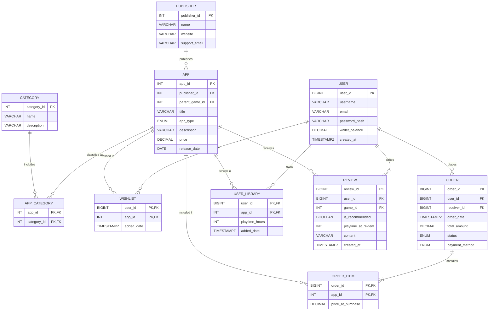

```mermaid
erDiagram
    USER {
        BIGINT user_id PK
        VARCHAR username
        VARCHAR email
        VARCHAR password_hash
        DECIMAL wallet_balance
        TIMESTAMPZ created_at
    }

    PUBLISHER {
        INT publisher_id PK
        VARCHAR name
        VARCHAR website
        VARCHAR support_email
    }

    APP {
        INT app_id PK
        INT publisher_id FK
        INT parent_game_id FK
        VARCHAR title
        ENUM app_type
        VARCHAR description
        DECIMAL price
        DATE release_date
    }

    CATEGORY {
        INT category_id PK
        VARCHAR name
        VARCHAR description
    }

    APP_CATEGORY {
        INT app_id PK,FK
        INT category_id PK,FK
    }

    WISHLIST {
        BIGINT user_id PK,FK
        INT app_id PK,FK
        TIMESTAMPZ added_date
    }

    ORDER {
        BIGINT order_id PK
        BIGINT user_id FK
        BIGINT receiver_id FK
        TIMESTAMPZ order_date
        DECIMAL total_amount
        ENUM status
        ENUM payment_method
    }

    ORDER_ITEM {
        BIGINT order_id PK,FK
        INT app_id PK,FK
        DECIMAL price_at_purchase
    }

    USER_LIBRARY {
        BIGINT user_id PK,FK
        INT app_id PK,FK
        INT playtime_hours
        TIMESTAMPZ added_date
    }

    REVIEW {
        BIGINT review_id PK
        BIGINT user_id FK
        INT game_id FK
        BOOLEAN is_recommended
        INT playtime_at_review
        VARCHAR content
        TIMESTAMPZ created_at
    }


    PUBLISHER ||--o{ APP : "publishes"
    USER ||--o{ ORDER : "places"
    USER ||--o{ USER_LIBRARY : "owns"
    APP ||--o{ USER_LIBRARY : "stored in"
    ORDER ||--|{ ORDER_ITEM : "contains"
    APP ||--o{ ORDER_ITEM : "included in"
    USER ||--o{ REVIEW : "writes"
    APP ||--o{ REVIEW : "receives"
    USER ||--o{ WISHLIST : "adds to"
    APP ||--o{ WISHLIST : "wished in"
    APP ||--o{ APP_CATEGORY : "classified as"
    CATEGORY ||--o{ APP_CATEGORY : "includes"
```