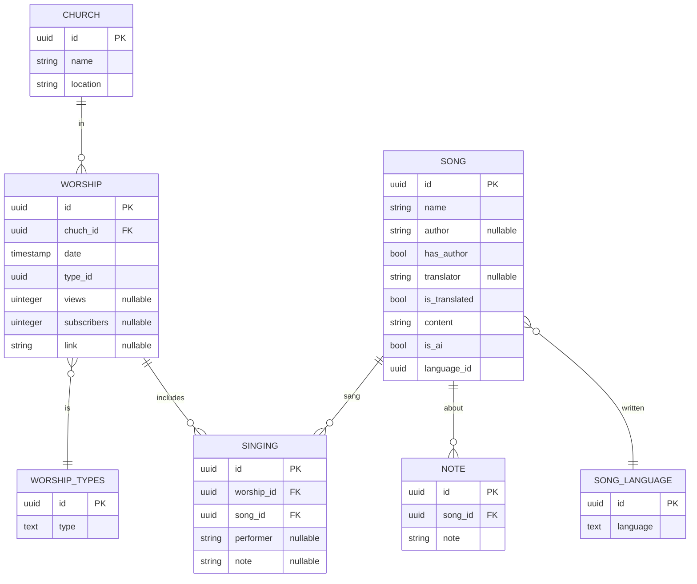

```mermaid
erDiagram
    SONG {
        uuid id "PK"
        string name
        string author "nullable"
        bool has_author
        string translator "nullable"
        bool is_translated
        string content
        bool is_ai
        uuid language_id
    }

    SONG_LANGUAGE {
        uuid id "PK"
        text language
    }

    NOTE {
        uuid id "PK"
        uuid song_id "FK"
        string note
    }

    CHURCH {
        uuid id "PK"
        string name
        string location
    }

    WORSHIP {
        uuid id "PK"
        uuid chuch_id "FK"
        timestamp date
        uuid type_id
        uinteger views "nullable"
        uinteger subscribers "nullable"
        string link "nullable"
    }

    WORSHIP_TYPES {
        uuid id "PK"
        text type
    }

    SINGING {
        uuid id "PK"
        uuid worship_id "FK"
        uuid song_id "FK"
        string performer "nullable"
        string note "nullable"
    }

    SONG ||--o{ NOTE : about
    SONG }o--|| SONG_LANGUAGE : written 
    CHURCH ||--o{ WORSHIP : in
    WORSHIP }o--|| WORSHIP_TYPES : is
    WORSHIP ||--o{ SINGING : includes
    SONG ||--o{ SINGING : sang
```