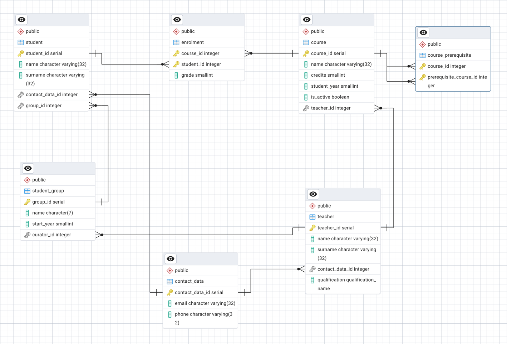

# Лекція 3: Таблиці, рядки, колонки та типи даних

## Теми лекції

- Структура баз даних: таблиці, рядки, колонки
- Типи даних у PostgreSQL
- Створення таблиць та обмеження (constraints)
- JSON та розширення PostgreSQL

---

## 1. Структура бази даних

У реляційних базах даних (наприклад, PostgreSQL) дані організовані у вигляді:

- Таблиць (Tables) – структуровані колекції пов’язаних даних, що зазвичай представляють одну сутність реального світу.
- Рядків (Rows, Tuples, Кортежі) – окремі екземпляри сутності, записи у таблиці.
- Колонок (Columns, Attributes) – характеристики сутності. Кожна колонка має:
  - власну назву
  - певний фіксований тип даних
  - набір обмежень

Аналогія з ER-діаграмою:
- Сутність ~ таблиця
- Атрибут ~ колонка

---

## 2. Типи даних у PostgreSQL

### 2.1. Числові типи даних
- smallint - 2 байти – цілі числа, аналог `short`
- integer - 4 байти – цілі числа, аналог `int`
- bigint - 8 байт – цілі числа великого діапазону, аналог `long`
- real - 4 байти – числа з плаваючою крапкою, аналог `float`
- double precision - 8 байт – числа з плаваючою крапкою (подвійна точність), аналог `double`
- numeric / decimal – точні десяткові числа з заданою точністю

Приклад:
```sql
numeric(3,2) -- три цифри, з них дві після коми, може містити значення в проміжку [-9.99; 9.99]
```

### 2.2. Послідовності (Serial)
serial – колонка з автоінкрементом, зазвичай використовується для первинних ключів.  
"Під капотом" базується на послідовностях (sequence) та при вставці нового рядку в таблицю генерується наступний елемент послідовності, який зберігається як значення атрибута у новому рядку.  
Також можна зберігати значення атрибута з типом serial і явно.  

Варіанти: 
- smallserial - `smallint` autoincrement
- serial - `integer` autoincrement
- bigserial - `bigint` autoincrement

### 2.3. Символьні типи
- char(n) – рядок фіксованої довжини n, доповнюється пробілами, якщо рядок коротший ніж `n`
- varchar(n) – рядок змінної довжини, але не більше ніж `n` символів
- text – рядок довільної довжини без обмежень

### 2.4. Часові типи даних
- date - 4 байти – дата без часу
- time - 8 байт – час без дати
- timestamp - 8 байт – дата та час
- interval - 16 байт – часовий проміжок (наприклад, `3 days`)

`time` та `timestamp` можна також зберігати з часовою зоною (`time with time zone`, `timestamp with time zone`).

### 2.5. Логічні значення
- boolean – приймає значення `TRUE`, `FALSE` або `NULL`

### 2.6. Спеціальні типи
- json, jsonb – збереження даних у вигляді JSON-документів
- arrays – масиви (одновимірні чи багатовимірні, з фіксованим або змінним розміром), наприклад `integer[3][3]`
- різноманітні спеціалізовані типи даних для геометричних об’єктів, грошових значень і тд

### 2.7. Enumerated типи
Enum – перелічуваний тип даних, що складається з статичного набору значень.

Приклад enum:
```sql
CREATE TYPE mood AS ENUM ('ok', 'happy', 'sad');
```
До колонки з типом `mood` можна буде записати виключно значення `'ok'`, `'happy'`, `'sad'` або `NULL`.

---

## 3. Створення таблиць

### 3.1. Загальний синтаксис
```sql
CREATE TABLE [ IF NOT EXISTS ] <table_name> (
    <column_name> <data_type> [constraints],
    ...
);
```

### 3.2. Приклад створення таблиці `students`
```sql
CREATE TABLE student (
    id SERIAL PRIMARY KEY,
    first_name VARCHAR(32),
    last_name VARCHAR(32),
    contact_data TEXT
);
```

---

## 4. Обмеження (Constraints)

### 4.1. Основні обмеження
- NOT NULL – забороняє порожні (`NULL`) значення - колонка з даним обмеженням не може містити `NULL`
- UNIQUE – забезпечує унікальність значень у колонці або комбінації колонок - забороняє додавання дублікатів значень
- CHECK – додаткові умови (наприклад, `age SMALLINT CHECK(age >= 0 AND age < 200)`)
- PRIMARY KEY – унікально ідентифікує кожен рядок, не може бути `NULL`, дозволено мати лише один `PRIMARY KEY` на таблицю, проте в `PRIMARY KEY` може входити кілька колонок
- FOREIGN KEY – зовнішній ключ, що посилається на унікальну колонку (або унікальний набір колонок) іншої таблиці - зазвичай посилається на `PRIMARY KEY` іншої таблиці, може бути NULL. Приклад: `teacher_id INTEGER REFERENCES teacher(teacher_id)`

### 4.2. Приклад створення таблиці з обмеженнями
```sql
CREATE TABLE student (
    id SERIAL PRIMARY KEY,
    first_name VARCHAR(32) NOT NULL,
    last_name VARCHAR(32) NOT NULL,
    age INT CHECK (age > 0 AND age < 200),
    group_id INTEGER REFERENCES student_group(group_id)
);
```

---

## 5. JSON у PostgreSQL

PostgreSQL дозволяє зберігати дані у форматі JSON:

- Використовується для зберігання гнучких, **денормалізованих** структур.
- Дає можливість уникати великої кількості `JOIN`.
- Поєднує реляційну та документоорієнтовану модель.

Приклад:
```sql
CREATE TABLE orders (
    id SERIAL PRIMARY KEY,
    data JSONB
);
```

---

## 6. Розширення PostgreSQL

PostgreSQL має механізм підключення розширень, які додають нові типи даних, чи новий функціонал.  
Приклад – `pgvector`, що дозволяє зберігати вектори (для AI, семантичного пошуку).

```sql
CREATE EXTENSION IF NOT EXISTS vector;
```

---

## 7. Висновки

1. Дані у PostgreSQL організовані у таблицях, рядках і колонках.
2. Кожна колонка має тип даних та може мати обмеження.
3. PostgreSQL надає велику кількість різноманітних вбудованих типів даних.
4. Існує можливість використання JSON, масивів та користувацьких типів.
5. Для забезпечення цілісності даних використовуються обмеження: `NOT NULL`, `UNIQUE`, `CHECK`, `PRIMARY KEY`, `FOREIGN KEY`.
6. PostgreSQL легко розширюється за допомогою модулів (наприклад, pgvector).

---

## 8. Практична частина лекції

У практичній частині лекції, було перетворено ER діаграму, побудовану на [2-й лекції](../02%20-%20ER%20diagrams/lecture_notes.md)


У схему бази даних у PostgreSQL



Всі запити створення таблиць також знаходяться у [файлі](../../scripts/create-campus-tables.sql).

```sql 
CREATE TABLE IF NOT EXISTS contact_data
(
     contact_data_id serial PRIMARY KEY,
     email varchar(32) NOT NULL,
     phone varchar(32) NOT NULL
);

CREATE TYPE qualification_name AS ENUM ('бакалавр', 'магістр', 'доктор філософії', 'доктор наук');

CREATE TABLE IF NOT EXISTS teacher
(
     teacher_id serial PRIMARY KEY,
     name varchar(32) NOT NULL,
     surname varchar(32) NOT NULL,
     contact_data_id integer not null references contact_data(contact_data_id),
     qualification qualification_name
);

CREATE TABLE IF NOT EXISTS student_group
(
     group_id serial PRIMARY KEY,
     name char(7) NOT NULL CHECK (name LIKE '__-%'),
     start_year SMALLINT NOT NULL CHECK (start_year >= 1898),
     curator_id INTEGER NOT NULL REFERENCES teacher(teacher_id)
);

CREATE TABLE IF NOT EXISTS student
(
     student_id serial PRIMARY KEY,
     name varchar(32) NOT NULL,
     surname varchar(32) NOT NULL,
     contact_data_id integer not null references contact_data(contact_data_id),
     group_id integer not null references student_group(group_id)
);

CREATE TABLE IF NOT EXISTS course
(
     course_id serial PRIMARY KEY,
     name varchar(32) NOT NULL,
     credits SMALLINT NOT NULL CHECK (credits > 0 AND credits < 100),
     student_year SMALLINT NOT NULL CHECK (student_year >= 1 AND student_year <= 4),
     is_active BOOLEAN NOT NULL,
     teacher_id INTEGER NOT NULL REFERENCES teacher(teacher_id)
);

CREATE TABLE IF NOT EXISTS enrolment
(
     course_id INTEGER not null references course(course_id),
     student_id INTEGER not null references student(student_id),
     grade SMALLINT,
     PRIMARY KEY (course_id, student_id)
);

CREATE TABLE IF NOT EXISTS course_prerequisite
(
     course_id INTEGER NOT NULL references course(course_id),
     prerequisite_course_id INTEGER NOT NULL references course(course_id) CHECK (course_id <> prerequisite_course_id),
     PRIMARY KEY (course_id, prerequisite_course_id)
);
```

---

## 9. Додаткові матеріали

1. PostgreSQL data types: https://www.postgresql.org/docs/current/datatype.html
2. PostgreSQL constraints: https://www.postgresql.org/docs/current/ddl-constraints.html
3. Більше про pgvector:
   - https://github.com/pgvector/pgvector
   - https://www.datacamp.com/tutorial/pgvector-tutorial
   - https://www.tigerdata.com/blog/postgresql-as-a-vector-database-using-pgvector
