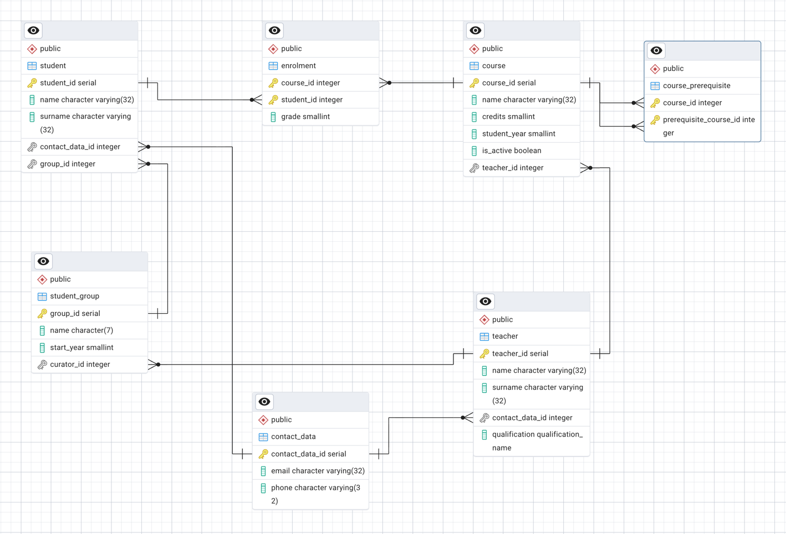

# Лекція 3: Таблиці, рядки, колонки та типи даних

## Теми лекції

- Структура баз даних: таблиці, рядки, колонки
- Типи даних у PostgreSQL
- Створення таблиць та обмеження (constraints)
- JSON та розширення PostgreSQL

---

## 1. Структура бази даних

У реляційних базах даних (наприклад, PostgreSQL) дані організовані у вигляді:

- Таблиць (Tables) – структуровані колекції пов’язаних даних, що зазвичай представляють одну сутність реального світу.
- Рядків (Rows, Tuples, Кортежі) – окремі екземпляри сутності, записи у таблиці.
- Колонок (Columns, Attributes) – характеристики сутності. Кожна колонка має:
  - власну назву
  - певний фіксований тип даних
  - набір обмежень

Аналогія з ER-діаграмою:
- Сутність ~ таблиця
- Атрибут ~ колонка

---

## 2. Типи даних у PostgreSQL

### 2.1. Числові типи даних
- smallint - 2 байти – цілі числа, аналог `short`
- integer - 4 байти – цілі числа, аналог `int`
- bigint - 8 байт – цілі числа великого діапазону, аналог `long`
- real - 4 байти – числа з плаваючою крапкою, аналог `float`
- double precision - 8 байт – числа з плаваючою крапкою (подвійна точність), аналог `double`
- numeric / decimal – точні десяткові числа з заданою точністю

Приклад:
```sql
numeric(3,2) -- три цифри, з них дві після коми, може містити значення в проміжку [-9.99; 9.99]
```

### 2.2. Послідовності (Serial)
serial – колонка з автоінкрементом, зазвичай використовується для первинних ключів.  
"Під капотом" базується на послідовностях (sequence) та при вставці нового рядку в таблицю генерується наступний елемент послідовності, який зберігається як значення атрибута у новому рядку.  
Також можна зберігати значення атрибута з типом serial і явно.  

Варіанти: 
- smallserial - `smallint` autoincrement
- serial - `integer` autoincrement
- bigserial - `bigint` autoincrement

### 2.3. Символьні типи
- char(n) – рядок фіксованої довжини n, доповнюється пробілами, якщо рядок коротший ніж `n`
- varchar(n) – рядок змінної довжини, але не більше ніж `n` символів
- text – рядок довільної довжини без обмежень

### 2.4. Часові типи даних
- date - 4 байти – дата без часу
- time - 8 байт – час без дати
- timestamp - 8 байт – дата та час
- interval - 16 байт – часовий проміжок (наприклад, `3 days`)

`time` та `timestamp` можна також зберігати з часовою зоною (`time with time zone`, `timestamp with time zone`).

### 2.5. Логічні значення
- boolean – приймає значення `TRUE`, `FALSE` або `NULL`

### 2.6. Спеціальні типи
- json, jsonb – збереження даних у вигляді JSON-документів
- arrays – масиви (одновимірні чи багатовимірні, з фіксованим або змінним розміром), наприклад `integer[3][3]`
- різноманітні спеціалізовані типи даних для геометричних об’єктів, грошових значень і тд

### 2.7. Enumerated типи
Enum – перелічуваний тип даних, що складається з статичного набору значень.

Приклад enum:
```sql
CREATE TYPE mood AS ENUM ('ok', 'happy', 'sad');
```
До колонки з типом `mood` можна буде записати виключно значення `'ok'`, `'happy'`, `'sad'` або `NULL`.

---

## 3. Створення таблиць

### 3.1. Загальний синтаксис
```sql
CREATE TABLE [ IF NOT EXISTS ] <table_name> (
    <column_name> <data_type> [constraints],
    ...
);
```

### 3.2. Приклад створення таблиці `students`
```sql
CREATE TABLE student (
    id SERIAL PRIMARY KEY,
    first_name VARCHAR(32),
    last_name VARCHAR(32),
    contact_data TEXT
);
```

---

## 4. Обмеження (Constraints)

### 4.1. Основні обмеження
- NOT NULL – забороняє порожні (`NULL`) значення - колонка з даним обмеженням не може містити `NULL`
- UNIQUE – забезпечує унікальність значень у колонці або комбінації колонок - забороняє додавання дублікатів значень
- CHECK – додаткові умови (наприклад, `age SMALLINT CHECK(age >= 0 AND age < 200)`)
- PRIMARY KEY – унікально ідентифікує кожен рядок, не може бути `NULL`, дозволено мати лише один `PRIMARY KEY` на таблицю, проте в `PRIMARY KEY` може входити кілька колонок
- FOREIGN KEY – зовнішній ключ, що посилається на унікальну колонку (або унікальний набір колонок) іншої таблиці - зазвичай посилається на `PRIMARY KEY` іншої таблиці, може бути NULL. Приклад: `teacher_id INTEGER REFERENCES teacher(teacher_id)`

### 4.2. Приклад створення таблиці з обмеженнями
```sql
CREATE TABLE student (
    id SERIAL PRIMARY KEY,
    first_name VARCHAR(32) NOT NULL,
    last_name VARCHAR(32) NOT NULL,
    age INT CHECK (age > 0 AND age < 200),
    group_id INTEGER REFERENCES student_group(group_id)
);
```

---

## 5. JSON у PostgreSQL

PostgreSQL дозволяє зберігати дані у форматі JSON:

- Використовується для зберігання гнучких, **денормалізованих** структур.
- Дає можливість уникати великої кількості `JOIN`.
- Поєднує реляційну та документоорієнтовану модель.

Приклад:
```sql
CREATE TABLE orders (
    id SERIAL PRIMARY KEY,
    data JSONB
);
```

---

## 6. Розширення PostgreSQL

PostgreSQL має механізм підключення розширень, які додають нові типи даних, чи новий функціонал.  
Приклад – `pgvector`, що дозволяє зберігати вектори (для AI, семантичного пошуку).

```sql
CREATE EXTENSION IF NOT EXISTS vector;
```

---

## 7. Висновки

1. Дані у PostgreSQL організовані у таблицях, рядках і колонках.
2. Кожна колонка має тип даних та може мати обмеження.
3. PostgreSQL надає велику кількість різноманітних вбудованих типів даних.
4. Існує можливість використання JSON, масивів та користувацьких типів.
5. Для забезпечення цілісності даних використовуються обмеження: `NOT NULL`, `UNIQUE`, `CHECK`, `PRIMARY KEY`, `FOREIGN KEY`.
6. PostgreSQL легко розширюється за допомогою модулів (наприклад, pgvector).

---

## 8. Практична частина лекції

У практичній частині лекції, було перетворено ER діаграму, побудовану на [2-й лекції](../02%20-%20ER%20diagrams/lecture_notes.md)


У схему бази даних у PostgreSQL



Всі запити створення таблиць також знаходяться у [файлі](../../scripts/create-campus-tables.sql).

```sql
create table if not exists person
(
    person_id    serial primary key,
    first_name   varchar(25)        NOT NULL,
    last_name    varchar(32)        NOT NULL,
    birth_date   date               NOT NULL,
    phone_number char(12)           NOT NULL,
    email        varchar(64) unique NOT NULL
);

-- workaround for missing `IF NOT EXISTS` for types creation
DO $$
BEGIN
	IF NOT EXISTS (SELECT 1 FROM pg_type WHERE typname = 'professor_status') THEN
        create type professor_status as enum ('викладає', 'звільнений', 'у відпустці');
    END IF;
END$$;

DO $$
BEGIN
	IF NOT EXISTS (SELECT 1 FROM pg_type WHERE typname = 'professor_role') THEN
        create type professor_role as enum ('асистент', 'старший викладач', 'доцент', 'професор');
    END IF;
END$$;

create table if not exists professor
(
    professor_id serial primary key,
    status       professor_status not null,
    job          professor_role,
    person_id    int              not null references person (person_id)
);

create table if not exists student_group
(
    group_id   serial primary key,
    name       char(7) not null check (name LIKE '__-%'),
    start_year smallint
);

DO $$
BEGIN
	IF NOT EXISTS (SELECT 1 FROM pg_type WHERE typname = 'student_status') THEN
        create type student_status as enum ('навчається', 'випускник', 'академ', 'відрахований', 'абітурієнт');
    END IF;
END$$;

DO $$
BEGIN
	IF NOT EXISTS (SELECT 1 FROM pg_type WHERE typname = 'student_form_of_study') THEN
        create type student_form_of_study as enum ('денна', 'заочна', 'вечірня', 'дистанційна');
    END IF;
END$$;

DO $$
BEGIN
	IF NOT EXISTS (SELECT 1 FROM pg_type WHERE typname = 'student_finance_source') THEN
        create type student_finance_source as enum ('контракт', 'бюджет', 'відпрацювання');
    END IF;
END$$;

create table if not exists student
(
    student_id     SERIAL PRIMARY KEY,
    course         int check (course >= 1 and course <= 6),
    start_date     date,
    end_date       date,
    status         student_status not null,
    form_of_study  student_form_of_study,
    finance_source student_finance_source,
    person_id      int            not null references person (person_id),
    tutor          int references professor (professor_id),
    group_id       int references student_group (group_id)
);

create table if not exists student_curator
(
    student_id int references student (student_id),
    group_id   int references student_group (group_id),
    primary key (student_id, group_id)
);

create table if not exists student_lead
(
    student_id int references student (student_id),
    group_id   int references student_group (group_id) unique,
    primary key (student_id, group_id)
);

DO $$
BEGIN
	IF NOT EXISTS (SELECT 1 FROM pg_type WHERE typname = 'course_control_type') THEN
        create type course_control_type as enum ('екзамен', 'залік');
    END IF;
END$$;

DO $$
BEGIN
	IF NOT EXISTS (SELECT 1 FROM pg_type WHERE typname = 'course_study_type') THEN
        create type course_study_type as enum ('очна', 'дистанційна', 'асинхронна');
    END IF;
END$$;

DO $$
BEGIN
	IF NOT EXISTS (SELECT 1 FROM pg_type WHERE typname = 'course_status') THEN
        create type course_status as enum ('активний', 'неактивний', 'в розробці');
    END IF;
END$$;

create table if not exists course
(
    course_id    serial primary key,
    name         varchar(64)         not null,
    hours        smallint            not null check (hours > 0 and hours < 350),
    credits      smallint            not null check (credits > 0),
    control_type course_control_type not null,
    study_type   course_study_type   not null default 'очна',
    status       course_status       not null
);

DO $$
BEGIN
	IF NOT EXISTS (SELECT 1 FROM pg_type WHERE typname = 'course_teacher_role') THEN
        create type course_teacher_role as enum ('лектор', 'викладач практики');
    END IF;
END$$;

create table if not exists course_teacher
(
    course_id      int                 not null references course (course_id),
    professor_id   int                 not null references professor (professor_id),
    professor_role course_teacher_role not null,
    primary key (course_id, professor_id, professor_role)
);

create table if not exists course_prerequisite
(
    course_id            int not null references course (course_id),
    prequisite_course_id int not null references course (course_id),
    primary key (course_id, prequisite_course_id)
);

DO $$
BEGIN
  IF NOT EXISTS (SELECT 1 FROM pg_type WHERE typname = 'enrolment_status') THEN
        create type enrolment_status as enum ('новий запис', 'активний', 'курс завершено');
    END IF;
END$$;

create table if not exists enrolement
(
    student_id int not null references student(student_id),
    course_id int not null references course(course_id),
    grade int check (grade >= 0 and grade <= 100),
    enrolemnt_date date not null default(now()),
    start_year smallint not null,
    status enrolment_status not null,
    primary key (student_id, course_id)
);
```

---

## 9. Додаткові матеріали

1. PostgreSQL data types: https://www.postgresql.org/docs/current/datatype.html
2. PostgreSQL constraints: https://www.postgresql.org/docs/current/ddl-constraints.html
3. Більше про pgvector:
   - https://github.com/pgvector/pgvector
   - https://www.datacamp.com/tutorial/pgvector-tutorial
   - https://www.tigerdata.com/blog/postgresql-as-a-vector-database-using-pgvector
