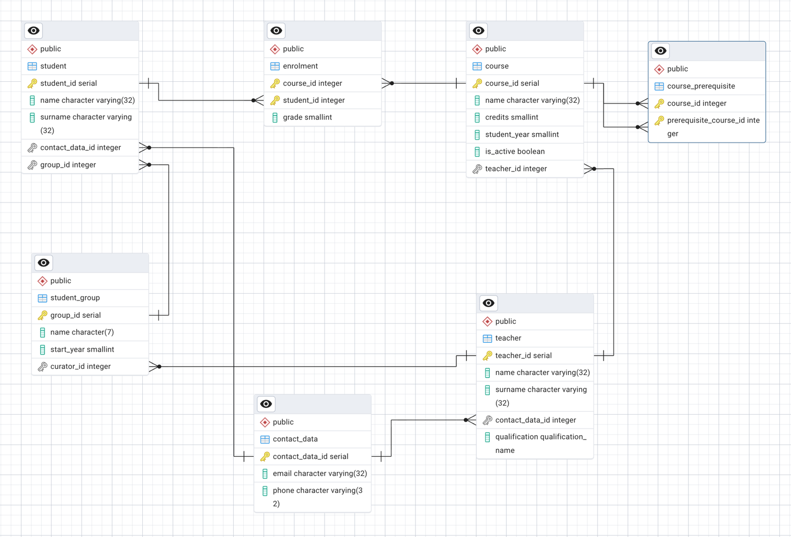

# Лекція 3: Таблиці, рядки, колонки та типи даних

## Теми лекції

- Структура баз даних: таблиці, рядки, колонки
- Типи даних у PostgreSQL
- Конвенції іменування
- Створення таблиць та обмеження (constraints)
- JSON та розширення PostgreSQL

> Для практичної частини потрібне запущене локальне оточення (PostgreSQL + pgAdmin у Docker).
> Як його підняти - див. [Лекцію 2, Частина 2](../02%20-%20ER%20diagrams/lecture_notes.md#частина-2-налаштування-локального-середовища-розробки).

---

## 1. Структура бази даних

У реляційних базах даних (наприклад, PostgreSQL) дані організовані у вигляді:

- Таблиць (Tables) – структуровані колекції пов’язаних даних, що зазвичай представляють одну сутність реального світу.
- Рядків (Rows, Tuples, Кортежі) – окремі екземпляри сутності, записи у таблиці.
- Колонок (Columns, Attributes) – характеристики сутності. Кожна колонка має:
  - власну назву
  - певний фіксований тип даних
  - набір обмежень

Аналогія з ER-діаграмою:
- Сутність ~ таблиця
- Атрибут ~ колонка

---

## 2. Типи даних у PostgreSQL

### 2.1. Числові типи даних
- smallint - 2 байти – цілі числа, аналог `short`
- integer - 4 байти – цілі числа, аналог `int`
- bigint - 8 байт – цілі числа великого діапазону, аналог `long`
- real - 4 байти – числа з плаваючою крапкою, аналог `float`
- double precision - 8 байт – числа з плаваючою крапкою (подвійна точність), аналог `double`
- numeric / decimal – точні десяткові числа з заданою точністю

Приклад:
```sql
numeric(3,2) -- три цифри, з них дві після коми, може містити значення в проміжку [-9.99; 9.99]
```

### 2.2. Автоінкрементні колонки (serial та identity)
Ідентифікатори (`person_id`, `student_id` тощо) зазвичай не задають вручну, а генерують автоматично: при вставці кожного нового рядка база сама видає наступне значення.

#### serial
serial – колонка з автоінкрементом, історично основний спосіб це зробити.  
"Під капотом" базується на послідовностях (sequence): послідовність зберігає попереднє значення та крок (за замовчуванням 1), і при вставці нового рядка в таблицю генерується наступний елемент послідовності, який зберігається як значення атрибута у новому рядку.

Варіанти: 
- smallserial - `smallint` autoincrement
- serial - `integer` autoincrement
- bigserial - `bigint` autoincrement

#### Проблема serial: дозволена явна вставка
У колонку з типом `serial` можна вставити значення явно - і тоді послідовність не інкрементується. Це прямий шлях до колізії ідентифікаторів:

```sql
-- послідовність стоїть на 5, ми явно вставляємо 100
INSERT INTO student (student_id, ...) VALUES (100, ...);
-- ... згодом послідовність доростає до 100 і автоматична вставка падає:
INSERT INTO student (...) VALUES (...);  -- duplicate key value violates unique constraint
```

База не знає, що рядок зі `student_id = 100` уже існує, бо він з'явився поза послідовністю.

#### Рекомендований варіант: GENERATED AS IDENTITY
`GENERATED ALWAYS AS IDENTITY` – стандартний (SQL:2003) спосіб оголосити автоінкрементну колонку. Поводиться так само, але **забороняє явну вставку**, тому проблема вище неможлива в принципі:

```sql
student_id INTEGER GENERATED ALWAYS AS IDENTITY PRIMARY KEY
```

Тому для нових таблиць варто використовувати `GENERATED ALWAYS AS IDENTITY` замість `serial`.  
`GENERATED BY DEFAULT AS IDENTITY` – проміжний варіант: явну вставку дозволяє, тобто має ту саму проблему, що й `serial`.

#### Чому не UUID
Ідентифікатор можна зробити і на типі `uuid` (128 біт; 32 hex-символи, 36 у записі з дефісами; тип вбудований, генератор `gen_random_uuid()` доступний з PostgreSQL 13). UUID доречні переважно в розподілених системах, де ідентифікатор потрібно згенерувати без звернення до бази.  
У реляційних базах даних для первинних ключів переважно беруть автоінкрементні цілі числа - і в межах курсу ми теж будемо їх використовувати, бо два числа значно простіше порівняти очима, ніж два UUID.

### 2.3. Символьні типи
- char(n) – рядок фіксованої довжини n. Довший за `n` рядок записати не вийде (помилка), а коротший PostgreSQL **доповнить пробілами** до `n`.
- varchar(n) – рядок змінної довжини, але не більше ніж `n` символів. Довший записати не вийде (помилка), коротший пробілами не доповнюється.
- text – рядок змінної довжини без логічних обмежень. Фізичне обмеження все ж є - близько 1 GB на значення, але досягнути його на практиці дуже важко.

Тобто `varchar(n)` - це строгіший варіант за `text` і вільніший за `char(n)`.

`char(n)` доречний саме для ідентифікаторів фіксованої довжини - наприклад, шифр групи (`ІМ-01`) або номер телефону в єдиному форматі.

#### Чому не завжди text

`text` виглядає найзручнішим (нічого не треба вирішувати заздалегідь), але відсутність обмеження - це вектор атаки. Якщо реєстрація в системі відкрита в інтернет, а ім'я користувача оголошено як `text`, зловмисник може скриптом реєструвати користувачів, у яких ім'я, прізвище та контакти - по гігабайту сміттєвих даних. За ніч це десятки гігабайтів у базі та відповідний рахунок від хмарного провайдера.

Правило: **те, що може бути логічно обмежене, варто обмежувати**. `varchar(100)` для імені - вже дуже щедре обмеження, якого в переважній більшості випадків навіть близько не досягнуть.

### 2.4. Часові типи даних
- date - 4 байти – дата без часу
- time - 8 байт – час без дати
- timestamp - 8 байт – дата та час
- interval - 16 байт – часовий проміжок (наприклад, `3 days`)

`time` та `timestamp` можна також зберігати з часовою зоною (`time with time zone`, `timestamp with time zone`).

### 2.5. Логічні значення
- boolean - 1 байт – приймає значення `TRUE`, `FALSE` або `NULL` (якщо колонка не має обмеження `NOT NULL`)

#### NULL - відсутність значення

`NULL` - це не нуль, не порожній рядок і не `FALSE`. Це позначення відсутності значення, приблизний аналог порожнього вказівника або `null` у мовах програмування.

Найважливіший наслідок: `NULL` **не можна порівнювати через знак рівності**, бо `NULL` не дорівнює `NULL`. Тому перевірка на відсутність значення робиться через `IS NULL` / `IS NOT NULL`.

Детальніше про поведінку `NULL` у запитах - на наступній лекції.

### 2.6. Спеціальні типи
- json, jsonb – збереження даних у вигляді JSON-документів
- arrays – масиви, наприклад `integer[]`
- різноманітні спеціалізовані типи даних для геометричних об’єктів, грошових значень і тд

#### Масиви: розмір не перевіряється

PostgreSQL приймає запис `integer[3]` чи `integer[3][3]` синтаксично, але повністю ігнорує і розмір, і кількість вимірів: такий тип фактично еквівалентний `integer[]`. У колонку з типом `integer[3]` можна вставити масив із 2 або 10 елементів, і це буде коректно з точки зору бази.

Тому при створенні таблиць довжину масиву краще не вказувати взагалі (`integer[]`) - інакше виникають неочевидні ситуації, коли ми очікуємо фіксовану кількість елементів, а насправді її ніхто не гарантує.

### 2.7. Enumerated типи
Enum – перелічуваний тип даних, що складається з статичного набору значень.

Приклад enum:
```sql
CREATE TYPE mood AS ENUM ('ok', 'happy', 'sad');
```
До колонки з типом `mood` можна буде записати виключно значення `'ok'`, `'happy'`, `'sad'` або `NULL`. Спроба записати будь-що інше повернеться помилкою.

Enum - найпоширеніша причина створити власний тип даних. Класичний приклад - різноманітні статуси: у діаграмі кампусу колонка `status` є у студента (навчається / випускник / академ / відрахований), у професора (викладає / звільнений / у відпустці), у запису на курс - і кожен із цих статусів це окремий enum.

Альтернативний спосіб змоделювати такий обмежений набір - окрема довідкова табличка зі статичним набором значень і посиланням на неї з основної таблиці (`mood` як табличка з трьох рядків). Про вибір між enum і довідковою табличкою поговоримо згодом; у межах курсу всі статуси реалізуємо як enum.

---

## 3. Створення таблиць

### 3.1. Загальний синтаксис
```sql
CREATE TABLE [ IF NOT EXISTS ] <table_name> (
    <column_name> <data_type> [DEFAULT <value>] [constraints],
    ...
);
```

- `IF NOT EXISTS` – якщо таблиця з такою назвою вже існує, запит просто нічого не зробить і завершиться успішно. Без цієї частини повторний запуск скрипта поверне помилку, тому `IF NOT EXISTS` використовують майже завжди.
- Ім'я колонки та її тип даних - обов'язкові; `DEFAULT` і обмеження - ні.

### 3.2. Значення за замовчуванням (DEFAULT)

`DEFAULT` задає значення, яке база підставить, якщо при вставці рядка колонку не вказали явно:

```sql
registration_date DATE NOT NULL DEFAULT now(),
study_type course_study_type NOT NULL DEFAULT 'очна'
```

Це доречно скрізь, де є логічне початкове значення: дата реєстрації - це момент вставки рядка, статус нового запису - "новий", форма навчання за замовчуванням - очна.

### 3.3. Конвенції іменування

Конкретні конвенції залежать від проєкту, але загальні правила хорошого тону такі:

- snake_case для всіх ідентифікаторів. SQL нечутливий до регістру - і в ключових словах, і в іменах таблиць та колонок (`SELECT` = `select`, `Person` = `person`), тому регістр як засіб розділення слів не працює. Історично SQL-запити прийнято було писати UPPERCASE; зараз багато хто пише lowercase - це справа смаку.
- Ідентифікатори з префіксом сутності: `person_id`, `student_id`, а не просто `id`. Так у запиті з кількома таблицями одразу видно, до чого належить колонка.
- Уникати скорочень: `user_name`, а не `usr_nm`.
- Імена мають бути зрозумілими, але не надмірно довгими - той самий баланс, що й у будь-якій розробці: дивлячись на таблицю чи запит, ми маємо розуміти, що в ній лежить і що запит повертає.
- Не використовувати зарезервовані слова як імена. Наприклад, `user` - ключове слово PostgreSQL, тому в схемі кампусу відповідна таблиця називається `person`.

### 3.4. Приклад створення таблиці `person`
```sql
CREATE TABLE IF NOT EXISTS person (
    student_id INTEGER GENERATED ALWAYS AS IDENTITY PRIMARY KEY,
    first_name VARCHAR(32),
    last_name VARCHAR(32),
    contact_data JSONB
);
```

---

## 4. Обмеження (Constraints)

Обмеження - це інструмент СУБД, який гарантує цілісність даних: база фізично не дасть записати те, що суперечить оголошеним правилам.

### 4.1. Основні обмеження
- NOT NULL – забороняє порожні (`NULL`) значення - колонка з даним обмеженням не може містити `NULL`. Варто ставити максимально широко: якщо ми знаємо, що дані не можуть бути відсутніми (ім'я студента, дата народження), колонка має бути `NOT NULL`.
- UNIQUE – забезпечує унікальність значень у колонці або комбінації колонок - забороняє додавання дублікатів значень (наприклад, email або номер телефону)
- CHECK – додаткові умови (наприклад, `age SMALLINT CHECK(age >= 0 AND age < 200)`)
- PRIMARY KEY – унікально ідентифікує кожен рядок, не може бути `NULL`, дозволено мати лише один `PRIMARY KEY` на таблицю, проте в `PRIMARY KEY` може входити кілька колонок
- FOREIGN KEY – зовнішній ключ, що посилається на унікальну колонку (або унікальний набір колонок) іншої таблиці - зазвичай посилається на `PRIMARY KEY` іншої таблиці, може бути NULL. Приклад: `teacher_id INTEGER REFERENCES teacher(teacher_id)`

### 4.2. CHECK доповнює валідацію, а не замінює її

`CHECK` - дуже важливий інструмент проти сміттєвих даних, але він працює разом із валідацією в коді застосунку, а не замість неї:

- наявність `CHECK` у базі не відміняє необхідності валідації в застосунку (користувачу потрібне зрозуміле повідомлення про помилку, а не текст виключення СУБД);
- наявність валідації в застосунку не відміняє необхідності `CHECK` (застосунків може бути кілька, дані іноді правлять вручну, а баги в коді трапляються).

### 4.3. Скільки коштує UNIQUE

`UNIQUE` не безкоштовний: щоб гарантувати відсутність дублікатів, база при кожній вставці має перевірити всю таблицю. "Під капотом" для цього автоматично створюється індекс, тому перевірка швидка, але індекс займає місце й уповільнює вставку.

Чи виправданий цей оверхед - залежить від розміру таблиці:
- таблиця користувачів гарантовано не виросте до десятків мільярдів рядків, а унікальність email критична - оверхед абсолютно виправданий;
- для великих таблиць, які можуть рости практично необмежено (логи, події), той самий оверхед може виявитися задорогим.

Детально про індекси - в окремих лекціях далі в курсі.

### 4.4. FOREIGN KEY - це не сам зв'язок

Важливий момент, який легко переплутати: зовнішній ключ не є зв'язком між сутностями. Зв'язок - це логічна річ із ER-діаграми; `FOREIGN KEY` - інструмент, який перевіряє цілісність цього зв'язку.

Механіка: при вставці рядка СУБД перевіряє, що в таблиці, на яку вказує зовнішній ключ, справді існує рядок із таким ідентифікатором. Якщо не існує - вставка не пройде. Якщо колонка `NULL`, перевірка не виконується (тому необов'язковий зв'язок 0..1 моделюється як `NULL`-колонка з `REFERENCES`, без `NOT NULL`).

На якому боці ставити зовнішній ключ. При зв'язку "багато до одного" - завжди на боці "багато". У зв'язку "один потік має багато груп" зовнішній ключ `stream_id` стоїть у таблиці групи: по-перше, в одну колонку не записати кілька ідентифікаторів; по-друге, змістовно це група належить потоку, тому саме при вставці групи ми перевіряємо, що відповідний потік існує.

Зв'язки можуть існувати і без зовнішніх ключів - у деяких випадках від них свідомо відмовляються. Причини (переважно пов'язані зі швидкодією) розглянемо ближче до кінця семестру.

Що робити при видаленні рядка, на який є посилання, задає `ON DELETE` (`CASCADE`, `SET NULL`, `RESTRICT`). `ON DELETE CASCADE` - доволі небезпечна дія, тому розберемо її окремо на наступній лекції, разом із двома підходами до видалення даних: фізичним видаленням і "м'яким" (soft delete), коли рядок лише позначається видаленим.

### 4.5. Приклад створення таблиці з обмеженнями
```sql
CREATE TABLE IF NOT EXISTS student (
    student_id INTEGER GENERATED ALWAYS AS IDENTITY PRIMARY KEY,
    first_name VARCHAR(32) NOT NULL,
    last_name VARCHAR(32) NOT NULL,
    age INT CHECK (age >= 0 AND age < 200),
    group_id INTEGER REFERENCES student_group(group_id)
);
```

---

## 5. JSON у PostgreSQL

PostgreSQL дозволяє зберігати дані у форматі JSON:

- Використовується для зберігання гнучких, *денормалізованих* структур.
- Дає можливість уникати великої кількості `JOIN`.
- Поєднує реляційну та документоорієнтовану модель.
- PostgreSQL дозволяє не лише зберігати JSON у колонці, а й шукати по полях документа в запитах.

Приклад:
```sql
CREATE TABLE orders (
    order_id INTEGER GENERATED ALWAYS AS IDENTITY PRIMARY KEY,
    data JSONB
);
```

JSON-колонка - зручний варіант, коли на етапі проєктування ще не зрозуміло, що саме там лежатиме (наприклад, контактні дані персони). Це не остаточне рішення: згодом, коли вимоги прояснюються (потрібен рівно один телефон і один email), таблицю можна еволюціонувати й замінити тип колонки на звичайні реляційні поля.

---

## 6. Розширення PostgreSQL

PostgreSQL має механізм підключення розширень, які додають нові типи даних, чи новий функціонал.  
Приклад – `pgvector`, що дозволяє зберігати вектори (для AI, семантичного пошуку).

```sql
CREATE EXTENSION IF NOT EXISTS vector;
```

---

## 7. Висновки

1. Дані у PostgreSQL організовані у таблицях, рядках і колонках.
2. Кожна колонка має тип даних та може мати обмеження.
3. PostgreSQL надає велику кількість різноманітних вбудованих типів даних.
4. Існує можливість використання JSON, масивів та користувацьких типів.
5. Тип даних варто обмежувати там, де обмеження логічне (`varchar(n)` замість `text`): це і документація, і захист від сміттєвих даних.
6. `NULL` - це відсутність значення; його не можна порівнювати через `=`.
7. Для автоінкрементних ідентифікаторів варто використовувати `GENERATED ALWAYS AS IDENTITY`, а не `serial`, який дозволяє явну вставку й тому допускає колізії.
8. Для забезпечення цілісності даних використовуються обмеження: `NOT NULL`, `UNIQUE`, `CHECK`, `PRIMARY KEY`, `FOREIGN KEY`.
9. `FOREIGN KEY` - не сам зв'язок, а інструмент перевірки його цілісності.
10. PostgreSQL легко розширюється за допомогою модулів (наприклад, pgvector).

---

## 8. Практична частина лекції

У практичній частині лекції, було перетворено ER діаграму, побудовану на [2-й лекції](../02%20-%20ER%20diagrams/lecture_notes.md)


У схему бази даних у PostgreSQL



Всі запити створення таблиць також знаходяться у [файлі](../../scripts/create-campus-tables.sql).

```sql

create type person_status as enum ('registered', 'banned', 'inactive');
create type student_status as enum ('active', 'expelled', 'graduated', 'academ');
create type professor_status as enum ('active', 'inactive', 'fired', 'vacation');
create type study_level as enum ('bachelors', 'masters', 'phd');
create type job_title as enum ('associate professor', 'professor', 'senior researcher');
create type course_status as enum ('active', 'in development', 'retired', 'inactive');
create type profesor_role as enum ('lecturer', 'practice', 'full_ownership');
create type enrolment_status as enum ('not_started', 'started', 'finished');
create type student_group_status as enum ('active', 'disbanned', 'graduated');
create type student_group_assignment_status as enum ('active', 'inactive', 'graduated');

create table person
(
    person_id         int generated always as identity primary key,
    first_name        varchar(100)  not null,
    last_name         varchar(100)  not null,
    date_of_birth     DATE          not null,
    contact_medium    JSON,
    registration_date timestamp     not null default now(),
    person_status     person_status not null default 'registered'
);

create table student
(
    student_id     int generated always as identity primary key,
    person_id      int            not null references person (person_id),
    student_status student_status not null default 'active'
);

create table professor
(
    professor_id     int generated always as identity primary key,
    person_id        int              not null references person (person_id),
    start_year       date             not null default now(),
    professor_status professor_status not null default 'active',
    professor_degree study_level,
    job_title        job_title
);

create table course
(
    course_id     int generated always as identity primary key,
    course_name   varchar(100)  not null check (length(trim(both ' ' from course_name)) > 0),
    credits       int           not null check (credits > 0),
    course_status course_status not null default 'active'
);

create table course_teacher
(
    course_id     int           not null references course (course_id),
    professor_id  int           not null references professor (professor_id),
    profesor_role profesor_role not null,
    primary key (course_id, professor_id)
);

create table course_prerequisite
(
    course_id              int not null references course (course_id),
    prerequisite_course_id int not null references course (course_id),
    primary key (course_id, prerequisite_course_id)
);

create table enrolment
(
    student_id       int              not null references student (student_id),
    course_id        int              not null references course (course_id),
    grade            int,
    enrolment_status enrolment_status not null default 'not_started',
    created_at       timestamp        not null default now(),
    primary key (student_id, course_id)
);

create table specialties
(
    specialty_code     varchar(4)  not null primary key,
    field_of_knowledge varchar(25) not null
);

create table cohort
(
    cohort_id      int generated always as identity primary key,
    cohort_name    char(5)    not null,
    specialty_code varchar(4) not null references specialties (specialty_code)
);

create table student_group
(
    group_id     int generated always as identity primary key,
    group_name   varchar(8)           not null,
    start_year   smallint             not null check (start_year > 1898),
    end_year     smallint             not null check (end_year > start_year),
    study_level  study_level          not null,
    group_status student_group_status not null default 'active',
    curator_id   int                  not null references professor (professor_id),
    student_lead int references student (student_id),
    cohort_id    int                  not null references cohort (cohort_id)
);

create table student_group_assignment
(
    student_id        int                             not null references student (student_id),
    group_id          int                             not null references student_group (group_id),
    assignment_status student_group_assignment_status not null default 'active',
    primary key (student_id, group_id)
);

```

---

## 9. Додаткові матеріали

1. PostgreSQL data types: https://www.postgresql.org/docs/current/datatype.html
2. PostgreSQL constraints: https://www.postgresql.org/docs/current/ddl-constraints.html
3. Більше про pgvector:
   - https://github.com/pgvector/pgvector
   - https://www.datacamp.com/tutorial/pgvector-tutorial
   - https://www.tigerdata.com/blog/postgresql-as-a-vector-database-using-pgvector
