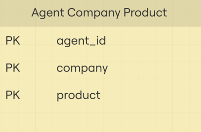

# Лекція 11: Нормалізація баз даних

---

## Теми лекції

- Функціональні залежності
- Нормальні форми
- Нормалізація

---

## 1. Функціональні залежності

Функціональна залежність - у заданому відношенні атрибут Y функціонально залежний від атрибуту X тоді та тільки тоді, 
коли кожному значенню X відповідає рівно одне значення Y.

Позначення: `X -> Y` (читається "X визначає Y" або "Y функціонально залежить від X")

Приклад:


```
Студент_ID -> Прізвище
Студент_ID -> Ім'я
Студент_ID -> Контактні дані
```


```
(Студент_ID, Курс_ID) -> Оцінка
```

### Основні поняття

#### Детермінант (визначник)
- Ліва частина функціональної залежності
- Атрибут або набір атрибутів, що визначає інші атрибути
- У прикладі `Студент_ID -> Прізвище` детермінантом є `Студент_ID`

#### Залежний атрибут
- Права частина функціональної залежності
- Атрибут, значення якого визначається детермінантом
- У прикладі `Студент_ID -> Прізвище` залежним атрибутом є `Прізвище`

### Види функціональних залежностей

#### Повна функціональна залежність
Атрибут Y повністю функціонально залежить від набору атрибутів X, якщо:
- Y залежить від X
- Y НЕ залежить від жодної власної підмножини X

Приклад:
```
(Студент_ID, Курс_ID) -> Оцінка
```
Оцінка залежить від комбінації студента та курсу, але не може бути визначена лише за одним з них.

#### Часткова функціональна залежність
Атрибут Y частково залежить від складеного ключа X, якщо Y залежить лише від частини ключа.

Приклад:
```
(Студент_ID, Курс_ID) -> Ім'я_студента
```
Ім'я студента залежить тільки від `Студент_ID`, а не від всього ключа.

#### Транзитивна функціональна залежність
Якщо A -> B і B -> C, то C транзитивно залежить від A.

Приклад:
```
Студент_ID -> Група
Група -> Факультет
Тому: Студент_ID -> Факультет (транзитивна залежність)
```

### Навіщо потрібні функціональні залежності?

Функціональні залежності є основою для:
1. Виявлення проблем у структурі бази даних
2. Нормалізації таблиць
3. Усунення аномалій (аномалії вставки, оновлення, видалення)

---

## 2. Нормалізація

Нормалізація - процес організації даних у базі даних, спрямований на:
- Зменшення надмірності даних
- Забезпечення цілісності даних
- Усунення аномалій при вставці, оновленні та видаленні

## 3. Перша нормальна форма (1НФ)

Відношення знаходиться в першій нормальній формі (1НФ), якщо:
1. Усі атрибути містять лише атомарні (неподільні) значення
2. Відсутні повторювані групи атрибутів
3. Кожен запис унікальний
4. Порядок записів не важливий

### Порушення 1НФ

Приклад таблиці, що НЕ відповідає 1НФ:


Проблема: атрибут "phone_numbers" містить множинні значення (неатомарний).

Приклад таблиці, що НЕ відповідає 1НФ:


Проблема: атрибути "phone_number1", "phone_number2" є групою повторюваних атрибутів.

### Приведення до 1НФ

Створення окремої таблиці зв'язку

Таблиця "Студенти":
- Студент_ID
- Ім'я

Таблиця "Номери":
- Студент_ID 
- Номер телефону

## 4. Друга нормальна форма (2НФ)

Відношення знаходиться в другій нормальній формі (2НФ), якщо:
1. Воно знаходиться в 1НФ
2. Кожен неключовий атрибут повністю функціонально залежить від первинного ключа (немає часткових залежностей)

### Порушення 2НФ

Приклад таблиці, що НЕ відповідає 2НФ:


Проблеми:
- `Покупець_ID` залежить тільки від `Замовлення_ID` (часткова залежність)
- `Назва_книги` залежить тільки від `ISBN` (часткова залежність)
- Первинний ключ: `(Замовлення_ID, ISBN)`

#### Функціональні залежності:
```
(Замовлення_ID, ISBN) -> Ціна                     // Повна залежність
(Замовлення_ID, ISBN) -> Покупець_ID              // Часткова залежність
(Замовлення_ID, ISBN) -> Назва_книги              // Часткова залежність
...
```

### Приведення до 2НФ

Рішення: Декомпозиція на три окремі таблиці

Таблиця "Замовлення Книг":
- Замовлення_ID - PK
- ISBN - PK
- Ціна

Таблиця "Замовлення":
- Замовлення_ID -> PK
- Покупець_ID
- Ім'я_покупця
- Місто_доставки

Таблиця "Книги":
- ISBN -> PK
- Назва
- Автор
- Базова_ціна

Результат: Усі неключові атрибути повністю залежать від первинного ключа.

## 5. Третя нормальна форма (3НФ)

Відношення знаходиться в третій нормальній формі (3НФ), якщо:
1. Воно знаходиться в 2НФ
2. Відсутні транзитивні залежності неключових атрибутів від первинного ключа

Іншими словами: всі неключові атрибути залежать від ключа безпосередньо, а не через інші атрибути.

### Порушення 3НФ

Приклад таблиці, що НЕ відповідає 3НФ:


Проблема:

#### Функціональні залежності:
```
Студент_ID -> Ім'я                    // Пряма залежність
Студент_ID -> Факультет_ID            // Пряма залежність
Факультет_ID -> Ім'я_Факультету       // Пряма залежність
Студент_ID -> Ім'я_Факультету         // Транзитивна залежність
```

Назва факультету залежить від студента транзитивно.

### Проблеми, спричинені порушенням 3НФ:

1. Аномалія оновлення: Якщо факультет змінює назву, потрібно оновлювати всі записи студентів цього факультету
2. Аномалія вставки: Неможливо додати інформацію про факультет, поки немає студентів у ньому
3. Аномалія видалення: Видалення останнього студента факультету призведе до втрати інформації про факультет
4. Надмірність: Назва факультету дублюється для кожного студента групи

### Приведення до 3НФ

Рішення: Декомпозиція на дві таблиці

Таблиця "Студенти":
- Студент_ID
- Ім'я 
- Факультет_ID

Таблиця "Факультети":
- Факультет_ID
- Ім'я_Факультету

Результат: 
- Відсутні транзитивні залежності
- Інформація про факультет зберігається тільки один раз
- Усунуто всі три типи аномалій

## 6. Нормальна форма Бойса-Кодда (НФБК)

Відношення знаходиться в нормальній формі Бойса-Кодда (BCNF), якщо:
1. Воно знаходиться в 3НФ
2. Для кожної функціональної залежності X -> Y детермінант X є надключем (суперключем). Тобто жодна з складових Х не залежить від неключових атрибутів.

Нормальна форма Бойса-Кодда - це посилена версія 3НФ, яка усуває певні аномалії, що можуть залишатися після приведення до 3НФ.

### Коли 3НФ недостатньо?

НФБК потрібна в ситуаціях, коли:
- Таблиця має кілька можливих ключів (кандидат-ключів)
- Ці ключі перекриваються (мають спільні атрибути)

### Приклад порушення НФБК


Умови:
- у співробітника може бути багато сертифікацій
- один "сертифікатор" сертифікує лише одну навичку

Можливі ключі:
- `(Співробітник_ID, Навичка)` - кандидат-ключ
- `(Співробітник_ID, Сертифікатор)` - кандидат-ключ

Функціональні залежності:
```
Сертифікатор -> Навичка
```

Проблема: 
Таблиця знаходиться в 3НФ, але НЕ в НФБК, оскільки `Сертифікатор -> Навичка`, але Сертифікатор не є надключем.

### Приведення до НФБК

Рішення: Декомпозиція

Таблиця "Сертифікації":
- Співробітник_ID
- Сертифікатор
- Дата

Таблиця "Сертифікатори":
- Сертифікатор
- Навичка

Результат: Усі функціональні залежності мають надключі як детермінанти.

## 7. Четверта нормальна форма (4НФ)

Відношення знаходиться в четвертій нормальній формі (4НФ), якщо:
1. Воно знаходиться в НФБК
2. Відсутні багатозначні залежності (multivalued dependencies)

### Багатозначна залежність

Багатозначна залежність X ->-> Y означає, що для кожного значення X існує множина значень Y, незалежна від інших атрибутів.

### Приклад порушення 4НФ


Проблема:
- Співробітник має кілька навичок
- Співробітник розмовляє кількома мовами
- Мови та навички незалежні одне від одного
- Виникає декартовий добуток: кожна комбінація (Мова × Навичка)

Багатозначні залежності:
```
Співробітник ->-> Мова
Співробітник ->-> Навичка
```

### Проблеми:
- Надмірність: Мови дублюються для кожної навички
- Аномалія вставки: Додавання нової навички вимагає дублювання всіх мов
- Аномалія оновлення: Зміна навички вимагає оновлення кількох записів

### Приведення до 4НФ

Рішення: Декомпозиція на дві таблиці

Таблиця "Навички":
- Співробітник
- Навичка

Таблиця "Мови":
- Співробітник
- Мова

Результат: Кожна багатозначна залежність знаходиться в окремій таблиці.

## 8. П'ята нормальна форма (5НФ) / Проекційно-з'єднувальна нормальна форма

Відношення знаходиться в п'ятій нормальній формі (5НФ), якщо:
1. Воно знаходиться в 4НФ
2. Відсутні залежності з'єднання (join dependencies), які не випливають із ключів

Таблицю в 5НФ **не можна** декомпозувати на менші таблиці без втрати інформації, таким чином 5НФ є найвищим рівнем нормалізації.

### Приклад порушення 5НФ



Дані:  

| Агент | Виробник | Продукт |
|-------|----------|---------|  
| Alice | Apple | iPhone |
| Alice | Apple | iPad |
| Alice | Samsung | Galaxy |
| Bob | Apple | iPhone |
| Bob | Samsung | Galaxy |

### Проблема:
Якщо розбити таблицю на дві окремі таблиці:
- (Агент, Виробник)
- (Виробник, Продукт)

При об'єднанні можуть з'явитися хибні комбінації.

### Приведення до 5НФ

Для приведення до 5НФ потрібно зберегти тільки ті проекції, об'єднання яких дає вихідне відношення без появи зайвих записів.

Рішення: Додати третю таблицю, що зв'язує Агент та Продукт. Таким чином, при об'єднанні буде неможливо отримати некоректну комбінацію.

Примітка: 5НФ рідко використовується на практиці, оскільки більшість реальних випадків покривається 3НФ або НФБК.

---

## 9. Порівняльна таблиця нормальних форм

| Нормальна форма | Основна вимога | Що усуває |
|-----------------|----------------|-----------|
| 1НФ | Атомарні значення, відсутність повторюваних груп | Множинні значення в одному полі |
| 2НФ | 1НФ + відсутність часткових залежностей | Часткові залежності від складених ключів |
| 3НФ | 2НФ + відсутність транзитивних залежностей | Транзитивні залежності неключових атрибутів |
| НФБК | 3НФ + кожен детермінант є надключем | Аномалії при множинних кандидат-ключах |
| 4НФ | НФБК + відсутність багатозначних залежностей | Багатозначні залежності |
| 5НФ | 4НФ + відсутність залежностей з'єднання | Складні залежності з'єднання |

---

## 10. Типові аномалії в ненормалізованих таблицях

### Аномалія вставки (Insert Anomaly)
Проблема: Неможливо додати дані без заповнення всіх полів

Приклад: У таблиці Студент_Група_Факультет неможливо додати нову групу, поки в неї не зарахований хоча б один студент.

### Аномалія оновлення (Update Anomaly)
Проблема: При зміні даних потрібно оновлювати кілька записів

Приклад: Якщо група змінює факультет, потрібно оновити записи для всіх студентів цієї групи.

### Аномалія видалення (Delete Anomaly)
Проблема: Видалення запису призводить до втрати іншої важливої інформації

Приклад: Видалення останнього студента групи призводить до втрати інформації про існування самої групи.

### Надмірність даних (Data Redundancy)
Проблема: Одна й та сама інформація зберігається в кількох місцях

Приклад: Назва факультету дублюється для кожного студента групи.

---

## 11. Практичні рекомендації

### Коли нормалізувати?

Нормалізація потрібна для:
- Транзакційних систем (OLTP)
- Систем, де важлива цілісність даних
- Систем з частими операціями вставки, оновлення, видалення

### Коли НЕ нормалізувати (денормалізація)?

Денормалізація виправдана для:
- Систем з переважанням операцій читання
- Оптимізації продуктивності запитів
- Сховищ даних (Data Warehouses)

### Золота середина

На практиці:
- Найчастіше достатньо 3НФ
- НФБК використовується при наявності множинних ключів
- 4НФ та 5НФ - рідкісні випадки
- Можна мати різні рівні нормалізації в одній БД:
  - Частина таблиць у 3НФ
  - Частина таблиць денормалізована для продуктивності

Важливо: Рішення про нормалізацію приймається для кожної сутності окремо, виходячи з:
- Вимог до цілісності
- Характеру операцій (читання vs запис)
- Вимог до продуктивності
- Складності запитів

---

## 12. Алгоритм нормалізації

### Крок 1: Привести до 1НФ
- Усунути множинні значення
- Усунути повторювані групи
- Забезпечити атомарність всіх значень

### Крок 2: Привести до 2НФ
- Виявити часткові залежності
- Винести частково залежні атрибути в окремі таблиці

### Крок 3: Привести до 3НФ
- Виявити транзитивні залежності
- Винести транзитивно залежні атрибути в окремі таблиці

### Крок 4: За потреби привести до НФБК
- Перевірити, чи всі детермінанти є надключами
- При необхідності виконати додаткову декомпозицію

### Крок 5: За потреби привести до 4НФ та 5НФ
- Виявити багатозначні залежності
- Виявити залежності з'єднання
- Виконати відповідну декомпозицію

---

## 13. Ключові терміни

Функціональна залежність - відношення між атрибутами, де одне значення визначає інше.  
Детермінант - атрибут (або набір атрибутів), що визначає інші атрибути (ліва частина залежності).  
Надключ (суперключ) - набір атрибутів, що однозначно ідентифікує запис.  
Кандидат-ключ - мінімальний надключ.  
Атомарне значення - неподільне значення.  
Декомпозиція - розбиття таблиці на кілька таблиць.  
Аномалія - проблема при виконанні операцій з даними через погану структуру.  
Денормалізація - навмисне порушення нормальних форм для оптимізації.  

---

## 14. Висновки

- Нормалізація - важливий інструмент проектування БД для забезпечення цілісності та усунення надмірності.
- Функціональні залежності - основа для розуміння та виявлення проблем у структурі даних.
- На практиці найчастіше достатньо приведення до 3НФ.
- Баланс між нормалізацією та денормалізацією залежить від конкретних вимог системи.
- Різні таблиці в одній БД можуть мати різні рівні нормалізації.
- Немає єдиного правильного рішення - проектування БД завжди є балансом між різними властивостями та вимогами.

---

## Додаткові матеріали

[DBMS Normalization: 1NF, 2NF, 3NF Database Example](https://www.guru99.com/database-normalization.html)
[Normalization in SQL (1NF - 5NF): A Beginner’s Guide](https://www.datacamp.com/tutorial/normalization-in-sql)
