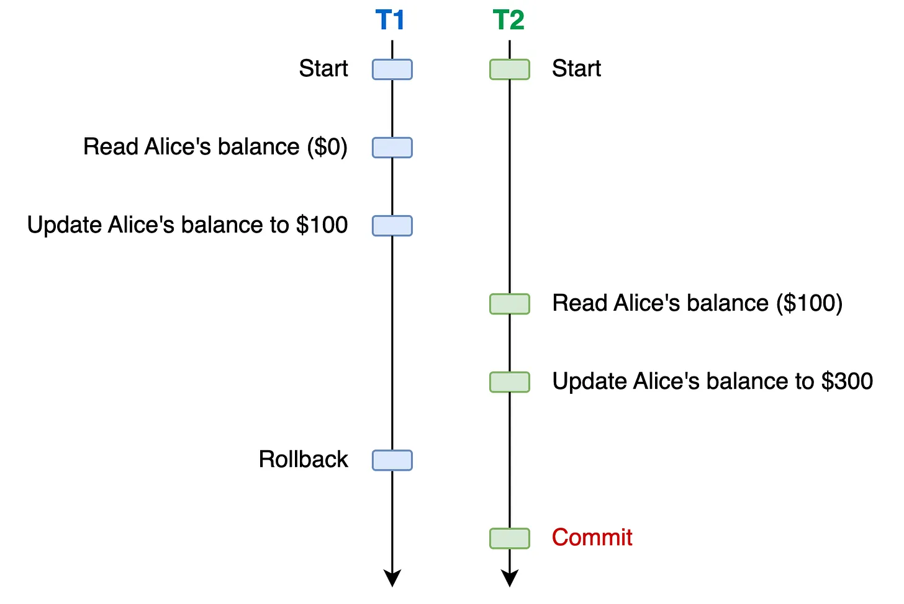
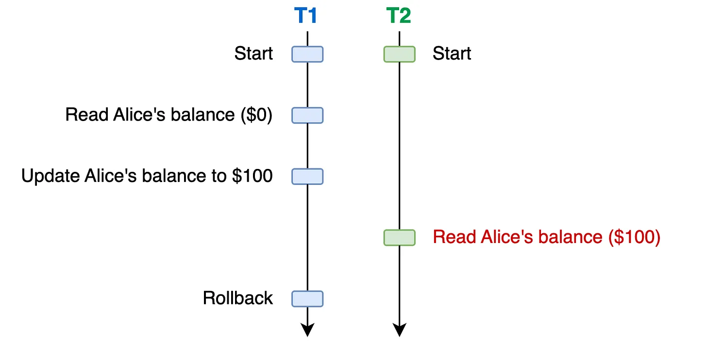
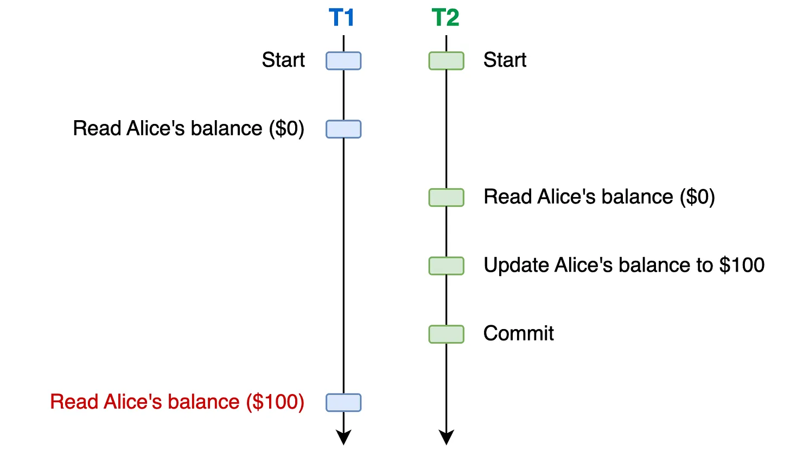
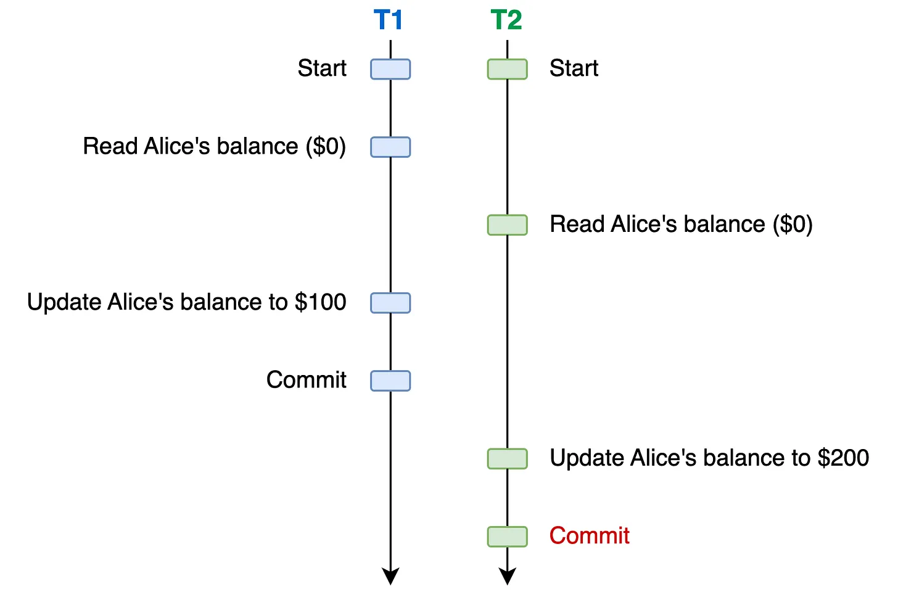
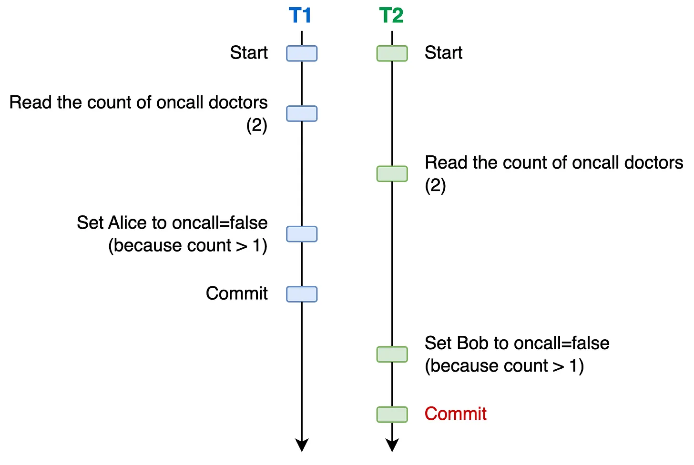

# Лекція 10. Транзакції, ACID, рівні ізоляції, SELECT FOR UPDATE

## Теми лекції
- Транзакції  
- Властивості ACID  
- Проблеми паралельних транзакцій  
- Рівні ізоляції  
- SELECT ... FOR UPDATE  

---

## 1. Транзакції

Транзакція - це набір запитів, що виконуються як одна неподільна логічна операція: виконуються або всі зміни, або жодної.

Транзакції дозволяють:
- виконувати кілька SQL‑операцій як одну задачу;  
- гарантувати цілісність даних;  
- відкотити зміни у разі помилки, втрати доступу до БД чи збою;  
- забезпечити коректну роботу паралельних процесів.

### Приклад неправильного підходу

```sql
UPDATE account_balance SET balance = balance - 100 WHERE account_id = 1;

-- тут стався збій
-- гроші зняли з account_id=1, але не зарахували account_id=2

UPDATE account_balance SET balance = balance + 100 WHERE account_id = 2;
```

### Приклад правильного підходу

```sql
BEGIN;

UPDATE account_balance SET balance = balance - 100 WHERE account_id = 1;
UPDATE account_balance SET balance = balance + 100 WHERE account_id = 2;

COMMIT;
```

---

## 2. Контроль транзакцій

| Команда | Опис                                                                       |
|--------|----------------------------------------------------------------------------|
| `BEGIN` | Початок транзакції                                                         |
| `COMMIT` | Збереження усіх змін                                                       |
| `ROLLBACK` | Відкат транзакції - база даних повертається до стану до початку транзакції |

---

## 3. Властивості транзакцій - ACID

### Атомарність (Atomicity)
Усі операції виконуються повністю або не виконуються зовсім.

### Консистентність (Consistency)
Транзакція переводить БД з одного коректного стану в інший.  
Жодні constraints (PRIMARY KEY, FOREIGN KEY, CHECK) не повинні бути порушені.

### Ізоляція (Isolation)
Паралельні транзакції не повинні впливати одна на одну.  
Різні рівні ізоляції дають різний баланс між безпечністю даних і швидкодією.

### Персистентність (Durability)
Після `COMMIT` зміни не можуть бути втрачені, навіть при вимкненні світла або перезапуску сервера.

---

## 4. Проблеми паралельних транзакцій

### 4.1 Dirty Write
Транзакція перезаписує незбережені зміни іншої транзакції.



### 4.2 Dirty Read
Транзакція читає дані, які інша транзакція ще не закомітила.



### 4.3 Non‑Repeatable Read
Повторне читання того ж рядка повертає інше значення.



### 4.4 Phantom Read
Повторний SELECT повертає нові (або зниклі) рядки, яких не було раніше.

### 4.5 Lost Update (втрачений апдейт)
Класична помилка:

- транзакція А читає дані  
- транзакція Б читає ті ж дані  
- обидві їх змінюють  
- запис Б перезаписує результат А



### 4.6 Write Skew
Типова ситуація зі зміною різних рядків при спільній умові.  
Приклад з лекції:  
двоє лікарів одночасно подають заявку піти додому -> обидва читають список лікарів -> обидва бачать, що на зміні 2 лікарі -> обидва зменшують кількість -> обох відпускають -> на зміні 0 лікарів.



---

## 5. Рівні ізоляції транзакцій

Чим вищий рівень ізоляції - тим менше проблем консистентності даних, але тим повільніша транзакція.

### Список рівнів ізоляції за стандартом SQL

| Рівень | Опис                                              | Уникає |
|--------|---------------------------------------------------|--------|
| No Isolation | Немає гарантій                                    | - |
| Read Uncommitted | Забороняє dirty write                             | Dirty write |
| Read Committed | Читає тільки закомічені дані                      | Dirty read |
| Repeatable Read | Значення рядків не змінюються                     | Non-repeatable read |
| Snapshot Isolation | Кожна транзакція бачить свій "снепшот" бази даних | Lost update |
| Serializable | Повна ізоляція                                    | Phantom read, write skew |

### Рівні ізоляції у PostgreSQL

| PostgreSQL | Опис                 | Уникає |
|------------|----------------------|--------|
| Read Uncommitted = Read Committed | фактично один рівень | Dirty read, Dirty write |
| Repeatable Read = Snapshot Isolation | розширений snapshot  | Non‑repeatable read, Lost update, Phantom read |
| Serializable | найвищий рівень      | Write skew |

Приклад зміни рівня ізоляції:

```sql
BEGIN TRANSACTION ISOLATION LEVEL SERIALIZABLE;
```

---

## 6. SELECT ... FOR UPDATE

Альтернатива підвищенню рівня ізоляції:  
дозволяє явно заблокувати певні рядки для оновлення.

`SELECT ... FOR UPDATE` блокує:

- `UPDATE`
- `DELETE`
- інші `SELECT ... FOR UPDATE`

Не блокує: звичайний `SELECT`.

### Використання

```sql
BEGIN;

SELECT * FROM users WHERE id = 10 FOR UPDATE;

UPDATE users SET balance = balance + 100 WHERE id = 10;

COMMIT;
```

### Варіанти блокувань

| Варіант | Опис |
|--------|------|
| FOR UPDATE | ексклюзивний лок |
| FOR NO KEY UPDATE | лок на неключові атрибути |
| FOR SHARE | дозволяє багато одночасних читачів, блокує UPDATE / DELETE |
| FOR KEY SHARE | як SHARE, але лише по ключах |

### Коли використовувати

- у сценаріях read -> modify -> write  
- для уникнення lost update без Repeatable Read  
- коли потрібен явний контроль за блокуваннями  

Ризики:  
може призвести до дедлоків - отже даний механізм потрібно застосовувати з обережністю.

---

## 7. Практичні поради

- Транзакції дозволяють виконувати кілька запитів "як один" - отже, якщо одна задача потребує кількох запитів - їх потрібно виконувати в транзакції.
- Використовуйте транзакції для будь-яких складних або небезпечних операцій, щоб у випадку помилки була можливість зробити ролбек.
- Завжди обирайте найнижчий необхідний рівень ізоляції, адже чим вищий рівень ізоляції - тим менша швидкодія. Для більшості випадків буде достатньо `Read Committed`.
- Для read‑modify‑write краще використовувати `SELECT ... FOR UPDATE`.
- Транзакцією можна "страхуватися" при виконанні "ручних" запитів (UPDATE/DELETE що виконуються з консолі).
- Якщо транзакцію не закомітили - зміни не буде застосовано.

---

## Додаткові матеріали

[Concurrency in Databases & Database Isolation Levels(Dirty Read, Phantom read, Non-Repeatable Read) with examples](https://medium.com/@iamssrofficial/concurrency-in-databases-database-isolation-levels-dirty-read-phantom-read-non-repeatable-read-320ff3553d6d)
[Exploring Database Isolation Levels](https://read.thecoder.cafe/p/exploring-database-isolation-levels)
[Consistency Models](https://jepsen.io/consistency/models)
