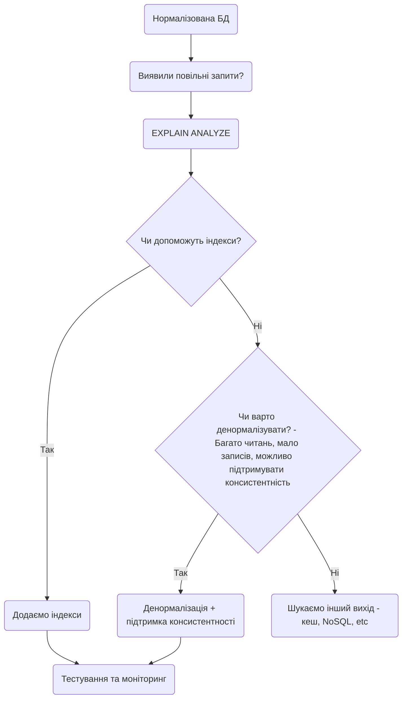

# Лекція 13: Денормалізація

---

## Теми лекції

- Нормалізація - коротке нагадування
- Денормалізація
- Підходи до денормалізації
- Денормалізація vs індекси

---

## 1. Нормалізація - коротке нагадування

Нормалізація - процес декомпозиції таблиць для уникнення надлишковості та небажаних аномалій даних.

По суті, нормалізація представляє собою розбиття неоптимальних таблиць на менші й більш оптимальні таблиці з коректнішими зв'язками між собою.

Основні цілі нормалізації:
- Простота модифікації даних
- Консистентність даних
- Простота підтримки бази даних
- Мінімізація дублювань даних

Ключовий принцип: кожен окремий елемент даних зберігається лише 1 раз.

### Переваги нормалізації

1. Простіше оновлення даних - дані зберігаються лише в одному місці і відповідно потрібно оновлювати лише одне місце
2. Простіша підтримка - структура бази даних більш логічна та зрозуміла
3. Простіші запити **на запис**
4. Оптимізація об'єму даних - відсутність дублювання економить місце
5. Консистентність даних - дані не можуть бути неузгодженими

### Недоліки нормалізації

1. Складніші запити **на читання** - потрібно більше JOIN операцій
2. Більше таблиць - часто складніша логіка роботи з базою даних
3. Нижча швидкодія читання - чим більше JOIN операцій, тим більше накладних витрат; JOIN операції можуть бути ресурсозатратними

Важливо: Якщо запити з багатьма JOIN виконуються часто, це збільшує навантаження на базу даних і негативно впливає на продуктивність.

---

## 2. Денормалізація

Денормалізація - процес **наміреного** внесення надлишковості до нормалізованих таблиць.

Важливо: Денормалізація - це не хаотичне додавання колонок чи зміна структури таблиць. 
Це навмисні, обдумані дії для досягнення певного бажаного ефекту.

### Основні цілі денормалізації

- Збільшення швидкодії запитів читання даних
- Спрощення складних запитів читання даних

### Компроміс

Денормалізація спрощує читання, але ускладнює запис та оновлення даних.

---

## 3. Додавання додаткових колонок

### Опис підходу

Один з основних підходів денормалізації полягає в додаванні додаткових колонок до таблиць, 
з яких часто відбувається читання з великою кількістю JOIN операцій.

### Коли використовувати

- Дані часто читаються разом
- Дані дуже рідко змінюються
- JOIN операції виконуються дуже часто

### Приклад

Нормалізована структура:

Таблиця "Order":
```
order_id (PK)
customer_id (FK)
total_amount
```

Таблиця "Customer":
```
customer_id (PK)
name
country
city
```

Запит з JOIN:
```sql
SELECT
    c.name, c.country, c.city, o.total_amount
FROM order o
INNER JOIN customer c USING (customer_id)
WHERE ...;
```

Денормалізована структура:

Таблиця "Order":
```
order_id (PK)
customer_id (FK)
customer_name      -- додана колонка
customer_city      -- додана колонка
customer_zip       -- додана колонка
customer_country   -- додана колонка
country_tax        -- додана колонка
total_amount
```

Запит без JOIN:
```sql
SELECT
    customer_name, customer_country, customer_city, total_amount
FROM order
WHERE ...;
```

### Переваги
- Запит виконується значно швидше (немає JOIN)
- Простіша структура запиту
- Менше навантаження на базу даних

### Недоліки
- При зміні даних клієнта потрібно оновлювати всі замовлення цього клієнта
- Збільшується розмір таблиці Order
- Потенційна неконсистентність даних
- Складніша логіка оновлення

---

## 4. Додавання похідних колонок

### Опис підходу

Підхід полягає в додаванні додаткових похідних (обчислених) колонок до таблиць, 
з яких часто відбувається читання з агрегаціями (GROUP BY, SUM, COUNT тощо).

Компроміс: Вибір між складністю читання з GROUP BY та складністю оновлень похідної колонки при будь-яких пов'язаних записах та оновленнях.

### Приклад

Нормалізована структура:

Таблиця "Order":
```
order_id (PK)
customer_id (FK)
```

Таблиця "OrderItem":
```
order_item_id (PK)
order_id (FK)
price
```

Запит з агрегацією:
```sql
SELECT
    o.order_id, SUM(oi.price) as total_amount
FROM order o
LEFT JOIN order_items oi USING (order_id)
WHERE ...
GROUP BY o.order_id;
```

Денормалізована структура:

Таблиця "Order":
```
order_id (PK)
customer_id (FK)
total_amount  -- додана похідна колонка
```

Запит без агрегації:
```sql
SELECT
    order_id, total_amount
FROM order
WHERE ...;
```

### Переваги
- Дуже швидкі запити (немає ні JOIN, ні GROUP BY)
- Не потрібно кожен раз обчислювати суму
- Значне зменшення навантаження на БД

### Недоліки
- При додаванні/видаленні/зміні товарів у замовленні потрібно оновлювати total_amount
- Складніша логіка оновлення
- Потребує використання тригерів (використання тригерів як інструменту не рекомендується та не буде розглянуто в межах курсу) або додаткової логіки в додатку

---

## 5. Materialized Views

### Опис підходу

Materialized Views (матеріалізовані представлення) дозволяють зберігати попередньо обчислені результати складних статистичних агрегацій, 
для яких не потрібні найновіші дані.

Підхід полягає в створенні materialized views, які зберігають складні статистичні вибірки у "закешованому" стані 
та допомагають уникнути довгих запитів для отримання статистики.

### Відмінність від звичайних Views

- View (представлення) - це збережений SQL-запит, який виконується кожен раз при зверненні
- Materialized View - це фізично збережений результат запиту, який оновлюється періодично і явно

### Приклад

Створення Materialized View:

```sql
CREATE MATERIALIZED VIEW order_summary AS
SELECT
    o.order_id,
    c.customer_name,
    COUNT(oi.item_id) as item_count,
    SUM(oi.price) as total_amount
FROM orders o
JOIN customers c USING (customer_id)
JOIN order_items oi USING (order_id)
GROUP BY o.order_id, c.customer_name;
```

Оновлення Materialized View:

```sql
-- Базове оновлення (блокує читання)
REFRESH MATERIALIZED VIEW order_summary;

-- Оновлення без блокування
REFRESH MATERIALIZED VIEW CONCURRENTLY order_summary;
```

Використання:

```sql
-- Простий і швидкий запит
SELECT * FROM order_summary
WHERE order_id = 1234;
```

### Переваги
- Дуже швидкі запити для складної аналітики
- Не блокує основні таблиці при читанні
- Підходить для звітів та аналітики
- Зручність використання (як звичайна таблиця)

### Недоліки
- Дані можуть бути застарілими (залежить від частоти оновлення)
- Потребує додаткового місця на диску
- Оновлення може бути ресурсозатратним
- Потрібна стратегія оновлення

### Коли використовувати

- Для аналітичних звітів
- Для dashboard-ів з статистикою
- Коли дані не повинні бути абсолютно актуальними
- Для складних агрегацій, які виконуються часто

### Стратегії оновлення

1. За розкладом - наприклад, щоночі або щогодини
2. За подією (тригером) - після певних змін в даних - не рекомендується
3. Ручне - коли потрібно

---

## 6. Array та JSON колонки

### Опис підходу

Для даних, що завжди зберігаються та завжди читаються "одним шматком", можлива денормалізація шляхом створення колонок типу JSON 
та масивів у реляційних базах даних.

Даний підхід дозволяє використовувати реляційні бази даних у форматі, схожому на нереляційні документо-орієнтовані бази даних.

### Приклад з масивом

Замість:

Таблиця "User":
```
user_id (PK)
```

Таблиця "UserPhone":
```
phone_id (PK)
user_id (FK)
phone_number
```

Денормалізовано:

Таблиця "User":
```
user_id (PK)
phone_numbers (ARRAY)
```

Використання:

```sql
-- Вставка
INSERT INTO users (user_id, phone_numbers)
VALUES (1, ARRAY['+380501234567', '+380671234567']);

-- Вибірка
SELECT user_id, phone_numbers
FROM users
WHERE user_id = 1;

-- Додавання номера
UPDATE users
SET phone_numbers = array_append(phone_numbers, '+380931234567')
WHERE user_id = 1;
```

### Приклад з JSON

Замість:

Таблиця "Product":
```
product_id (PK)
```

Таблиця "ProductAttribute":
```
attribute_id (PK)
product_id (FK)
attribute_name
attribute_value
```

Денормалізовано:

Таблиця "Product":
```
product_id (PK)
attributes (JSONB)
```

Використання:

```sql
-- Вставка
INSERT INTO products (product_id, attributes)
VALUES (1, '{"color": "red", "size": "XL", "material": "cotton"}'::jsonb);

-- Вибірка атрибута
SELECT product_id, attributes->>'color' as color
FROM products
WHERE product_id = 1;

-- Оновлення атрибута
UPDATE products
SET attributes = jsonb_set(attributes, '{color}', '"blue"')
WHERE product_id = 1;

-- Додавання нового атрибута
UPDATE products
SET attributes = attributes || '{"weight": "200g"}'::jsonb
WHERE product_id = 1;
```

### Переваги
- Гнучка структура даних
- Швидке читання всіх атрибутів одним запитом
- Підходить для слабко структурованих даних
- Простота додавання нових атрибутів

### Недоліки
- Складніше індексування
- Значно менш ефективні запити за окремими атрибутами
- Складніша валідація даних
- Можливе збільшення розміру таблиці
- Обмежені можливості для складних запитів

### Коли використовувати
- Дані **завжди** використовуються разом
- Структура даних варіюється між записами
- Пошуки за окремими атрибутами рідкісні або відсутні
- Для налаштувань, метаданих, додаткових параметрів, тощо

---

## 7. Денормалізація vs Індекси

### Коли використовувати індекси

Індекси призначені для:

1. Пришвидшення WHERE - швидкий пошук за умовою
2. Пришвидшення JOIN - де це можливо
3. Забезпечення унікальності записів (UNIQUE)
4. Пришвидшення сортування (ORDER BY)

### Коли використовувати денормалізацію

Денормалізація призначена для:

1. Усунення JOIN-ів - коли JOIN операції занадто повільні
2. Попереднього обчислення агрегацій - для складних розрахунків
3. Спрощення запитів - зменшення складності SQL

### Порівняння

| Аспект | Індекси | Денормалізація |
|--------|---------|----------------|
| Мета | Пришвидшення пошуку | Усунення JOIN/агрегацій |
| Складність | Низька | Висока |
| Підтримка | Автоматична | Ручна (тригери/код) |
| Консистентність | Гарантована | Потребує зусиль |
| Запис | Трохи повільніше | Значно повільніше |
| Читання | Швидше | Дуже швидко |

---

## 8. Стратегія прийняття рішення щодо денормалізації

### Послідовність дій при повільних запитах

1. Виконайте `EXPLAIN ANALYZE` - проаналізуйте план виконання запиту
```sql
EXPLAIN ANALYZE
SELECT * FROM orders WHERE customer_id = 123;
```

Шукайте в плані:
- `Seq Scan` - послідовне сканування (погано)
- `Index Scan` - використання індексу (добре)
- `Nested Loop` - вкладені цикли (може бути повільно)
- `Hash Join` - хеш-з'єднання (зазвичай швидше)

2. Додати індекси, якщо їх не вистачає
3. Якщо індекси не допомогли - денормалізувати

Оцініть:
- Чи варто додавати надлишкові дані?
- Який компроміс між швидкістю читання та складністю оновлення?
- Як часто змінюються дані?
- Наскільки критична консистентність?

4. Додати індекси для денормалізованої таблиці, якщо потрібно

Денормалізація та індекси не виключають одне одного - часто потрібні обидва підходи.

---

## 9. Практичні рекомендації

### 1. Завжди аналізуйте запити перед оптимізацією

- Не оптимізуйте передчасно - спочатку переконайтеся, що проблема існує
- Використовуйте `EXPLAIN ANALYZE` для аналізу запитів
- Вимірюйте продуктивність до та після змін
- Збирайте метрики (час виконання запитів, навантаження на БД)

### 2. Приймайте рішення обдумано та стратегічно

- Денормалізація - це компроміс, а не універсальне рішення
- Враховуйте співвідношення читання/запису:
    - Багато читань, мало записів - денормалізація підходить
    - Багато записів - денормалізація може погіршити ситуацію
- Оцінюйте довгострокові наслідки
- Документуйте рішення та їх обґрунтування

### 3. Денормалізація ускладнює підтримку

Складніша підтримка консистентності:
- Більше коду для підтримки
- Складніше тестування
- Потенційні проблеми з міграціями даних

### 4. Дублювання даних

Наслідки дублювання:
- Збільшується розмір бази даних
- Збільшуються витрати на зберігання
- Більше часу на резервне копіювання
- Складніше відновлення після збоїв

### 5. Компроміс: читання vs запис

Денормалізація помітно ускладнює записи та спрощує читання

```sql
-- Нормалізовано: простий запис
INSERT INTO order_items (order_id, price) VALUES (1, 100);

-- Денормалізовано: складний запис
BEGIN;
INSERT INTO order_items (order_id, price) VALUES (1, 100);
UPDATE orders SET total_amount = total_amount + 100 WHERE order_id = 1;
COMMIT;
```

Проблеми:
- Оновлення даних стає складнішим
- Можуть виникнути race conditions при паралельних оновленнях
- Потрібна ретельна обробка помилок

### 6. Ризик неконсистентності

Механізми синхронізації:
- Тригери
- Періодичні перевірки
- Логування змін
- Механізми відновлення

### 7. Тестування та моніторинг

- Ретельно тестуйте денормалізовані рішення
- Моніторте консистентність даних
- Регулярно перевіряйте, чи дані синхронізовані
- Майте план відновлення у разі проблем

### 8. Коли НЕ варто денормалізувати

- Дані часто змінюються
- Критична важливість консистентності
- Мало читань
- Багато паралельних оновлень
- Складна бізнес-логіка для синхронізації
- Система в активній розробці (часті зміни структури)

---

## 10. Підсумок

### Ключові моменти

1. Денормалізація - це інструмент оптимізації, а не правило
2. Завжди починайте з нормалізованої структури та денормалізуйте за потребою
3. Використовуйте `EXPLAIN ANALYZE` для аналізу проблем
4. Спочатку спробуйте індекси, потім денормалізацію
5. Денормалізація вимагає підтримки консистентності даних
6. Документуйте свої рішення про денормалізацію

### Рекомендований процес



### Баланс між нормалізацією та денормалізацією

Найкраща база даних - це та, яка:
- Задовольняє вимоги до продуктивності
- Залишається підтримуваною
- Забезпечує консистентність даних
- Не переускладнена

Золоте правило: Нормалізуйте, поки це можливо. Денормалізуйте, коли це необхідно.

---

## 11. Висновки

- Денормалізація - це компроміс між продуктивністю читання та складністю запису.
- Завжди починайте з нормалізації та денормалізуйте тільки там, де це дійсно необхідно.
- EXPLAIN ANALYZE - ваш найкращий друг при оптимізації запитів.
- Індекси повинні бути першим кроком оптимізації, денормалізація - останнім.
- Денормалізовані дані вимагають постійної підтримки консистентності.
- Різні таблиці в одній БД можуть мати різні рівні денормалізації.
- Документуйте всі рішення про денормалізацію та обґрунтування.
- Регулярно перевіряйте консистентність денормалізованих даних.

---

## Додаткові матеріали

[Denormalization in Databases: When and How to Use It](https://www.datacamp.com/tutorial/denormalization)  
[Denormalization: A Solution for Performance or a Long-Term Trap?](https://rafaelrampineli.medium.com/denormalization-a-solution-for-performance-or-a-long-term-trap-6b9af5b5b831)  
[Use The Index, Luke!](https://use-the-index-luke.com/)  
[PostgreSQL Performance Optimization](https://www.postgresql.org/docs/current/performance-tips.html)  
