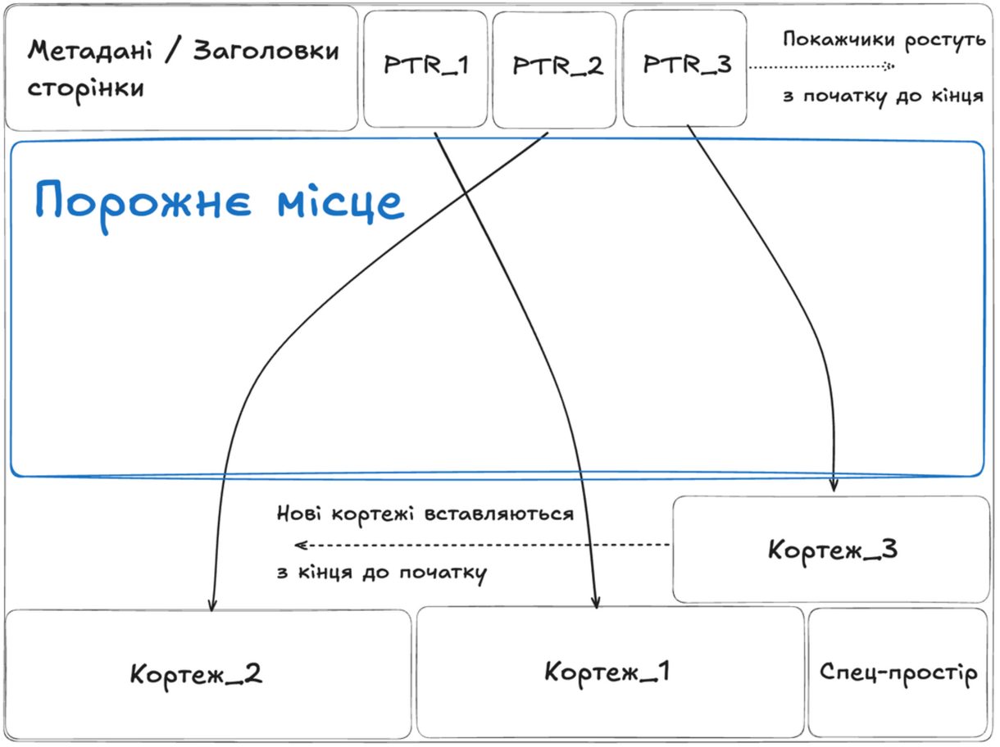
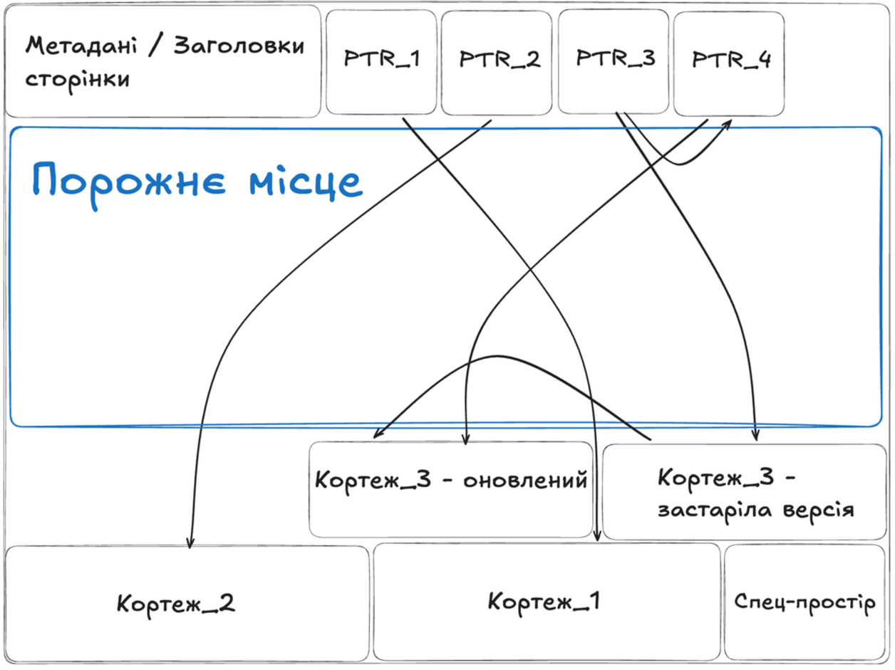
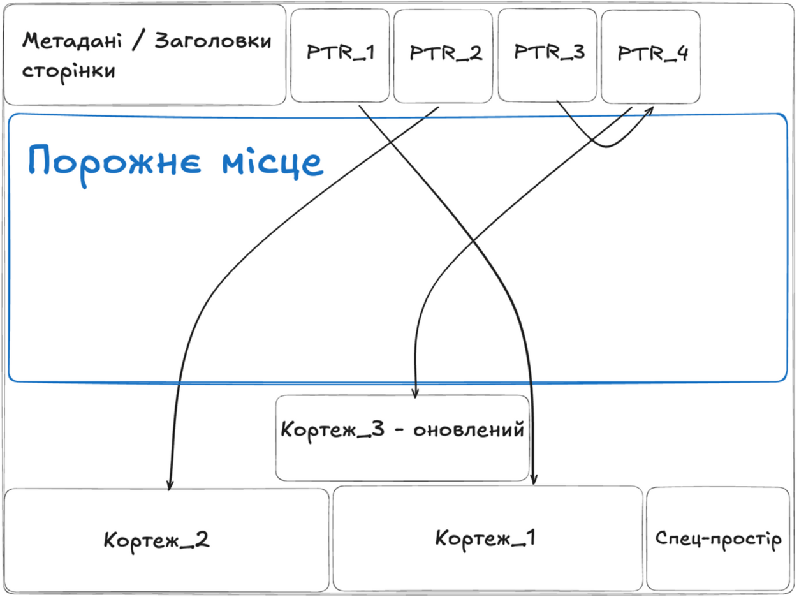
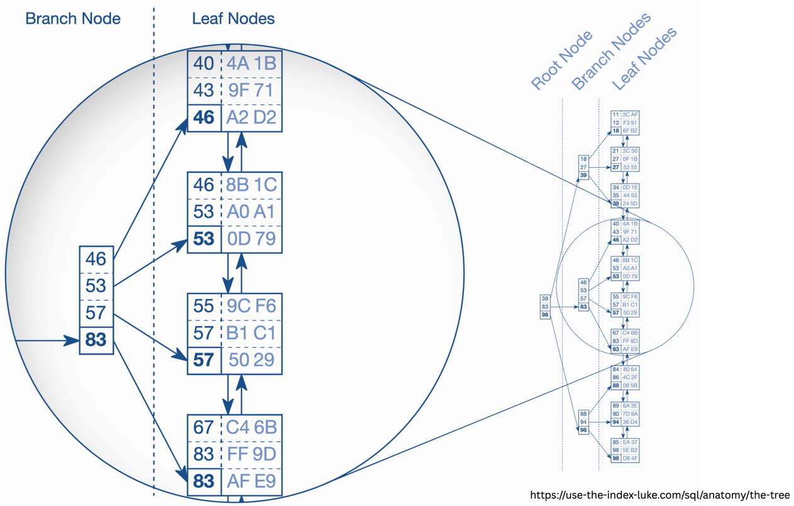
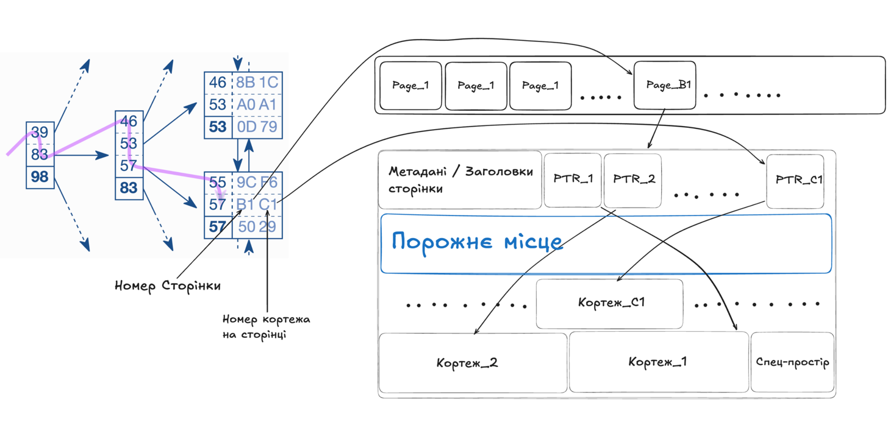

# Лекція 14: Фізична організація даних на диску

## Теми лекції

- Кортежі (Tuples) - внутрішня структура рядочків
- Сторінки (Pages) - організація даних на диску
- B-Tree індекси - збереження на диску
- MVCC (Multi-Version Concurrency Control) - механізм управління паралельними транзакціями
- WAL (Write-Ahead Log) - механізм збереження записів

---

## 1. Кортежі (Tuples)

Кортеж (tuple) - це рядок даних таблиці в базі даних, що зберігається на диску у спеціальному форматі.

### Структура кортежу на диску

Кортеж складається з трьох основних частин:

1. Заголовки (tuple header) - метадані, які завжди мають розміром 23 байти
2. Бітмапа NULL значень - компактне зберігання інформації про `NULL` колонки
3. Дані - власне значення колонок у рядочку

### Заголовки кортежу

Заголовки кортежу містять мета-інформацію, що використовується PostgreSQL для управління версіями рядочків та їх життєвим циклом.

Основні компоненти заголовків:

- xmin - ідентифікатор транзакції, яка створила цей кортеж
- xmax - ідентифікатор транзакції, яка видалила цей кортеж (0 якщо не видалений)
- ctid (current tuple id) - посилання на місце зберігання кортежу або нової версії даного кортежу
- hoff (header offset) - адреса початку даних після заголовків
- infomask - різноманітні прапорці стану кортежу

### Бітмапа NULL значень

Бітмапа - це набір бітів, де кожен біт відповідає одній колонці:
- Біт = 1: колонка містить `NULL`
- Біт = 0: колонка містить значення (не `NULL`)

Переваги використання бітмапи:

1. Економія місця на диску - PostgreSQL може не зберігати NULL значення, тим самим економлячи місце
2. Швидка перевірка - при запитах з фільтрацією по `NOT NULL` можна легко перевірити чи є значення NULL, навіть не читаючи саме значення
3. Компактність - для таблиці з 100 колонками потрібно лише 100 біт (один біт для однієї колонки)

Приклад:

```sql
CREATE TABLE users (
    id INT,           -- біт 0
    name TEXT,        -- біт 1
    email TEXT,       -- біт 2
    age INT           -- біт 3
);

-- Рядок: (1, 'John', NULL, 25)
-- NULL бітмапа: 0010 (тільки email є NULL)
```

### Як PostgreSQL читає кортеж

Послідовність читання кортежу з диску:

1. Прочитати заголовки (23 байти)
2. З заголовків отримати `hoff` - адресу початку даних
3. Опціонально прочитати бітмапу `NULL` значень
4. Перейти до даних за адресою `hoff`
5. Прочитати значення колонок

`hoff` дозволяє пропускати NULL бітмапу, якщо вона не потрібна, і швидко переходити безпосередньо до даних.

---


## 2. Сторінки

Сторінка (page) - це логічна одиниця збереження даних базою даних на диску.

### Основні характеристики сторінок

- Послідовний сектор пам'яті на диску
- Містить метадані та кортежі
- Фіксований розмір - завжди 8КВ за замовчуванням (розмір можна конфігурувати)
- Найменша одиниця для операцій читання та запису на диск

Це означає, що PostgreSQL завжди читає та записує дані порціями по 8КВ, навіть якщо потрібен лише один рядок.

### Структура сторінки



Важливі особливості:
- Покажчики на кортежі ростуть від початку сторінки до кінця
- Кортежі ростуть від кінця сторінки до початку
- Вільне місце знаходиться між останнім покажчиком та останнім кортежем

### Заголовки сторінки

Розмір: 24 байти

Містять інформацію, необхідну для роботи з сторінкою:

- Чек-сума сторінки - для виявлення пошкоджень даних
- Посилання на початок вільного місця - де можна вставити новий покажчик
- Посилання на кінець вільного місця - де закінчуються існуючі кортежі та куди можна записати новий кортеж
- Розмір сторінки - підтвердження розміру (має бути 8КВ)
- Версія алгоритму - для сумісності між версіями PostgreSQL
- Найбільше значення xmax - максимальний xmax серед усіх кортежів на сторінці (для оптимізацій VACUUM)

### Покажчики на кортежі (Item Pointers)

Покажчики на кортежі - це масив посилань на фактичне розташування кортежів на сторінці.

Чому це важливо:

1. Стабільні посилання - індекси посилаються на ці покажчики, а не безпосередньо на кортежі
2. Переміщення кортежів - можна переміщувати кортежі в межах сторінки (наприклад, для дефрагментації) без оновлення індексів
3. HOT updates - можливість оновлення рядочків (`UPDATE` запити) без оновлення індексів

Структура покажчика:
- Offset (зсув від початку сторінки до кортежу)
- Length (довжина кортежу)
- Flags (різні прапорці стану)

---

## 3. Організація даних на диску

### Heap Files

Сторінки таблиць зберігаються на диску у форматі Heap Files (кучі).

Heap (у цьому контексті) - це неупорядкований набір сторінок.

Основні характеристики heap:
- Немає гарантованого порядку рядочків
- Нові рядочки додаються туди, де є місце
- Сторінки не сортуються по жодному ключу
- Для швидкого пошуку потрібні індекси

### Шлях до файлів таблиць

Файли з даними таблиць (набором сторінок) знаходяться за шляхом: `$PGDATA/base/{id бази даних}/{id таблиці}`

- `$PGDATA` - каталог даних PostgreSQL (зазвичай `/var/lib/postgresql/data`)
- `{id бази даних}` - Object id бази даних
- `{id таблиці}` - id таблиці

Приклад: `/var/lib/postgresql/data/base/1234/56789`

### Як знайти файл таблиці

```sql
SELECT pg_relation_filepath('users');
```

### Великі таблиці

Якщо таблиця перевищує 1GB за розміром:
- PostgreSQL розбиває її на кілька файлів, які називаються сегментами
- Кожен сегмент не перевищує 1GB
- Додаються числові суфікси

```
24576 - основний файл (до 1GB)
24576.1 - перше розширення (до 1GB)
24576.2 - друге розширення (до 1GB)
...
```

Це обмеження необхідне для сумісності з файловими системами, що мають обмеження на максимальний розмір файлів.

---

## 4. TOAST (The Oversized-Attribute Storage Technique)

### Проблема

Сторінки мають фіксований розмір 8КВ, але значення колонок типу TEXT, JSON (та також інших типів) можуть бути набагато більшими ніж 8КВ.

```sql
CREATE TABLE documents (
    id SERIAL,
    content TEXT  -- може містити документ на кілька мегабайт!
);
```

Що робити, якщо один рядочок не поміщається в сторінку?

### Рішення: TOAST

TOAST - це техніка збереження великих атрибутів, яка полягає в автоматичному винесенні великих значення в окрему спеціальну TOAST-таблицю.  

Принцип роботи:

Якщо значення колонки перевищує ~2КВ:
- значення може бути стиснуте (якщо це допомагає)
- або розбите на "шматки" (chunks) по ~2КВ кожен
- шматки зберігаються в окремій TOAST-таблиці

В основній таблиці зберігається:
- вказівник на TOAST-таблицю
- інформація про стиснення
- розмір оригінального значення

### TOAST таблиця

Для кожної таблиці, що має колонки з можливими великими значеннями, PostgreSQL автоматично створює TOAST-таблицю.

Структура TOAST-таблиці:
- `chunk_id` - ідентифікатор значення (до якого кортежу належить)
- `chunk_seq` - порядковий номер шматка
- `chunk_data` - дані (~2КВ)

### Вплив TOAST на продуктивність

Переваги:
- Дозволяє зберігати дуже великі значення
- Не сповільнює роботу з невеликими рядочками
- Автоматичне стиснення економить місце на диску

Недоліки:
- Читання TOAST значення вимагає додаткових I/O операцій і є повільнішим
- Оновлення TOAST значення може бути повільним

---

## 5. MVCC (Multi-Version Concurrency Control)

MVCC - це механізм, який використовує PostgreSQL для контролю паралельних (конкурентних) транзакцій. За своєю суттю це реалізація підходу Copy-on-Write.

### Основна ідея MVCC

Ключові принципи:
- Кожний UPDATE створює нову версію рядочку
- Старі версії не видаляються відразу
- Транзакції, що почалися до UPDATE, можуть бачити стару версію (згідно рівня ізоляції `REPEATABLE READ`)
- Всі рядочки на диску незмінні - замість зміни створюється нова версія

### Як працює UPDATE "під капотом"

При оновленні рядочка відбувається наступне:

1. Створюється нова версія кортежу з новими даними в іншому місці на диску
2. Оновлюються заголовки старої версії кортежу:
    - `v1_tuple.xmax = transaction_id` - позначаємо як видалений поточною транзакцією
    - `v1_tuple.ctid = v2_tuple` - встановлюємо посилання на нову версію
3. Заповнюються заголовки нової версії:
    - `v2_tuple.xmin = transaction_id` - хто створив
    - `v2_tuple.xmax = 0` - не видалений
    - `v2_tuple.ctid = v2_tuple` - посилається на себе (остання версія)

### Видимість версій для транзакцій

PostgreSQL визначає яку версію рядочка показати транзакції на основі:
- ідентифікатор поточної транзакції
- xmin та xmax кортежів
- рівня ізоляції транзакції

Правила видимості виглядють приблизно наступним чином:
- Якщо `xmin > transaction_id` - рядок ще не створений для цієї транзакції (невидимий для рівня ізоляції `REPEATABLE READ`)
- Якщо `xmax < transaction_id` та `xmax != 0` - рядок вже видалений для цієї транзакції (невидимий для всіх рівнів ізоляції)
- Інакше - рядок видимий для поточної транзакції

### HOT Update (Heap-Only Tuple)

HOT Update - це спеціальна оптимізація, коли нова версія кортежу зберігається на тій самій сторінці, що і попередня.

Переваги HOT Update:

1. Не потрібно оновлювати індекси - індекс продовжує вказувати на стару версію, яка має посилання (ctid) на нову версію
2. Дуже швидко - вимагає лише одного фізичного запису на диск замість багатьох

Коли можливий HOT Update:

- Нова версія поміщається на ту саму сторінку (на сторінці достатньо вільного місця)
- Оновлювані колонки не індексовані або індекс не змінюється





---

## 6. B-Tree індекси

B-Tree (Balanced Tree) - це збалансоване дерево пошуку, яке PostgreSQL використовує для індексів за замовчуванням.   
[Див. лекцію про індекси.](../08-09%20-%20Indices/lecture_notes.md)



### Основні властивості B-Tree

- Дерево завжди збалансоване - всі листи на приблизно однаковій глибині
- Ефективний пошук за O(log n)
- Підтримує range запити (діапазони значень)
- Підтримує сортування

### Збереження B-Tree на диску

Критично важливі факти:

- B-Tree зберігається у вигляді сторінок по 8КВ
- Кожна вершина дерева відповідає одній сторінці на диску
- Глибина типового B-Tree: 3-4 рівні навіть для таблиць з мільйонами рядків
- Це означає 3-4 читання з диску для пошуку будь-якого значення

### Пошук за індексом

Кількість читань з диску для пошуку одного значення:
```
Кількість I/O операцій = глибина дерева + 1
```

Де `+ 1` - це читання сторінки таблиці після знаходження посилання на кортеж в індексі.

Приклад:
```
Таблиця має 1,000,000 рядків
Глибина B-Tree: 3 рівні

Пошук за індексом:
1. Читання root node (1 I/O)
2. Читання branch node (1 I/O)
3. Читання leaf node (1 I/O)
4. Читання сторінки таблиці (1 I/O)
Всього: 4 читання з диску
```

### Структура leaf node

Листова вершина містить:
- мета-інформацію сторінки
- впорядковані пари "ключ -> посилання на кортеж"
- посилання на попередню листову вершину B-Tree
- посилання на наступну листову вершину B-Tree

Ключ - значення індексованої колонки (або набору колонок)  
Посилання на кортеж - пара "номер сторінки, що містить дані -> номер кортежу на сторінці"  

### Процес пошуку



1. Почати з кореня дерева
2. Порівняти "57" з ключами в корені, визначити потрібну гілку
3. Прочитати відповідну вершину
4. Порівняти з ключами в вершині, визначити потрібний лист дерева
5. Прочитати листкову вершину
6. Знайти точний ключ "57" і отримати посилання на кортеж
7. Прочитати сторінку таблиці за посиланням
8. Знайти кортеж на сторінці за посиланням
9. Повернути результат

---

## 7. Write-Ahead Log (WAL)

WAL (Write-Ahead Log) - це підхід, який PostgreSQL використовує для ефективного та надійного збереження транзакцій на диску.

### Проблема без WAL

При кожній зміні даних без WAL потрібно:

1. Знайти потрібну сторінку на диску (random I/O)
2. Прочитати її в пам'ять
3. Змінити
4. Записати назад на диск

Це повільно, особливо якщо:
- Змін багато
- Вони в різних місцях на диску
- Кожна зміна вимагає окремої операції запису

### Рішення: Write-Ahead Logging

Ідея WAL відносно проста:

1. Всі зміни в процесі транзакції записуються в сторінки в оперативній пам'яті (на цьому етапі на диск нічого не записується)
2. Історія змін (лог) також зберігається в оперативній пам'яті (WAL buffer)
3. При `COMMIT` транзакції, лише історія змін записується на диск (WAL file) - sequential I/O. Це швидко, тому що запис послідовний
4. Змінені сторінки даних (з кроку 1) записуються на диск пізніше (вже після того, як транзакція закінчилась) у фоновому режимі

### Основні принципи WAL

1. Write-Ahead - лог змін записується перш за все та завжди в кінець логу
2. COMMIT чекає на WAL fsync - транзакція вважається завершеною лише після запису WAL на диск
3. Асинхронний запис даних - змінені сторінки записуються пізніше
4. Періодичні checkpoints - запис всіх змінених сторінок з пам'яті на диск

### Формат WAL записів

WAL файл містить послідовність записів про зміни:
- LSN (Log Sequence Number) - це унікальний, монотонно зростаючий ідентифікатор, що показує позицію запису в WAL.
- Тип операції (INSERT/UPDATE/DELETE)
- Transaction id
- Які саме дані змінились (delta)

### Переваги WAL

- WAL запис - це послідовний запис (sequential I/O) - набагато швидший за випадковий запис (random I/O)
- Можна групувати багато WAL записів в один fsync
- Якщо система впала після COMMIT, але до запису сторінок - не проблема, адже з WAL можна відновити всі дані
- fsync WAL гарантує durability транзакцій (D в ACID)

Важливо: клієнт отримує підтвердження COMMIT лише після fsync WAL, але ДО запису змінених сторінок на диск.

### Checkpoints

Checkpoint - це момент, коли всі змінені сторінки в оперативній пам'яті (dirty pages) записуються на диск.

Коли відбувається checkpoint:
- Періодично за таймером (`checkpoint_timeout`, за замовчуванням 5 хвилин)
- Коли WAL досяг граничного розміру (`max_wal_size`)
- При командах `CHECKPOINT` або `pg_start_backup()`
- При зупинці сервера (shutdown checkpoint)

Після checkpoint:
- Старі WAL файли можна видалити або архівувати
- Відновлення після збою потребуватиме менше часу (меншу частину WAL потрібно застосувати)

Процес checkpoint:
1. Запам'ятати поточний LSN (checkpoint location)
2. Записати всі dirty pages на диск
3. Записати checkpoint record в WAL

### Відновлення після збою

Якщо PostgreSQL було зупинено через збій (вимкнення електроенергії, kernel panic, etc):

1. При наступному запуску PostgreSQL бачить, що зупинка була "неочікуваною"
2. Знаходить останній успішний checkpoint в WAL
3. Починає відтворення WAL записів після checkpoint: читає записи у WAL по черзі та застосовує кожну зміну до сторінок даних. Таким чином, відновлюється стан бази даних до збою
4. Відкочує незавершені транзакції (де не було COMMIT в WAL)
5. База даних повністю відновлена і готова до роботи

Це гарантує, що всі закоміченні транзакції збережені, а незавершені - відкочені.

---

## 8. Висновки

Все зберігається у форматі сторінок
- Сторінки мають фіксований розмір (8КВ за замовчуванням)
- Це базова одиниця для всіх I/O операцій
- Неможливо прочитати менше або більше однієї сторінки за одну операцію з диском
- Всі I/O операції з диском завжди відбуваються по 8КВ
- Навіть для читання одного рядочка PostgreSQL читає цілу сторінку

Дані таблиць зберігаються в рандомному порядку (Heap)
- Порядок рядочків не гарантується
- Для швидкого пошуку потрібні індекси
- Нові рядочки вставляються туди, де є місце
- Кожен файл збереження даних таблиць містить багато сторінок (>= 1)

Всі рядочки на диску незмінні
- UPDATE не змінює існуючий кортеж, а створює нову версію кортежу
- Це основа MVCC

MVCC забезпечує конкурентність без блокувань на читання
- Різні транзакції можуть бачити різні версії рядочків
- Мертві та застарілі версії очищає процес VACUUM

WAL забезпечує швидкість та надійність записів
- Послідовний запис WAL набагато швидший за випадковий запис даних
- Можна відновити базу після будь-якого збою

---

## 9. Додаткові матеріали

- [Deep Dive into PostgreSQL: Pages, Tuples, and Updates](https://medium.com/@ductran999/deep-dive-into-postgresql-pages-tuples-and-updates-cf9122f5f743)
- [Use The Index, Luke!](https://use-the-index-luke.com/) - дуже хороший ресурс про роботу індексів
- [Read Committed transaction isolation in PostgreSQL](https://dev.to/olegelantsev/read-committed-transaction-isolation-in-postgresql-3c4d)
- [Fighting PostgreSQL write amplification with HOT updates](https://medium.com/adyen/fighting-postgresql-write-amplification-with-hot-updates-c8090f329ad6)

Документація PostgreSQL:
- [Storage Page Layout](https://www.postgresql.org/docs/current/storage-page-layout.html)
- [Database Physical Storage](https://www.postgresql.org/docs/current/storage.html)
- [Write-Ahead Logging (WAL)](https://www.postgresql.org/docs/current/wal-intro.html)
- [MVCC](https://www.postgresql.org/docs/current/mvcc-intro.html)
