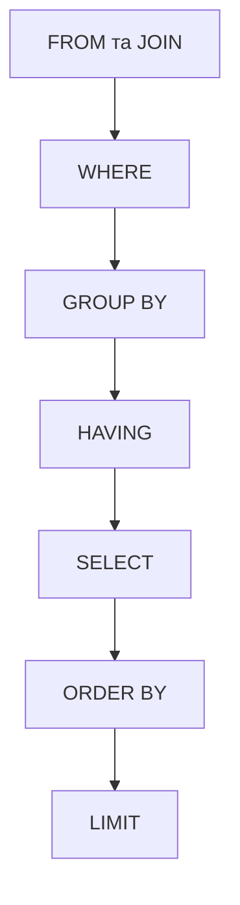

# SQL Cheat Sheet

Короткий довідник з SQL для PostgreSQL.

---

## DDL (Data Definition Language)

### CREATE TABLE

```sql
CREATE TABLE student (
    student_id SERIAL PRIMARY KEY,
    name VARCHAR(100) NOT NULL,
    surname VARCHAR(100) NOT NULL,
    email VARCHAR(255) UNIQUE,
    birth_date DATE,
    is_active BOOLEAN DEFAULT TRUE,
    group_id INTEGER REFERENCES student_group(group_id)
);
```

### Основні типи даних

| Тип                             | Опис                                         | Приклад                 |
|---------------------------------|----------------------------------------------|-------------------------|
| `INTEGER`                       | Ціле число                                   | `42`                    |
| `SERIAL`                        | Автоінкремент (ціле число)                   | `1, 2, 3...`            |
| `NUMERIC(p,s)` / `DECIMAL(p,s)` | Точне число з фіксованою точністю            | `99.95`                 |
| `REAL` / `DOUBLE PRECISION`     | Число з плаваючою точкою                     | `3.14`                  |
| `CHAR(n)`                       | Рядок фіксованої довжини (завжди n символів) | `'Андрій'`              |
| `VARCHAR(n)`                    | Рядок змінної довжини (до n символів)        | `'Андрій'`              |
| `TEXT`                          | Рядок без обмеження довжини                  | `'довгий текст...'`     |
| `BOOLEAN`                       | Логічне значення                             | `TRUE` / `FALSE`        |
| `DATE`                          | Дата                                         | `'2025-01-15'`          |
| `TIMESTAMP`                     | Дата і час                                   | `'2025-01-15 14:30:00'` |
| `JSONB`                         | JSON з індексацією                           | `'{"key": "value"}'`    |

### Обмеження (Constraints)

| Обмеження                    | Опис                                      |
|------------------------------|-------------------------------------------|
| `PRIMARY KEY`                | Унікальний ідентифікатор рядка            |
| `FOREIGN KEY` / `REFERENCES` | Зовнішній ключ - зв'язок з іншою таблицею |
| `NOT NULL`                   | Значення обов'язкове                      |
| `UNIQUE`                     | Значення має бути унікальним              |
| `DEFAULT value`              | Значення за замовчуванням                 |
| `CHECK (умова)`              | Перевірка значення при вставці/оновленні  |

### ALTER TABLE

```sql
-- Додати колонку
ALTER TABLE student ADD COLUMN phone VARCHAR(20);

-- Видалити колонку
ALTER TABLE student DROP COLUMN phone;

-- Змінити тип колонки
ALTER TABLE student ALTER COLUMN name TYPE TEXT;

-- Додати обмеження
ALTER TABLE student ADD CONSTRAINT unique_email UNIQUE (email);

-- Видалити обмеження
ALTER TABLE student DROP CONSTRAINT unique_email;

-- Додати NOT NULL
ALTER TABLE student ALTER COLUMN name SET NOT NULL;

-- Видалити NOT NULL
ALTER TABLE student ALTER COLUMN name DROP NOT NULL;

-- Додати значення за замовчуванням
ALTER TABLE student ALTER COLUMN is_active SET DEFAULT TRUE;
```

### DROP TABLE

```sql
DROP TABLE IF EXISTS student;           -- видалити таблицю
DROP TABLE student CASCADE;             -- видалити з усіма залежностями
```

---

## DML (Data Manipulation Language)

### INSERT

```sql
-- Вставити один рядок
INSERT INTO student (name, surname, group_id)
VALUES ('Андрій', 'Ковальчук', 1);

-- Вставити кілька рядків
INSERT INTO student (name, surname, group_id)
VALUES
    ('Марія', 'Коваленко', 2),
    ('Олександр', 'Шевченко', 3);

-- Вставка з поверненням
INSERT INTO student (name, surname)
VALUES ('Іван', 'Петренко')
RETURNING student_id, name;

-- Вставка або оновлення (UPSERT)
INSERT INTO student (student_id, name, surname)
VALUES (1, 'Андрій', 'Ковальчук')
ON CONFLICT (student_id)
DO UPDATE SET name = EXCLUDED.name, surname = EXCLUDED.surname;
```

### SELECT

```sql
-- Базовий запит
SELECT name, surname FROM student;

-- Всі колонки
SELECT * FROM student;

-- З псевдонімом
SELECT name || ' ' || surname AS full_name FROM student;

-- Без дублікатів
SELECT DISTINCT group_id FROM student;

-- Обмеження кількості
SELECT * FROM student LIMIT 10;
SELECT * FROM student LIMIT 10 OFFSET 20;    -- пропустити перші 20
```

### UPDATE

```sql
-- Оновити конкретні рядки
UPDATE student
SET name = 'Андрій', group_id = 2
WHERE student_id = 1;
-- ВАЖЛИВО: без WHERE оновляться ВСІ рядки
```

### DELETE

```sql
-- Видалити конкретні рядки
DELETE FROM student WHERE student_id = 1;
-- ВАЖЛИВО: без WHERE видаляться ВСІ рядки
```

---

## Фільтрація та сортування

### WHERE

```sql
-- Порівняння
WHERE grade > 60
WHERE name = 'Андрій'
WHERE name <> 'Андрій'             -- не дорівнює

-- Діапазон
WHERE grade BETWEEN 60 AND 90      -- включно

-- Список значень
WHERE group_id IN (1, 2, 3)

-- Шаблони (LIKE - чутливий до регістру, ILIKE - ні)
WHERE name LIKE 'А%'               -- починається з А
WHERE name LIKE '%ко'              -- закінчується на "ко"
WHERE name LIKE '_ван'             -- 1 довільний символ + "ван"
WHERE name ILIKE '%андрій%'        -- нечутливий до регістру

-- NULL
WHERE grade IS NULL
WHERE grade IS NOT NULL

-- Логічні оператори
WHERE grade > 60 AND group_id = 1
WHERE grade > 90 OR grade IS NULL
WHERE NOT is_active
```

### ORDER BY

```sql
ORDER BY name ASC                  -- за зростанням (за замовчуванням)
ORDER BY grade DESC                -- за спаданням
ORDER BY surname ASC, name ASC     -- кілька колонок
ORDER BY grade DESC NULLS LAST     -- NULL в кінці
```

---

## JOIN

```sql
-- INNER JOIN - тільки рядки зі збігами в обох таблицях
SELECT s.name, g.name AS group_name
FROM student s
INNER JOIN student_group g ON s.group_id = g.group_id;

-- скорочений запис, якщо колонки мають однакові імена
SELECT s.name, g.name AS group_name
FROM student s
INNER JOIN student_group g USING (group_id);

-- LEFT JOIN - всі рядки з лівої таблиці + збіги з правої
SELECT s.name, g.name AS group_name
FROM student s
LEFT JOIN student_group g ON s.group_id = g.group_id;

-- RIGHT JOIN - всі рядки з правої таблиці + збіги з лівої
-- FULL OUTER JOIN - всі рядки з обох таблиць

-- CROSS JOIN - декартів добуток (кожен з кожним)
SELECT s.name, c.name
FROM student s
CROSS JOIN course c;

-- Anti-join - рядки БЕЗ збігів
SELECT s.name
FROM student s
LEFT JOIN enrolment e ON s.student_id = e.student_id
WHERE e.student_id IS NULL;        -- студенти без записів на курси
```

### Операції над множинами

```sql
-- Об'єднання результатів (без дублікатів)
SELECT name FROM student UNION SELECT name FROM teacher;

-- Об'єднання результатів (з дублікатами)
SELECT name FROM student UNION ALL SELECT name FROM teacher;

-- Перетин (спільні рядки)
SELECT name FROM student INTERSECT SELECT name FROM teacher;

-- Різниця (рядки з першого, яких немає в другому)
SELECT name FROM student EXCEPT SELECT name FROM teacher;
```

---

## Агрегація та GROUP BY

### Функції агрегації

| Функція                  | Опис                         |
|--------------------------|------------------------------|
| `COUNT(*)`               | Кількість рядків             |
| `COUNT(column)`          | Кількість NOT NULL значень   |
| `COUNT(DISTINCT column)` | Кількість унікальних значень |
| `SUM(column)`            | Сума                         |
| `AVG(column)`            | Середнє                      |
| `MIN(column)`            | Мінімум                      |
| `MAX(column)`            | Максимум                     |

### GROUP BY

```sql
-- Кількість студентів у кожній групі
SELECT group_id, COUNT(*) AS student_count
FROM student
GROUP BY group_id;

-- Середній бал по кожному курсу
SELECT course_id, AVG(grade) AS avg_grade
FROM enrolment
GROUP BY course_id
HAVING AVG(grade) > 70;             -- фільтрація ПІСЛЯ агрегації

-- FILTER - умовна агрегація
SELECT
    COUNT(*) AS total,
    COUNT(*) FILTER (WHERE grade >= 60) AS passed,
    COUNT(*) FILTER (WHERE grade < 60 OR grade IS NULL) AS failed
FROM enrolment;
```

### Порядок виконання SQL-запиту



---

## Віконні функції (Window Functions)

```sql
-- Нумерація рядків
SELECT name, grade,
    ROW_NUMBER() OVER (ORDER BY grade DESC) AS rank
FROM enrolment;

-- Нумерація в межах групи
SELECT name, course_id, grade,
    ROW_NUMBER() OVER (PARTITION BY course_id ORDER BY grade DESC) AS rank_in_course
FROM enrolment;

-- Агрегація без згортання рядків
SELECT name, grade,
    AVG(grade) OVER () AS overall_avg,
    AVG(grade) OVER (PARTITION BY course_id) AS course_avg
FROM enrolment;
```

| Функція                      | Опис                                        |
|------------------------------|---------------------------------------------|
| `ROW_NUMBER()`               | Послідовний номер рядка                     |
| `RANK()`                     | Ранг (з пропусками при однакових значеннях) |
| `DENSE_RANK()`               | Ранг (без пропусків)                        |
| `LAG(col, n)`                | Значення з попереднього рядка               |
| `LEAD(col, n)`               | Значення з наступного рядка                 |
| `SUM/AVG/COUNT... OVER(...)` | Агрегація як віконна функція                |

---

## Підзапити та CTE

### Підзапити

```sql
-- Скалярний підзапит (одне значення)
SELECT * FROM enrolment
WHERE grade > (SELECT AVG(grade) FROM enrolment);

-- Колонковий підзапит (список значень)
SELECT * FROM student
WHERE group_id IN (SELECT group_id FROM student_group WHERE name LIKE 'ІТ%');

-- Табличний підзапит (у FROM)
SELECT s.name, sub.avg_grade
FROM (
    SELECT student_id, AVG(grade) AS avg_grade
    FROM enrolment GROUP BY student_id
) AS sub
INNER JOIN student s USING (student_id);

-- EXISTS - перевірка існування
SELECT * FROM course c
WHERE EXISTS (
    SELECT 1 FROM enrolment e WHERE e.course_id = c.course_id
);
```

### CTE (Common Table Expressions)

```sql
-- Один CTE
WITH avg_grades AS (
    SELECT student_id, AVG(grade) AS avg_grade
    FROM enrolment
    GROUP BY student_id
)
SELECT s.name, ag.avg_grade
FROM avg_grades ag
INNER JOIN student s USING (student_id)
WHERE ag.avg_grade > 90;

-- Кілька CTE
WITH
course_stats AS (
    SELECT teacher_id, COUNT(*) AS num_courses
    FROM course GROUP BY teacher_id
),
grade_stats AS (
    SELECT teacher_id, AVG(grade) AS avg_grade
    FROM enrolment INNER JOIN course USING (course_id)
    GROUP BY teacher_id
)
SELECT t.name, cs.num_courses, gs.avg_grade
FROM teacher t
INNER JOIN course_stats cs USING (teacher_id)
INNER JOIN grade_stats gs USING (teacher_id);

-- Рекурсивний CTE
WITH RECURSIVE deps AS (
    -- базовий випадок
    SELECT course_id, 1 AS level
    FROM course c
    WHERE NOT EXISTS (
        SELECT 1 FROM course_prerequisite p WHERE p.course_id = c.course_id
    )
    UNION ALL
    -- рекурсивний крок
    SELECT p.course_id, d.level + 1
    FROM course_prerequisite p
    INNER JOIN deps d ON p.prerequisite_course_id = d.course_id
)
SELECT * FROM deps;
```

---

## Індекси

```sql
-- Створити індекс
CREATE INDEX idx_student_group ON student(group_id);

-- Унікальний індекс
CREATE UNIQUE INDEX idx_student_email ON student(email);

-- Композитний індекс (порядок колонок важливий)
CREATE INDEX idx_enrolment_course_grade ON enrolment(course_id, grade);

-- Частковий індекс (тільки для рядків, що відповідають умові)
CREATE INDEX idx_active_courses ON course(name) WHERE is_active = TRUE;

-- Видалити індекс
DROP INDEX idx_student_group;

-- Аналіз плану запиту
EXPLAIN ANALYZE SELECT * FROM student WHERE group_id = 1;
```

### Типи сканування (від швидкого до повільного)

| Тип                 | Коли                                                        |
|---------------------|-------------------------------------------------------------|
| `Index Only Scan`   | Всі потрібні дані є в індексі                               |
| `Index Scan`        | Пошук за індексом + читання таблиці                         |
| `Bitmap Index Scan` | Багато рядків з індексу                                     |
| `Seq Scan`          | Повне сканування таблиці (немає індексу або він невигідний) |

---

## Транзакції

```sql
-- почати транзакцію
BEGIN;

-- будь-які SQL-операції
UPDATE account SET balance = balance - 100 WHERE id = 1;
UPDATE account SET balance = balance + 100 WHERE id = 2;

-- зберегти зміни
COMMIT;

-- скасувати всі зміни
ROLLBACK;

-- Рівні ізоляції (PostgreSQL)
SET TRANSACTION ISOLATION LEVEL READ COMMITTED;      -- за замовчуванням
SET TRANSACTION ISOLATION LEVEL REPEATABLE READ;
SET TRANSACTION ISOLATION LEVEL SERIALIZABLE;

-- Блокування рядків
SELECT * FROM account WHERE id = 1 FOR UPDATE;       -- блокує рядок для оновлення
SELECT * FROM account WHERE id = 1 FOR UPDATE NOWAIT; -- помилка якщо заблоковано
```

---

## Корисні функції PostgreSQL

### Рядкові

```sql
CONCAT(name, ' ', surname)           -- конкатенація
name || ' ' || surname               -- теж конкатенація
UPPER('hello')                        -- 'HELLO'
LOWER('HELLO')                        -- 'hello'
LENGTH('hello')                       -- 5
SUBSTRING('hello' FROM 1 FOR 4)      -- 'hell'
TRIM('  hello  ')                     -- 'hello'
REPLACE('hello', 'l', 'r')           -- 'herro'
```

### Числові

```sql
ROUND(3.14159, 2)                    -- 3.14
ABS(-5)                              -- 5
CEIL(4.1)                            -- 5
FLOOR(4.9)                           -- 4
```

### Дата і час

```sql
NOW()                                -- поточна дата і час
CURRENT_DATE                         -- поточна дата
EXTRACT(YEAR FROM birth_date)        -- витягнути рік
DATE_PART('month', birth_date)       -- витягнути місяць
AGE(birth_date)                      -- інтервал від дати до зараз
```

### Умовні вирази

```sql
-- CASE WHEN
SELECT name,
    CASE
        WHEN grade >= 90 THEN 'Відмінно'
        WHEN grade >= 60 THEN 'Задовільно'
        ELSE 'Незадовільно'
    END AS result
FROM enrolment;

-- COALESCE - перше NOT NULL значення
SELECT COALESCE(phone, email, 'немає контакту') FROM contact_data;

-- NULLIF - повертає NULL якщо значення рівні
SELECT NULLIF(grade, 0) FROM enrolment;   -- 0 стає NULL
```

---

## Нормальні форми (коротко)

| Форма | Вимога                                                              |
|-------|---------------------------------------------------------------------|
| 1NF   | Атомарні значення (немає масивів чи вкладених таблиць в комірках)   |
| 2NF   | 1NF + кожен неключовий атрибут залежить від всього первинного ключа |
| 3NF   | 2NF + немає транзитивних залежностей (A -> B -> C)                  |
| BCNF  | 3NF + кожна функціональна залежність X -> Y: X є надключем          |

---

## Docker (швидкий мінімальний набір команд)

```bash
# Запустити середовище
docker-compose up -d

# Зупинити середовище
docker-compose down

# Переглянути статус
docker-compose ps

# Переглянути логи PostgreSQL
docker-compose logs postgres
```

Підключення до PostgreSQL, запущеного з [docker-compose.yml](./docker-compose.yml):
- Хост: `localhost` (або `postgres` з pgAdmin в Docker)
- Порт: `5432`
- Користувач: `postgres`
- Пароль: `password123`
- pgAdmin: `http://localhost:8080` (root@kpi.edu / password123)
